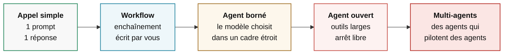

# Comment fonctionne un agent

<div class="opacity-50 pt-2">les fondations</div>

<!--
**Transition :** poser le vocabulaire, puis ouvrir la boucle pour distinguer ce que décide le modèle de ce qu’exécute le code.
-->
---
layout: default
---

# « Orchestrateur », trois choses différentes

<div class="pt-2 text-xl pb-8">
C'est le mot du titre de la journée. Avant tout le reste : dire lequel des trois.
</div>

<div class="space-y-5 text-[1.15rem]">

<v-clicks>

<div class="rail">1 · <strong>Du code</strong> — la bibliothèque qui fait tourner un agent</div>
<div class="rail">2 · <strong>Un agent</strong> — celui qui découpe le travail et le distribue aux autres</div>
<div class="rail">3 · <strong>Un produit</strong> — la plateforme qui héberge et facture des agents</div>

</v-clicks>

</div>

<div v-click class="pt-10 text-base">
« On a mis un orchestrateur » — toujours demander lequel des trois.
</div>

<!--
**Idée clé :** « orchestrateur » peut désigner trois objets de nature différente.

- **Dire :** code qui tient la boucle, agent qui distribue le travail, ou plateforme qui héberge des agents.
- **Préciser :** aujourd’hui, nous travaillons surtout les deux premiers sens.
- **Demander :** en réunion, toujours faire préciser lequel des trois est visé.
- **Transition :** le code de boucle prendra le nom de « harness » en fin de module.
-->

---
layout: default
---

# Remettre le vocabulaire d'aplomb

| Terme | Ce que c'est vraiment |
|---|---|
| **Modèle** | Une fonction. Texte → texte. Sans état. |
| **Assistant** | Un modèle + une conversation. Il parle. |
| **Outil** | Une fonction de *votre* code. Il ne l'exécute pas. |
| **Workflow** | Un enchaînement **que vous avez écrit**. |
| **Agent** | Un modèle qui **choisit**, en boucle, jusqu'à un arrêt. |
| **Orchestrateur** | Ce qui tient la boucle. Voir slide précédente. |

<!--
**Idée clé :** un modèle choisit, un outil agit, un workflow impose l’ordre, un agent choisit la suite.

- **Montrer :** prendre seulement les lignes « Outil » et « Modèle ».
- **Insister :** le modèle reste sans état et n’exécute rien. Le serveur agit avec ses propres droits.
- **Éviter :** appeler un workflow « agent ». Cette confusion masque soit une fausse imprévisibilité, soit l’absence de bornes.
-->

---
layout: center
class: text-center
---

<div class="kicker pb-5">La définition minimale, et il n'y en a pas d'autre</div>

# Un modèle.<br>Des outils.<br>Une boucle.

<!--
**Idée clé :** tout agent se ramène à un modèle, des outils et une boucle.

- **Faire :** marquer un silence. La slide doit surtout être vue.
- **Dire :** interface, marketing et intégrations viennent autour de ces trois éléments.
- **Si question :** prendre le produit cité par la salle et faire identifier son modèle, ses outils et sa boucle.
-->

---
layout: default
---

# Un tour de boucle, en détail


<div class="pt-8 grid grid-cols-3 gap-8 text-base">
<div v-click><span class="font-semibold">Le modèle décide</span></div>
<div v-click><span class="font-semibold">Votre code agit</span></div>
<div v-click><span class="font-semibold">Le contexte grossit</span></div>
</div>

<!--
**Idée clé :** le modèle décide, le code agit et le contexte accumule les résultats.

- **Dessiner :** reproduire la boucle au tableau. Elle doit pouvoir être redessinée de mémoire.
- **Insister :** les effets réels et les garde-fous se trouvent dans le code qui exécute l’outil.
- **Montrer :** chaque tour ajoute décision et observation au contexte.
- **Transition :** la flèche de retour transforme un appel isolé en agent.
-->

---
layout: default
---

# Le fait que tout le monde oublie

<div class="text-2xl pb-8">Le modèle est <strong>sans état</strong>.<br>À l'étape 12, il ne se souvient de rien.</div>

<div class="grid grid-cols-2 gap-10">
<div>

<div class="eyebrow pb-3">Ce qu'il se passe réellement</div>

```text
Appel 1  : [système, user]
Appel 2  : [système, user, décision1, obs1]
Appel 3  : [système, user, décision1, obs1,
            décision2, obs2]
...
Appel 12 : [système, user, ×11 décisions,
            ×11 observations]
```

</div>
<div>

<v-clicks>

<div class="rail">Douze tours = <strong>douze appels</strong>, chacun relisant tout</div>
<div class="rail">Sa mémoire est un tableau que <strong>vous</strong> contrôlez</div>
<div class="rail">Une erreur à l'étape 3 pèse encore à l'étape 11</div>

</v-clicks>

</div>
</div>

<!--
**Idée clé :** le modèle repart sans état à chaque appel.

- **Dire :** imaginer un consultant amnésique à qui l’on redonne tout le dossier avant chaque phrase.
- **Insister :** le contexte peut être coupé, résumé ou réordonné par le code.
- **Annoncer :** cette accumulation explique le coût et la dérive des longues sessions.
- **Transition :** au module 4, la mémoire persistante sera un fichier relu puis réinjecté.

**Si question :** vingt étapes peuvent représenter 210 fois le coût d’une étape, pas vingt fois.
-->

---
layout: default
---

# L'unité de compte s'appelle le token

<div class="pt-2 text-xl pb-8">
Le modèle ne lit pas des mots. Il lit des <strong>tokens</strong> — des fragments de texte.
</div>

<div class="grid grid-cols-2 gap-14">
<div>

<div class="eyebrow pb-3">Ordre de grandeur, en anglais</div>

<div class="space-y-2 text-[1.05rem]">
<div><span class="mono-value">1</span> token <span class="opacity-40">≈</span> <span class="mono-value">4</span> caractères</div>
<div><span class="mono-value">100</span> tokens <span class="opacity-40">≈</span> <span class="mono-value">75</span> mots</div>
<div class="text-t3">En français, il en faut davantage</div>
</div>

</div>
<div>

<v-clicks>

<div class="rail">Le <strong>contexte</strong> se mesure en tokens</div>
<div class="rail">La <strong>facture</strong> se compte en tokens</div>
<div class="rail">Entrée et sortie, <strong>deux tarifs</strong></div>

</v-clicks>

</div>
</div>

<SourceNote :items="[
  ['OpenAI, « What are tokens and how to count them? »', 'help.openai.com/en/articles/4936856'],
  ['Petrov et al., « Language Model Tokenizers Introduce Unfairness Between Languages », NeurIPS 2023', 'arxiv.org/abs/2305.15425'],
]" />

<!--
**Idée clé :** un token est un fragment de texte qui mesure contexte et facture.

- **Dire :** ce n’est ni une lettre ni un mot. Les séquences fréquentes restent entières, les rares sont découpées.
- **Montrer :** fenêtre en tokens, tarif au million, sortie généralement quatre à cinq fois plus chère que l’entrée.
- **Insister :** le français demande davantage de tokens. Ne donner aucun facteur précis pour le français.

**Si question :** pour l’anglais, OpenAI donne environ 4 caractères ou 0,75 mot par token. Petrov et al., NeurIPS 2023, observent jusqu’à un facteur 15 entre langues.
-->

---
layout: default
---

# Chaque modèle a son propre token

<div class="pt-2 text-xl pb-7">
Le <strong>même texte</strong> ne fait pas le même nombre de tokens d'un modèle à l'autre.
</div>

<div class="grid grid-cols-[1.05fr_1fr] gap-12 items-start">
<div>

<div class="pt-2 text-meta">Image tirée du fil de T. Sottiaux, X, 2026</div>
</div>
<div class="space-y-6">
<div v-click class="card">

<div class="eyebrow">La pizza d'en face</div>

<div class="pt-3 space-y-1 text-[1.05rem]">
<div><span class="mono-value">8</span> parts <span class="opacity-40">×</span> <span class="mono-value">2,00 €</span></div>
<div class="text-2xl pt-1"><span class="mono-value">16 €</span></div>
</div>

</div>
<div v-click class="card-warn">

<div class="eyebrow !text-warn">« Moins cher la part »</div>

<div class="pt-3 space-y-1 text-[1.05rem]">
<div><span class="mono-value">16</span> parts <span class="opacity-40">×</span> <span class="mono-value">1,25 €</span></div>
<div class="text-2xl pt-1"><span class="mono-value">20 €</span></div>
</div>

</div>
</div>
</div>

<div v-click class="pt-8 text-lg font-medium">
Le prix par token ne dit pas la facture. Le seul chiffre honnête : <span class="text-accent">le coût d'une tâche menée à bout</span>.
</div>

<SourceNote label="D'après" :items="[
  ['T. Sottiaux, « On tokens and prices per token », X, 2026', 'x.com/thsottiaux/status/2088866513008873560'],
  ['Anthropic, documentation Claude Sonnet 5 — nouveau tokenizer, ~30 % de tokens en plus', 'platform.claude.com/docs/en/models/sonnet-5/whats-new-sonnet-5'],
]" />

<!--
**Idée clé :** un prix par token plus bas ne garantit pas une facture plus basse.

- **Montrer :** deux pizzas identiques. 8 parts à 2 € coûtent 16 €, 16 parts à 1,25 € coûtent 20 €.
- **Dire :** chaque modèle découpe le même texte différemment. Comparer le coût d’une tâche complète sur ses propres textes.
- **Éviter :** répondre « quel modèle est le moins cher ? » sans mesurer.

**Si question :**
- Sonnet 4.6 vers 5 : environ 30 % de tokens en plus, tarif de 3 $ à 2 $. La facture équivalente baisse d’environ 13 %, pas 33 %.
- Sottiaux mesure 766 contre 1 170 tokens estimés. Il travaille chez OpenAI, Claude est estimé et l’échantillon ne couvre que quatre types de texte.
-->

---
layout: default
---

# Un outil, c'est du code que vous écrivez

<div class="grid grid-cols-2 gap-10 pt-2">
<div>

```ts
tool({
  description:
    "Prévisions météo pour une ville. " +
    "Renvoie température, vent, précipitations.",
  inputSchema: z.object({
    ville: z.string(),
    jours: z.number().default(3),
    unite: z.enum(["C", "F"]).default("C"),
  }),
  execute: async ({ ville, jours, unite }) => {
    return await api.previsions(ville, jours, unite)
  },
})
```

</div>
<div class="space-y-6 pt-4">

<v-clicks>

<div><span class="font-semibold text-warn">La description</span> — lue par le modèle</div>
<div><span class="font-semibold text-warn">Le schéma</span> — contraint la forme, pas le sens</div>
<div><span class="font-semibold text-warn">L'exécution</span> — sur votre machine, avec vos droits</div>

</v-clicks>

</div>
</div>

<!--
**Idée clé :** la description guide le choix du modèle, le schéma valide la forme et le code produit l’effet.

- **Dire :** écrire la description pour un stagiaire compétent qui découvre le système. Ici, « prévisions » exclut la météo passée.
- **Montrer :** un schéma accepte encore des valeurs absurdes comme `jours: 365` ou une ville ambiguë.
- **Insister :** la validation métier reste dans votre code.
- **Transition :** l’agent possède exactement les droits du processus qui exécute l’outil.
-->

---
layout: default
---

# Ce qui entoure le modèle a un nom

<div class="pt-2 text-xl pb-8">
Un agent, c'est un modèle <strong>plus tout le reste</strong>. Le reste s'appelle le <em>harness</em>.
</div>

<div class="space-y-4 text-[1.05rem]">

<v-clicks>

<div class="rail">Il <strong>assemble le contexte</strong> — prompt système, historique, descriptions d'outils</div>
<div class="rail">Il <strong>tient la boucle</strong> — appeler, exécuter, réinjecter, recommencer</div>
<div class="rail">Il <strong>décide de ce qui est permis</strong> — la liste d'outils, les approbations</div>
<div class="rail">Il <strong>exécute</strong> — sur une machine, avec des droits</div>

</v-clicks>

</div>

<div v-click class="pt-10 text-base">
À modèle identique, deux harness ne donnent pas le même agent.
</div>

<!--
**Idée clé :** le harness regroupe la boucle, le prompt système, les outils, les permissions et l’environnement d’exécution.

- **Dire :** utiliser « enveloppe » à l’oral, mais poser le mot anglais que la salle retrouvera dans les articles.
- **Insister :** deux harness différents donnent un travail différent avec le même modèle.
- **Demander :** face à une démo, regarder d’abord ce que fait le harness.
- **Transition :** MCP expliquera plus tard comment des outils entrent dans ce harness.

**Si question :** « scaffolding », utilisé notamment par METR depuis 2023, désigne la même idée.
-->

---
layout: default
---

# On change l'un sans changer l'autre

<div class="pt-2 text-xl pb-6">
Chaque éditeur livre les deux — le modèle <em>et</em> son enveloppe.
</div>

<div class="space-y-4 text-[1.05rem]">

<v-clicks>

<div class="flex gap-8 items-baseline">
<div class="w-28 shrink-0 font-mono text-sm opacity-50">Anthropic</div>
<div>Opus, Sonnet, Haiku, Fable <span class="opacity-50">→</span> <strong>Claude Code</strong></div>
</div>

<div class="flex gap-8 items-baseline">
<div class="w-28 shrink-0 font-mono text-sm opacity-50">OpenAI</div>
<div>GPT-5.6 Sol, Terra, Luna <span class="opacity-50">→</span> <strong>Codex</strong></div>
</div>

<div class="flex gap-8 items-baseline">
<div class="w-28 shrink-0 font-mono text-sm opacity-50">Google</div>
<div>Gemini <span class="opacity-50">→</span> <strong>Antigravity CLI</strong></div>
</div>

<div class="flex gap-8 items-baseline">
<div class="w-28 shrink-0 font-mono text-sm opacity-50">sans modèle</div>
<div><strong>OpenCode, Aider, Goose, Pi</strong> <span class="opacity-50">→</span> on y branche celui qu'on veut</div>
</div>

</v-clicks>

</div>

<div v-click class="pt-8 text-base">
Un éditeur retaille son harness pour chaque modèle. Vous pouvez écrire le vôtre.
</div>

<SourceNote :items="[
  ['Cursor, « Continually improving our agent harness », 2026', 'cursor.com/blog/continually-improving-agent-harness'],
  ['Google, « Transitioning Gemini CLI to Antigravity CLI », mai 2026', 'developers.googleblog.com'],
]" />

<!--
**Idée clé :** le modèle et le harness sont deux choix distincts.

- **Dire :** Claude Code ou Codex nomment des harness, pas des modèles. Les outils indépendants peuvent accepter plusieurs fournisseurs.
- **Montrer :** Cursor adapte format d’édition et prompt système à chaque famille de modèles.
- **Insister :** la liste illustre le découplage. Elle ne classe ni ne recommande les outils.
- **Transition :** « Dans deux minutes, vous verrez le harness choisir et exécuter les actions. »

**Si question :** Antigravity CLI a remplacé Gemini CLI en 2026. Cursor ne publie aucun chiffre de gain. Pi est un harness MIT qui annonce plus de quinze fournisseurs.
-->

---
layout: statement
class: text-center
---

# Labo 1

<div class="text-xl opacity-60 pt-6">
Une phrase. Dix cabinets comptables.
</div>

<div class="pt-14 text-sm opacity-50">
Quinze minutes. Vous tapez une ligne, vous regardez ce qui défile.
</div>

<!--
**Objectif :** lancer le même agent sur la même consigne et comparer les trajectoires.

**Déclaration exacte :** « L'outil qu'on va utiliser aujourd'hui, c'est le mien. Je vous le dis maintenant, avant que vous le découvriez tout seuls. Je le prends pour deux raisons : c'est le plus rapide pour avoir un agent qui tourne en deux minutes au lieu d'y passer la journée, et je peux le casser devant vous sans demander la permission à personne. Tout ce qu'on va y faire existe ailleurs : c'est le même modèle, les mêmes outils, la même boucle qu'on vient de voir. »

1. **Faire :** ouvrir l’agent portant leur prénom.
2. **Taper :** « Trouve-moi les dix cabinets comptables de Namur : nom, adresse, téléphone, site. Et dis-moi ceux que tu n’as pas pu vérifier. »
3. **Règle :** aucun réglage ni menu.

**Débrief :** qui en a dix, moins de dix ou un cabinet douteux ? Même modèle et même phrase, résultats différents. Faire nommer les actions choisies.

**Transition :** passer au curseur d’autonomie.
-->

---
layout: default
---

# Le curseur d'autonomie

<div class="pt-2">



</div>

<div class="grid grid-cols-2 gap-12 pt-10 text-base">
<div v-click>

**Vers la droite, vous gagnez**
- les cas non prévus
- l'adaptabilité

</div>
<div v-click>

**Vers la droite, vous perdez**
- la prévisibilité
- la reproductibilité
- la maîtrise du coût
- l'explication d'un échec

</div>
</div>

<div v-click class="pt-8 text-center text-lg font-medium">
La bonne réponse est presque toujours <span class="text-ok">plus à gauche</span> que votre premier réflexe.
</div>

<!--
**Idée clé :** commencer avec un enchaînement explicite et n’ajouter de l’autonomie qu’en réponse à un cas réel.

- **Dire deux fois :** partir à gauche et avancer seulement si le besoin l’impose.
- **Insister :** aller à droite réduit parfois le développement initial, mais augmente fortement le temps de stabilisation.
- **Présenter comme expérience :** les projets que j’ai vus échouer avaient souvent démarré trop à droite.
- **Transition :** au module 3, nous ramènerons un agent vers la gauche en refixant certaines étapes.
-->

---
layout: default
---

# Pourquoi maintenant, et pas en 2022

<div class="pt-6 space-y-5 text-[1.05rem]">

<v-clicks>

<div class="flex gap-8 items-baseline">
<div class="w-16 shrink-0 font-mono text-sm opacity-50">2022</div>
<div>On parse la sortie à coups d'expressions régulières</div>
</div>

<div class="flex gap-8 items-baseline">
<div class="w-16 shrink-0 font-mono text-sm opacity-50">2023</div>
<div><strong>L'appel d'outils devient natif</strong></div>
</div>

<div class="flex gap-8 items-baseline">
<div class="w-16 shrink-0 font-mono text-sm opacity-50">2024</div>
<div>Le contexte passe à des centaines de milliers de tokens</div>
</div>

<div class="flex gap-8 items-baseline">
<div class="w-16 shrink-0 font-mono text-sm opacity-50">2025</div>
<div>À capacité égale, le token coûte cent fois moins qu'en 2023</div>
</div>

<div class="flex gap-8 items-baseline">
<div class="w-16 shrink-0 font-mono text-sm opacity-50">2026</div>
<div>La question devient <strong>« comment on le surveille »</strong></div>
</div>

</v-clicks>

</div>

<SourceNote :items="[
  ['Epoch AI, « LLM inference prices have fallen rapidly but unequally across tasks », 2025', 'epoch.ai/data-insights/llm-inference-price-trends'],
  ['a16z, « Welcome to LLMflation », G. Appenzeller, 2024', 'a16z.com/llmflation-llm-inference-cost'],
]" />

<!--
**Idée clé :** sortie structurée, contexte long et baisse des coûts ont rendu les agents praticables.

- **Dire :** 2023 apporte l’appel d’outil structuré. 2024 normalise les longues fenêtres. En 2025, un niveau de capacité donné coûte environ cent fois moins qu’en 2023.
- **Insister :** la baisse concerne un niveau de capacité comparable, pas tous les prix catalogue.
- **Transition :** en 2026, le sujet devient surveillance, budget et sécurité.

**Si question :** GPT-4 Turbo 128 k et Claude 2.1 200 k datent de novembre 2023, Gemini 1.5 Pro 1 M de février 2024. Epoch AI mesure une baisse annuelle de 9 à 900 fois selon la tâche. o1-preview date de 2024 et DeepSeek-R1 de 2025.
-->

---
layout: default
---

# Ce qu'il faut retenir du module 1

<div class="pt-8 space-y-5 text-lg">
<v-clicks>

<div class="flex gap-4"><span class="text-accent font-bold">1</span><div>Un agent = <strong>un modèle, des outils, une boucle</strong>.</div></div>

<div class="flex gap-4"><span class="text-accent font-bold">2</span><div>Le modèle <strong>décide</strong>, votre code <strong>agit</strong>.</div></div>

<div class="flex gap-4"><span class="text-accent font-bold">3</span><div>Sa mémoire est <strong>un tableau de messages que vous contrôlez</strong>.</div></div>

<div class="flex gap-4"><span class="text-accent font-bold">4</span><div>Plus d'autonomie = moins de prévisibilité. <strong>Commencez à gauche.</strong></div></div>

</v-clicks>
</div>

<v-click>
<div class="pt-12 opacity-50 text-sm">Pause 15 minutes. Ensuite : les cinq formes que prend l'orchestration.</div>
</v-click>

<!--
**Idée clé :** modèle, outils, boucle et harness séparent décision, action et contrôle.

- **Reprendre :** les quatre points sans lire la slide.
- **Insister :** les garde-fous se placent entre la décision du modèle et l’action du code.
- **Dire :** l’autonomie se règle dans le code. Elle ne vient pas naturellement du modèle.
- **Transition :** annoncer la pause et l’heure exacte de reprise.
-->
