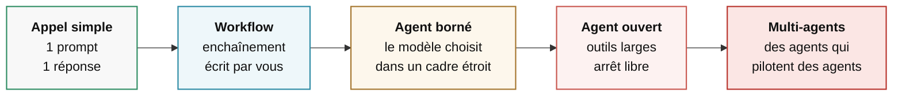

# Comment fonctionne un agent

<div class="opacity-50 pt-2">les fondations</div>

---
layout: default
---

# « Orchestrateur », trois choses différentes

<div class="pt-2 text-xl pb-8">
C'est le mot du titre de la journée. Avant tout le reste : dire lequel des trois.
</div>

<div class="space-y-5 text-[1.15rem]">

<v-clicks>

<div class="rail">1 · <strong>Du code</strong> — la bibliothèque qui fait tourner un agent</div>
<div class="rail">2 · <strong>Un agent</strong> — celui qui découpe le travail et le distribue aux autres</div>
<div class="rail">3 · <strong>Un produit</strong> — la plateforme qui héberge et facture des agents</div>

</v-clicks>

</div>

<div v-click class="pt-10 text-base">
« On a mis un orchestrateur » — toujours demander lequel des trois.
</div>

<!--
Pourquoi on ouvre le module là-dessus : c'est le mot du titre de la journée,
et tant qu'on n'a pas dit lequel des trois, il ne veut rien dire.

Annoncer que les trois lignes sont des objets de nature différente — pas trois
niveaux d'une même pile. Un bout de code, un agent, un produit qu'on achète.

1 · Du code — la bibliothèque qui tient la boucle : appeler le modèle, exécuter
l'outil, ré-appeler le modèle. Quelques centaines de lignes. On l'ouvre dans
vingt minutes, et il prend son nom complet en fin de module : le harness.
Les mots qu'ils liront pour désigner ça : « runtime », « framework d'agents ».
Les poser à l'oral, une fois, sans les mettre à l'écran.

2 · Un agent — un agent dont le travail est de découper une tâche et de la
distribuer à d'autres agents. C'est le pattern « orchestrateur / exécutants »
du module 2.

3 · Un produit — la plateforme qui héberge, planifie, surveille et facture des
agents. C'est un sujet d'exploitation, pas d'architecture. Il revient au module 5.

Dire le découpage de la journée : aujourd'hui, surtout 1 et 2.

Pourquoi cette slide existe : cette ambiguïté fait perdre un temps considérable
en réunion. Quand quelqu'un dit « on a mis un orchestrateur », toujours demander
lequel des trois. Neuf fois sur dix, deux personnes autour de la table
ne parlent pas du même objet.
-->

---
layout: default
---

# Remettre le vocabulaire d'aplomb

| Terme | Ce que c'est vraiment |
|---|---|
| **Modèle** | Une fonction. Texte → texte. Sans état. |
| **Assistant** | Un modèle + une conversation. Il parle. |
| **Outil** | Une fonction de *votre* code. Il ne l'exécute pas. |
| **Workflow** | Un enchaînement **que vous avez écrit**. |
| **Agent** | Un modèle qui **choisit**, en boucle, jusqu'à un arrêt. |
| **Orchestrateur** | Ce qui tient la boucle. Voir slide précédente. |

<!--
Ne pas lire le tableau. Prendre le temps sur DEUX lignes seulement.

Ligne « Outil » — le contresens numéro un du grand public. Non, le modèle
n'exécute rien. Il émet une intention structurée. C'est votre serveur qui agit,
avec vos droits. On y revient dans trois slides et au module 5.

Ligne « Modèle » — sans état, sans mémoire, sans accès au monde. C'est la slide
d'après, la plus importante du module.

La confusion la plus coûteuse, à dire à l'oral : appeler « agent » un workflow.
Quand on appelle « agent » un workflow, on se met
à débugger de l'imprévisibilité qui n'existe pas — et inversement, quand on
appelle « workflow » un agent, on ne pose pas les bornes. Les deux erreurs
coûtent cher et se voient en production, pas en réunion.
-->

---
layout: center
class: text-center
---

<div class="kicker pb-5">La définition minimale, et il n'y en a pas d'autre</div>

# Un modèle.<br>Des outils.<br>Une boucle.

<!--
Marquer un temps. C'est une slide qu'on montre, pas qu'on commente.

Ce qu'on dit par-dessus : tout ce qu'on appellera « agent », « copilote »,
« collègue numérique » ou « employé IA » se ramène à ces trois éléments.
Le reste est de l'emballage — de l'interface, du marketing, de l'intégration.

Si quelqu'un cite un produit à la mode, faire l'exercice en direct :
où est le modèle, où sont les outils, où est la boucle. Ça marche à tous les coups.
-->

---
layout: default
---

# Un tour de boucle, en détail


<div class="pt-8 grid grid-cols-3 gap-8 text-base">
<div v-click><span class="font-semibold">Le modèle décide</span></div>
<div v-click><span class="font-semibold">Votre code agit</span></div>
<div v-click><span class="font-semibold">Le contexte grossit</span></div>
</div>

<!--
Dessiner ce schéma au tableau en parallèle. C'est le seul schéma que les gens
doivent pouvoir redessiner de mémoire à la fin de la journée. Le dire.

« Le modèle décide » — il ne répond pas. Il choisit : parler, ou appeler
tel outil avec tels arguments. C'est un choix, pas une réponse.

« Votre code agit » — requête HTTP, écriture de fichier, envoi de mail.
C'est ici et nulle part ailleurs qu'il y a un effet sur le monde.
C'est aussi ici, et nulle part ailleurs, qu'on met les garde-fous. → module 5.

« Le contexte grossit » — chaque tour ajoute une décision et une observation.
Rien n'est jamais retiré, sauf si VOUS le retirez. → module 4.

Souligner la flèche de retour au tableau : c'est elle, et rien d'autre,
qui fait la différence entre un appel d'API et un agent.
-->

---
layout: default
---

# Le fait que tout le monde oublie

<div class="text-2xl pb-8">Le modèle est <strong>sans état</strong>.<br>À l'étape 12, il ne se souvient de rien.</div>

<div class="grid grid-cols-2 gap-10">
<div>

<div class="eyebrow pb-3">Ce qu'il se passe réellement</div>

```text
Appel 1  : [système, user]
Appel 2  : [système, user, décision1, obs1]
Appel 3  : [système, user, décision1, obs1,
            décision2, obs2]
...
Appel 12 : [système, user, ×11 décisions,
            ×11 observations]
```

</div>
<div>

<v-clicks>

<div class="rail">Douze tours = <strong>douze appels</strong>, chacun relisant tout</div>
<div class="rail">Sa mémoire est un tableau que <strong>vous</strong> contrôlez</div>
<div class="rail">Une erreur à l'étape 3 pèse encore à l'étape 11</div>

</v-clicks>

</div>
</div>

<!--
LE moment clé du module. Si une seule idée passe ce matin, c'est celle-là.
Ralentir.

L'analogie qui fonctionne : un consultant amnésique à qui on redonne
l'intégralité du dossier avant chaque phrase. Il est brillant, mais il ne sait
que ce qui est dans le dossier — et il ne sait pas ce qu'il a oublié.

Conséquence 1 — le coût ne croît pas linéairement, il croît en carré.
Chiffres au module 3 : 20 étapes coûtent 210 fois une étape, pas 20 fois.

Conséquence 2 — vous pouvez couper, résumer, réordonner, mentir même.
C'est une décision d'ingénierie, PAS une propriété du modèle. Tout le module 4
découle de cette phrase.

Conséquence 3 — les agents se contaminent eux-mêmes. C'est ce qui explique
pourquoi les longues sessions dérivent. → module 3, mode d'échec « contamination ».

Si quelqu'un demande « et la mémoire persistante alors ? » : c'est un fichier
qu'on relit et qu'on réinjecte. Module 4. Ça ne contredit pas le sans-état,
ça le confirme.
-->

---
layout: default
---

# L'unité de compte s'appelle le token

<div class="pt-2 text-xl pb-8">
Le modèle ne lit pas des mots. Il lit des <strong>tokens</strong> — des fragments de texte.
</div>

<div class="grid grid-cols-2 gap-14">
<div>

<div class="eyebrow pb-3">Ordre de grandeur, en anglais</div>

<div class="space-y-2 text-[1.05rem]">
<div><span class="mono-value">1</span> token <span class="opacity-40">≈</span> <span class="mono-value">4</span> caractères</div>
<div><span class="mono-value">100</span> tokens <span class="opacity-40">≈</span> <span class="mono-value">75</span> mots</div>
<div class="text-t3">En français, il en faut davantage</div>
</div>

</div>
<div>

<v-clicks>

<div class="rail">Le <strong>contexte</strong> se mesure en tokens</div>
<div class="rail">La <strong>facture</strong> se compte en tokens</div>
<div class="rail">Entrée et sortie, <strong>deux tarifs</strong></div>

</v-clicks>

</div>
</div>

<SourceNote :items="[
  ['OpenAI, « What are tokens and how to count them? »', 'help.openai.com/en/articles/4936856'],
  ['Petrov et al., « Language Model Tokenizers Introduce Unfairness Between Languages », NeurIPS 2023', 'arxiv.org/abs/2305.15425'],
]" />

<!--
Pourquoi cette slide arrive ICI et pas ailleurs : on vient de dire « le contexte
grossit ». Grossit de combien, et ça coûte quoi ? Il faut l'unité maintenant,
sinon les modules 3 et 4 se font sans compteur.

Le mot est utilisé partout dans la journée à partir de maintenant — autant
qu'il soit posé une fois proprement.

CE QU'EST UN TOKEN, à dire simplement : un fragment de texte. Pas une lettre,
pas un mot. Le découpage est appris à l'entraînement, sur du texte : les
séquences fréquentes deviennent un seul token, les rares sont coupées en
morceaux. « bonjour » passe probablement d'un bloc ; un nom propre rare,
une référence bibliographique ou une formule chimique sont hachés.

LES ORDRES DE GRANDEUR sont ceux qu'OpenAI publie pour l'anglais :
1 token ≈ 4 caractères ≈ trois quarts d'un mot ; 100 tokens ≈ 75 mots ;
1 500 mots ≈ 2 048 tokens. Ne pas les donner comme une loi — c'est une règle
de pouce, éditeur par éditeur, et elle ne vaut que pour l'anglais.

LE FRANÇAIS COÛTE PLUS CHER, et c'est le point qui intéresse cette salle.
Le même contenu traduit ne fait pas le même nombre de tokens : les tokenizers
sont entraînés sur des corpus très majoritairement anglophones, donc l'anglais
est le mieux découpé. Ne PAS avancer de facteur chiffré pour le français,
je n'en ai pas de mesure propre — dire « davantage », c'est tout.
Le papier à citer si on me pousse : Petrov, La Malfa, Torr et Bibi,
« Language Model Tokenizers Introduce Unfairness Between Languages »,
NeurIPS 2023 — l'écart va jusqu'à un facteur 15 entre langues, ce qui se
traduit directement en écart de prix, de latence et de contexte utile.
Le mot du papier, « unfairness », est assumé : c'est une inégalité d'accès.

LES TROIS RAILS de droite, une phrase chacun :
— le contexte : la fenêtre est un budget en tokens, pas en pages ;
— la facture : les tarifs sont affichés au million de tokens ;
— deux tarifs : la sortie coûte typiquement quatre à cinq fois l'entrée.
Ordre de grandeur seulement, ça bouge tous les trimestres.

NE PAS ouvrir ici le coût de la boucle — c'est le module 3, et la slide
suivante a déjà de quoi occuper la salle.
-->

---
layout: default
---

# Chaque modèle a son propre token

<div class="pt-2 text-xl pb-7">
Le <strong>même texte</strong> ne fait pas le même nombre de tokens d'un modèle à l'autre.
</div>

<div class="grid grid-cols-[1.05fr_1fr] gap-12 items-start">
<div>

<div class="pt-2 text-meta">Image tirée du fil de T. Sottiaux, X, 2026</div>
</div>
<div class="space-y-6">
<div v-click class="card">

<div class="eyebrow">La pizza d'en face</div>

<div class="pt-3 space-y-1 text-[1.05rem]">
<div><span class="mono-value">8</span> parts <span class="opacity-40">×</span> <span class="mono-value">2,00 €</span></div>
<div class="text-2xl pt-1"><span class="mono-value">16 €</span></div>
</div>

</div>
<div v-click class="card-warn">

<div class="eyebrow !text-warn">« Moins cher la part »</div>

<div class="pt-3 space-y-1 text-[1.05rem]">
<div><span class="mono-value">16</span> parts <span class="opacity-40">×</span> <span class="mono-value">1,25 €</span></div>
<div class="text-2xl pt-1"><span class="mono-value">20 €</span></div>
</div>

</div>
</div>
</div>

<div v-click class="pt-8 text-lg font-medium">
Le prix par token ne dit pas la facture. Le seul chiffre honnête : <span class="text-accent">le coût d'une tâche menée à bout</span>.
</div>

<SourceNote label="D'après" :items="[
  ['T. Sottiaux, « On tokens and prices per token », X, 2026', 'x.com/thsottiaux/status/2088866513008873560'],
  ['Anthropic, documentation Claude Sonnet 5 — nouveau tokenizer, ~30 % de tokens en plus', 'platform.claude.com/docs/en/models/sonnet-5/whats-new-sonnet-5'],
]" />

<!--
LA SLIDE QUI FAIT MAL AU BUDGET. Elle sert deux fois dans la journée : ici pour
le vocabulaire, et au module 5 quand on parle de facture.

L'IMAGE ARRIVE AVANT LES CHIFFRES : elle est à l'écran dès l'entrée sur la
slide, les deux cartes attendent un clic. Laisser la salle la lire, puis
raconter. Deux pizzas identiques. L'une est coupée en 8 parts à 2 €, l'autre en
16 parts à 1,25 €. La deuxième affiche la part la moins chère de la rue. La
pizza entière y coûte 20 € au lieu de 16. Votre estomac, lui, ne compte pas
les parts. Le visuel comme l'analogie viennent du fil de Thibault Sottiaux,
sur X, en 2026 — c'est écrit sous l'image, et le dire à voix haute vaut mieux
que de se faire attraper dessus.

LE TRANSFERT, mot pour mot : on compare les prix de l'IA en dollars par million
de tokens comme si le token était une unité normalisée, un gramme ou un
kilowattheure. Ça n'en est pas une. Chaque modèle a son propre découpage.
Le même texte, chez deux fournisseurs, ne fait pas le même nombre de tokens.
Donc un prix par token plus bas ne fait pas forcément une facture plus basse.

L'EXEMPLE CHIFFRÉ À DONNER, et je le choisis exprès CHEZ UN SEUL ÉDITEUR pour
qu'on ne me lise pas comme un comparatif. Anthropic a changé de tokenizer entre
Sonnet 4.6 et Sonnet 5 : le même texte produit environ 30 % de tokens en plus,
c'est écrit dans leur propre documentation. Sur la même période, le tarif est
passé de 3 $ à 2 $ le million de tokens d'entrée.
  — le tarif affiché baisse de 33 % ;
  — la facture, pour le même texte, baisse de 13 % (3,00 → 2,60 par unité).
Leur doc le dit elle-même : « le coût d'une requête équivalente ne baisse pas
proportionnellement aux prix par token ». Le calcul est reproductible au tableau,
et personne ne peut me soupçonner de tirer sur un concurrent.

L'AUTRE CHIFFRE, si quelqu'un demande une comparaison entre éditeurs — et
c'est là que la slide devient une leçon de méthode, à donner comme telle :
Sottiaux publie une petite comparaison sur quatre types de texte (anglais,
technique, multilingue, numérique) : 766 tokens pour GPT-5.6 Sol contre 1 170
estimés pour Claude Opus 5, soit 34,5 % de tokens en moins d'un côté — ou 53 %
de tokens en plus vu de l'autre, c'est le même fait retourné.
TROIS RÉSERVES À ÉNONCER, dans cet ordre :
1. Sottiaux est directeur produit chez OpenAI. La mesure vient d'une partie
   prenante.
2. Le nombre côté Claude est ESTIMÉ — le tokenizer d'Anthropic n'est pas public,
   il faut appeler leur API de comptage pour le connaître exactement.
3. C'est un échantillon, sur quatre types de texte. Le sens de l'écart peut
   s'inverser selon le domaine et selon la langue.
Et pourtant la direction est corroborée par l'autre camp : la doc d'Anthropic
prévient que le tokenizer d'OpenAI sous-compte les tokens Claude de 15 à 20 %
sur du texte courant, davantage sur du code et du non-anglais.
La leçon à faire dire à la salle : le fait technique tient, ET il faut
regarder qui mesure. Devant ce public-là, c'est cette deuxième moitié
qui vaut le détour.

CE QU'IL FAUT FAIRE, en pratique, à donner comme protocole en trois lignes :
prendre VOS textes ; les compter avec l'outil de comptage de chaque éditeur,
pas avec celui d'un autre ; multiplier par le tarif. Et ne jamais s'arrêter
au coût d'un appel : ce qui se compare, c'est le coût d'une tâche menée à bout —
un modèle moins cher qui s'y reprend à trois fois n'est pas moins cher.

ANTICIPER « alors lequel est le moins cher ? » : je ne réponds pas, et je dis
pourquoi. La réponse dépend de vos textes, de votre tâche, et elle aura changé
d'ici la fin du trimestre. Ce qui ne changera pas, c'est la méthode.
-->

---
layout: default
---

# Un outil, c'est du code que vous écrivez

<div class="grid grid-cols-2 gap-10 pt-2">
<div>

```ts
tool({
  description:
    "Prévisions météo pour une ville. " +
    "Renvoie température, vent, précipitations.",
  inputSchema: z.object({
    ville: z.string(),
    jours: z.number().default(3),
    unite: z.enum(["C", "F"]).default("C"),
  }),
  execute: async ({ ville, jours, unite }) => {
    return await api.previsions(ville, jours, unite)
  },
})
```

</div>
<div class="space-y-6 pt-4">

<v-clicks>

<div><span class="font-semibold text-warn">La description</span> — lue par le modèle</div>
<div><span class="font-semibold text-warn">Le schéma</span> — contraint la forme, pas le sens</div>
<div><span class="font-semibold text-warn">L'exécution</span> — sur votre machine, avec vos droits</div>

</v-clicks>

</div>
</div>

<!--
La description — c'est votre seule chance d'expliquer au modèle QUAND s'en servir.
Elle compte autant que le code, et personne ne la relit jamais. Formule à donner :
un outil est une API documentée pour un lecteur qui devine. Écrivez la description
pour un stagiaire compétent qui n'a jamais vu votre système. Ici, un seul mot
fait tout le travail : « prévisions ». Sans lui, le modèle appellera l'outil
pour demander le temps qu'il faisait hier.

Le schéma — traduit en contrainte de génération. Le modèle ne PEUT PAS produire
d'arguments invalides. Mais il peut produire des arguments valides et absurdes.
Deux exemples à donner : jours: 365 passe le schéma, alors qu'aucun service
ne prévoit le temps à un an. ville: "Springfield" passe aussi, et il en existe
des dizaines. La validation métier reste votre travail, entièrement.

L'exécution — sur votre machine, avec votre clé d'API et votre quota. Le modèle n'y a
aucun accès. Poser la phrase ici, elle rouvre au module 5 : un agent a exactement
les droits du processus qui exécute ses outils.
-->

---
layout: default
---

# Ce qui entoure le modèle a un nom

<div class="pt-2 text-xl pb-8">
Un agent, c'est un modèle <strong>plus tout le reste</strong>. Le reste s'appelle le <em>harness</em>.
</div>

<div class="space-y-4 text-[1.05rem]">

<v-clicks>

<div class="rail">Il <strong>assemble le contexte</strong> — prompt système, historique, descriptions d'outils</div>
<div class="rail">Il <strong>tient la boucle</strong> — appeler, exécuter, réinjecter, recommencer</div>
<div class="rail">Il <strong>décide de ce qui est permis</strong> — la liste d'outils, les approbations</div>
<div class="rail">Il <strong>exécute</strong> — sur une machine, avec des droits</div>

</v-clicks>

</div>

<div v-click class="pt-10 text-base">
À modèle identique, deux harness ne donnent pas le même agent.
</div>

<!--
Le mot d'abord : harness, on le garde en anglais, il n'a pas d'équivalent
français installé. En salle, dire « l'enveloppe » ou « ce qu'il y a autour »
et poser le mot anglais une fois, parce que c'est celui qu'ils liront partout.

L'autre mot qu'ils croiseront, avec sa provenance si on me la demande :
« scaffolding », employé par METR dès 2023 pour la même idée — l'échafaudage
autour du modèle, qu'on évalue séparément de lui. « Harness » est le terme plus
récent pour la même chose. Deux mots, un objet ; ça vaut la peine de le dire
à un public qui va lire des papiers.

C'est le sens 1 de la première slide du module — le bout de code qui fait tourner
l'agent — mais en plus large. Ce code tient la boucle ; le harness, c'est la boucle PLUS le prompt système,
PLUS la liste d'outils, PLUS les permissions, PLUS l'endroit où le code tourne.
Le faire remarquer : on a passé quarante minutes à décrire le harness sans
lui donner son nom. Maintenant il en a un.

POURQUOI CETTE SLIDE EXISTE, et c'est le vrai message :
quand une démo impressionne, le réflexe est de créditer le modèle. Très souvent,
ce qui fait la différence est ailleurs — dans le harness : quels outils sont
exposés, ce qu'on remet dans le contexte à chaque tour, quand on s'arrête.
Ne PAS chiffrer (« neuf fois sur dix ») : je n'ai pas de mesure à mettre
derrière, et c'est le genre de ratio qu'on me demandera de sourcer.
Le même modèle, mis dans deux enveloppes différentes, ne produit pas le même
travail. C'est une bonne nouvelle : c'est la partie que VOUS écrivez.

La conséquence pratique, à donner comme grille de lecture — devant un système
d'agents, la question utile est « que fait le harness ? », bien avant « quel
modèle ? ». Elle ressort telle quelle au module 5 et à la clôture.

À garder pour plus tard, ne pas ouvrir ici : la façon dont les outils arrivent
DANS le harness est devenue un sujet en soi. C'est la slide MCP du module 5.
-->

---
layout: default
---

# On change l'un sans changer l'autre

<div class="pt-2 text-xl pb-6">
Chaque éditeur livre les deux — le modèle <em>et</em> son enveloppe.
</div>

<div class="space-y-4 text-[1.05rem]">

<v-clicks>

<div class="flex gap-8 items-baseline">
<div class="w-28 shrink-0 font-mono text-sm opacity-50">Anthropic</div>
<div>Opus, Sonnet, Haiku, Fable <span class="opacity-50">→</span> <strong>Claude Code</strong></div>
</div>

<div class="flex gap-8 items-baseline">
<div class="w-28 shrink-0 font-mono text-sm opacity-50">OpenAI</div>
<div>GPT-5.6 Sol, Terra, Luna <span class="opacity-50">→</span> <strong>Codex</strong></div>
</div>

<div class="flex gap-8 items-baseline">
<div class="w-28 shrink-0 font-mono text-sm opacity-50">Google</div>
<div>Gemini <span class="opacity-50">→</span> <strong>Antigravity CLI</strong></div>
</div>

<div class="flex gap-8 items-baseline">
<div class="w-28 shrink-0 font-mono text-sm opacity-50">sans modèle</div>
<div><strong>OpenCode, Aider, Goose, Pi</strong> <span class="opacity-50">→</span> on y branche celui qu'on veut</div>
</div>

</v-clicks>

</div>

<div v-click class="pt-8 text-base">
Un éditeur retaille son harness pour chaque modèle. Vous pouvez écrire le vôtre.
</div>

<SourceNote :items="[
  ['Cursor, « Continually improving our agent harness », 2026', 'cursor.com/blog/continually-improving-agent-harness'],
  ['Google, « Transitioning Gemini CLI to Antigravity CLI », mai 2026', 'developers.googleblog.com'],
]" />

<!--
Pourquoi cette slide suit la précédente : « harness » reste un mot creux tant
qu'on ne l'a pas posé sur des noms qu'ils ont déjà entendus. Ils connaissent
tous des noms d'outils ; presque aucun ne sait lequel des deux objets le nom
désigne. La slide sert à ranger : à gauche des modèles, à droite des harness.

LA PHRASE À FAIRE PASSER : quand on dit « j'utilise Claude Code », on ne nomme
pas un modèle. On nomme une enveloppe, et le modèle qui tourne dedans se change
dans un menu. Inversement, « quel modèle utilisez-vous » est une question
incomplète — voir la grille de lecture de la slide précédente.

Le tableau, ligne par ligne :
— Anthropic : famille Claude 5 (Opus, Sonnet, Haiku, plus Fable) d'un côté,
  Claude Code de l'autre ;
— OpenAI : la famille GPT-5.6, déclinée en trois niveaux — Sol le plus capable,
  Terra intermédiaire, Luna le plus rapide et le moins cher — et Codex comme
  harness ;
— Google : Gemini côté modèle. ATTENTION AU NOM DU HARNESS, c'est récent : le
  Gemini CLI a été retiré au profit d'Antigravity CLI, annoncé à Google I/O le
  19 mai 2026, extinction pour les particuliers le 18 juin 2026, la commande
  passe de `gemini` à `agy`. Si quelqu'un dit « Gemini CLI », il n'a pas tort,
  il a six mois de retard — le dire comme ça. Source : blog développeurs de
  Google, « Transitioning Gemini CLI to Antigravity CLI ».

La quatrième ligne est celle qui prouve le titre : des harness qui n'ont aucun
modèle à eux. Pi, par exemple, annonce plus de quinze fournisseurs et le
changement de modèle en cours de session. C'est là qu'on voit que les deux
objets sont séparables : on peut faire tourner un modèle d'Anthropic dans un
harness qui n'est pas celui d'Anthropic.

NUANCE À DONNER SI ON ME POUSSE, parce qu'elle est vraie : le découplage ne
marche pas dans les deux sens. Les harness indépendants acceptent à peu près
tous les modèles ; les harness maison, eux, restent sur l'écurie de leur
éditeur. La liberté est du côté des outils tiers.

L'ANECDOTE, c'est la dernière ligne, et c'est celle qui vaut le détour : chez
Cursor, le harness est retaillé modèle par modèle. Le détail concret à citer —
les modèles d'OpenAI sont entraînés à éditer un fichier au format patch, ceux
d'Anthropic au remplacement de chaîne ; le harness sert donc à chaque modèle le
format qu'il a vu à l'entraînement, parce que l'autre « coûte des tokens de
raisonnement en plus et produit plus d'erreurs ». Même chose pour le prompt
système, réécrit par fournisseur et par version. Source : blog d'ingénierie de
Cursor, « Continually improving our agent harness ». NE PAS citer de chiffre de
gain : leur billet n'en donne pas, les pourcentages qui circulent viennent de
seconde main.

Ce que ça dit, et c'est le seul but de l'anecdote : le harness est tout sauf
une couche neutre au-dessus du modèle. Il est ajusté à un modèle donné, et cet
ajustement se voit dans le résultat.

« Vous pouvez écrire le vôtre » n'est pas une figure de style : Pi est un
harness minimal, MIT, écrit par un développeur (Mario Zechner), et l'écosystème
en compte des dizaines. Si on me demande « faut-il écrire le sien » : non, pas
pour coder au quotidien ; oui, dès qu'on veut un agent taillé pour un usage précis — corriger des copies,
préparer un TP — parce que c'est justement là que les harness génériques
n'ont rien de prévu.

NEUTRALITÉ, à dire une fois : cette liste n'est pas un classement et je ne
recommande rien. Ce sont des noms pour accrocher le concept. Couper court à
« lequel est le meilleur » : ça dépend du modèle, du dépôt et de la tâche, et
la réponse aura changé d'ici la fin du trimestre.

ENCHAÎNEMENT SUR LE LABO, à dire juste avant d'ouvrir l'écran :
« dans deux minutes vous allez taper une phrase, et il va aller faire des
choses. Ce qui se passe entre votre phrase et sa réponse n'est pas dans le
modèle — le modèle ne sait même pas que ça existe. C'est le harness. »
-->

---
layout: statement
class: text-center
---

# Labo 1

<div class="text-xl opacity-60 pt-6">
Une phrase. Dix cabinets comptables.
</div>

<div class="pt-14 text-sm opacity-50">
Quinze minutes. Vous tapez une ligne, vous regardez ce qui défile.
</div>

<!--
**LABO 1 · 15 MIN**

Ce labo sert aussi à vérifier que tout le monde arrive à se connecter.

**Déclaration à lire mot pour mot**

« L'outil qu'on va utiliser aujourd'hui, c'est le mien. Je vous le dis maintenant, avant que vous le découvriez tout seuls. Je le prends pour deux raisons : c'est le plus rapide pour avoir un agent qui tourne en deux minutes au lieu d'y passer la journée, et je peux le casser devant vous sans demander la permission à personne. Tout ce qu'on va y faire existe ailleurs : c'est le même modèle, les mêmes outils, la même boucle qu'on vient de voir. »

**Ce qu'ils font**

1. « Ouvrez l'agent qui porte votre prénom. » Prévoir 2 minutes.
2. « Tapez cette phrase, celle de ce matin. »

> Trouve-moi les dix cabinets comptables de Namur : nom, adresse,
> téléphone, site. Et dis-moi ceux que tu n'as pas pu vérifier.

3. « Regardez défiler. C'est tout ce que vous avez à faire. »

**Règle :** aucun réglage, aucune case et aucun menu. Si quelqu'un explore les onglets : « Fermez ça, on ne touche à rien aujourd'hui. »

**Débrief à main levée**

1. « Qui en a dix ? Qui en a moins de dix ? » Compter les mains, puis dire : « Même modèle, même phrase, quinze résultats différents. »
2. « Qui a un cabinet qu'il ne reconnaît pas, ou qui a fermé ? » Puis : « Gardez-le, c'est le sujet de tout l'après-midi. »
3. « Qu'est-ce qu'il a fait entre votre phrase et sa réponse ? »

Si personne ne répond : il a cherché, ouvert des pages, abandonné des pistes et recommencé. Le modèle a choisi les actions. Du code ordinaire les a exécutées.

**Ensuite :** passer directement à « Le curseur d'autonomie ».
-->

---
layout: default
---

# Le curseur d'autonomie

<div class="pt-2">



</div>

<div class="grid grid-cols-2 gap-12 pt-10 text-base">
<div v-click>

**Vers la droite, vous gagnez**
- les cas non prévus
- l'adaptabilité

</div>
<div v-click>

**Vers la droite, vous perdez**
- la prévisibilité
- la reproductibilité
- la maîtrise du coût
- l'explication d'un échec

</div>
</div>

<div v-click class="pt-8 text-center text-lg font-medium">
La bonne réponse est presque toujours <span class="text-ok">plus à gauche</span> que votre premier réflexe.
</div>

<!--
Règle de terrain à énoncer clairement, deux fois : commencez à gauche,
déplacez-vous vers la droite uniquement quand un cas réel vous y force,
jamais par anticipation.

Ce qu'on gagne aussi en allant à droite et qui n'est pas sur la slide :
du temps de développement initial. C'est le vrai piège — c'est plus rapide
à écrire, et beaucoup plus long à stabiliser.

Sur les projets que j'ai vus, ceux qui échouent ont presque tous démarré
trop à droite. Le dire À LA PREMIÈRE PERSONNE — « ma lecture », « ce que j'ai
vu » — et surtout PAS « la majorité des projets » : je n'ai pas de chiffre
public à mettre derrière, et devant cette salle-là ça se retourne.

Cette slide se relit à l'envers au module 3 : on y montre comment on ramène
un agent vers la gauche en refixant une partie de l'enchaînement.
-->

---
layout: default
---

# Pourquoi maintenant, et pas en 2022

<div class="pt-6 space-y-5 text-[1.05rem]">

<v-clicks>

<div class="flex gap-8 items-baseline">
<div class="w-16 shrink-0 font-mono text-sm opacity-50">2022</div>
<div>On parse la sortie à coups d'expressions régulières</div>
</div>

<div class="flex gap-8 items-baseline">
<div class="w-16 shrink-0 font-mono text-sm opacity-50">2023</div>
<div><strong>L'appel d'outils devient natif</strong></div>
</div>

<div class="flex gap-8 items-baseline">
<div class="w-16 shrink-0 font-mono text-sm opacity-50">2024</div>
<div>Le contexte passe à des centaines de milliers de tokens</div>
</div>

<div class="flex gap-8 items-baseline">
<div class="w-16 shrink-0 font-mono text-sm opacity-50">2025</div>
<div>À capacité égale, le token coûte cent fois moins qu'en 2023</div>
</div>

<div class="flex gap-8 items-baseline">
<div class="w-16 shrink-0 font-mono text-sm opacity-50">2026</div>
<div>La question devient <strong>« comment on le surveille »</strong></div>
</div>

</v-clicks>

</div>

<SourceNote :items="[
  ['Epoch AI, « LLM inference prices have fallen rapidly but unequally across tasks », 2025', 'epoch.ai/data-insights/llm-inference-price-trends'],
  ['a16z, « Welcome to LLMflation », G. Appenzeller, 2024', 'a16z.com/llmflation-llm-inference-cost'],
]" />

<!--
Le message d'ensemble, à dire en ouverture de la slide : rien de magique n'est
arrivé. Trois courbes d'ingénierie se sont croisées — sortie structurée,
taille de contexte, prix. L'agent est la conséquence, pas la cause.

2022 — les modèles savent écrire du texte. Pour les faire agir, on devine
leur sortie au regex. C'est fragile, et personne ne met ça en production.

2023 — le modèle émet un objet structuré, plus du texte à deviner.
C'est LE déclencheur technique de tout le reste. Si on ne retient qu'une date,
c'est celle-là.

2024 — une boucle de vingt étapes devient possible sans tout perdre en route.
SI ON ME CONTESTE LA DATE, et quelqu'un le fera : les premières fenêtres à
centaines de milliers de tokens sont de fin 2023 — GPT-4 Turbo 128 k et
Claude 2.1 200 k, tous deux en novembre 2023. Le million arrive en février 2024
avec Gemini 1.5 Pro. Je mets 2024 sur la frise parce que c'est l'année où ça
devient la norme et où on peut construire dessus, pas l'année de la première
annonce. Le dire comme ça, c'est défendable ; prétendre que rien n'existait
avant 2024 ne l'est pas.

2025 — la même boucle, à capacité égale, coûte cent fois moins qu'en 2023.
Ce qui était une démo devient un produit. C'est un changement économique,
pas technique.

DIRE LA FORMULATION EXACTE, elle porte tout : ce qui s'est effondré, c'est le
prix d'un NIVEAU DE CAPACITÉ donné. Le prix catalogue
d'un modèle de tête, lui, n'a pas été divisé par cent — Claude Sonnet est resté
à 3 $ le million de tokens d'entrée de 2024 à 2025. Si je dis « le prix par
token s'effondre » tout court, quelqu'un sortira son tableau de prix et aura
raison contre moi.

Les deux sources, si on me demande le chiffre. Epoch AI (« LLM inference prices
have fallen rapidly but unequally across tasks », 12 mars 2025) : à performance
constante, le prix baisse d'un facteur 9 à 900 par an selon le niveau visé,
environ 40 par an pour le niveau GPT-4 sur GPQA Diamond. a16z (« LLMflation »,
Guido Appenzeller) : facteur 10 par an à qualité constante. Dix par an sur deux
ans donne exactement cent. Le repère concret : GPT-4 à sa sortie, mars 2023,
30 $ le million de tokens d'entrée ; GPT-4o mini, juillet 2024, 0,15 $ pour un
niveau comparable. Cent fois moins est donc le bas de la fourchette.

ET LA DATE, même prudence qu'en 2024 : la pente est continue de 2023 à 2026,
2025 n'est pas l'année où tout tombe. Je la mets là parce que c'est l'année où
le cumul devient assez gros pour changer ce qu'on ose mettre en production.

2026 — attention à la date si on me la demande : les modèles de raisonnement,
eux, sont arrivés avant — o1-preview en septembre 2024, DeepSeek-R1 en janvier
2025. Ce qui appartient à 2026, c'est le déplacement du sujet : de « est-ce que ça marche » vers « comment on le
surveille, on le budgète et on le sécurise ». C'est exactement le plan
de l'après-midi.

Anticiper « et l'AGI dans tout ça » : hors sujet aujourd'hui, on parle
de systèmes qu'on déploie et qu'on facture. Ne pas s'y engager.
-->

---
layout: default
---

# Ce qu'il faut retenir du module 1

<div class="pt-8 space-y-5 text-lg">
<v-clicks>

<div class="flex gap-4"><span class="text-accent font-bold">1</span><div>Un agent = <strong>un modèle, des outils, une boucle</strong>.</div></div>

<div class="flex gap-4"><span class="text-accent font-bold">2</span><div>Le modèle <strong>décide</strong>, votre code <strong>agit</strong>.</div></div>

<div class="flex gap-4"><span class="text-accent font-bold">3</span><div>Sa mémoire est <strong>un tableau de messages que vous contrôlez</strong>.</div></div>

<div class="flex gap-4"><span class="text-accent font-bold">4</span><div>Plus d'autonomie = moins de prévisibilité. <strong>Commencez à gauche.</strong></div></div>

</v-clicks>
</div>

<v-click>
<div class="pt-12 opacity-50 text-sm">Pause 15 minutes. Ensuite : les cinq formes que prend l'orchestration.</div>
</v-click>

<!--
Point 2 — ajouter : la frontière est nette, et c'est exactement là que se placent
tous les garde-fous du module 5.

Point 3 — ajouter : l'autonomie est une décision d'ingénierie, elle se règle
dans le code. C'est le pont vers le module 4.

Reprendre les quatre points sans les lire, en regardant la salle.
Puis annoncer la pause avec l'heure de retour précise.
-->
