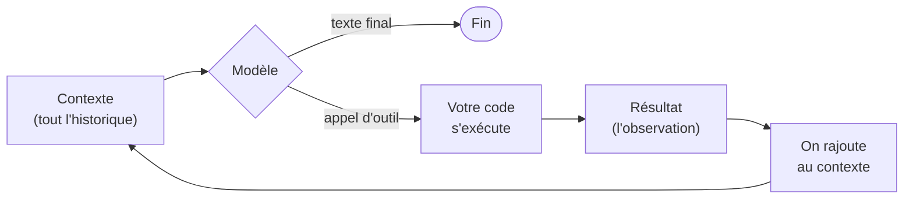
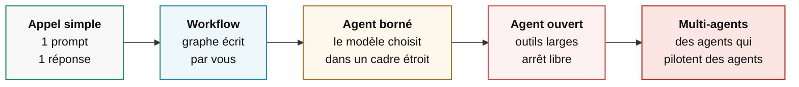

# Modèle, outils, boucle

<div class="opacity-50 pt-2">75 minutes · les fondations</div>

---
layout: default
---

# « Orchestrateur », trois sens différents

<div class="pt-4 space-y-5">

<div class="rail py-1">
<div class="font-semibold">1 · La couche technique</div>
<div class="opacity-70 text-sm pt-1">La bibliothèque qui tient la boucle : appeler le modèle, exécuter l'outil, ré-appeler le modèle. C'est un <em>runtime</em>.</div>
</div>

<div class="rail py-1">
<div class="font-semibold">2 · Le chef d'orchestre</div>
<div class="opacity-70 text-sm pt-1">Un agent dont le travail est de découper une tâche et de la distribuer à d'autres agents. C'est un <em>rôle</em>.</div>
</div>

<div class="rail py-1">
<div class="font-semibold">3 · La plateforme</div>
<div class="opacity-70 text-sm pt-1">Le produit qui héberge, planifie, surveille et facture des agents. C'est une <em>infrastructure</em>.</div>
</div>

</div>

<div class="pt-8 text-sm opacity-60">
Aujourd'hui on passe l'essentiel du temps sur <strong>1</strong> et <strong>2</strong>. On touche à <strong>3</strong> au module 5.
</div>

<!--
Cette ambiguïté fait perdre beaucoup de temps dans les discussions.
Quand quelqu'un dit "on a mis un orchestrateur", toujours demander lequel des trois.
-->

---
layout: default
---

# Remettre le vocabulaire d'aplomb

| Terme | Ce que c'est vraiment |
|---|---|
| **Modèle** | Une fonction. Texte en entrée, texte en sortie. Sans état, sans mémoire, sans accès au monde. |
| **Assistant** | Un modèle + une interface de conversation. Il parle, il n'agit pas. |
| **Outil** | Une fonction de *votre* code que le modèle peut demander à exécuter. Il ne l'exécute pas lui-même. |
| **Workflow** | Un enchaînement d'étapes **que vous avez écrit**. Le modèle remplit les cases. |
| **Agent** | Un modèle qui **choisit** ses actions dans une boucle, jusqu'à une condition d'arrêt. |
| **Orchestrateur** | Ce qui tient la boucle et coordonne. Voir slide précédente. |

<div class="pt-8 text-sm opacity-60">
La confusion la plus coûteuse : appeler « agent » un workflow. On se met alors à débugger de l'imprévisibilité qui n'existe pas.
</div>

<!--
Prendre le temps sur la ligne "Outil". C'est le contresens numéro un du grand public :
non, le modèle n'exécute rien. Il émet une intention structurée. C'est votre serveur qui agit.
-->

---
layout: center
class: text-center
---

<div class="kicker pb-5">La définition minimale, et il n'y en a pas d'autre</div>

# Un modèle.<br>Des outils.<br>Une boucle.

<div class="pt-12 text-base opacity-60 max-w-xl mx-auto">
Tout ce qu'on appellera « agent », « copilote », « collègue numérique » ou « employé IA »<br>se ramène à ces trois éléments. Le reste est de l'emballage.
</div>

---
layout: default
---

# Un tour de boucle, en détail



<div class="pt-6 grid grid-cols-3 gap-6 text-sm">
<div>
<div class="font-semibold pb-1">Le modèle décide</div>
<div class="opacity-70">Il ne « répond » pas. Il choisit : parler, ou appeler tel outil avec tels arguments.</div>
</div>
<div>
<div class="font-semibold pb-1">Votre code agit</div>
<div class="opacity-70">Requête HTTP, écriture de fichier, envoi de mail. C'est ici et nulle part ailleurs qu'il y a un effet réel.</div>
</div>
<div>
<div class="font-semibold pb-1">Le contexte grossit</div>
<div class="opacity-70">Chaque tour ajoute une décision et une observation. Rien n'est jamais retiré, sauf si vous le retirez.</div>
</div>
</div>

<!--
Dessiner ce schéma au tableau en parallèle. C'est le seul schéma que les gens doivent
pouvoir redessiner de mémoire à la fin de la journée.

Souligner la flèche de retour : c'est elle qui fait la différence entre un appel d'API et un agent.
-->

---
layout: default
---

# Le fait que tout le monde oublie

<div class="text-xl pb-6">Le modèle est <strong>sans état</strong>. À l'étape 12, il ne « se souvient » de rien.</div>

<div class="grid grid-cols-2 gap-8">
<div>

<div class="text-sm opacity-60 pb-2">Ce qu'on croit qu'il se passe</div>

```text
Vous  → « Trouve-moi X »
Agent → (réfléchit, cherche, se souvient)
Agent → « Voilà »
```

<div class="text-sm opacity-60 pb-2 pt-6">Ce qu'il se passe réellement</div>

```text
Appel 1 : [système, user]
Appel 2 : [système, user, décision1, obs1]
Appel 3 : [système, user, décision1, obs1,
           décision2, obs2]
...
Appel 12 : [système, user, ×11 décisions,
            ×11 observations]
```

</div>
<div>

<v-clicks>

**Trois conséquences immédiates**

1. Douze tours de boucle, c'est **douze appels au modèle** — et chacun relit tout ce qui précède. Le coût ne croît pas linéairement.

2. Sa « mémoire » est un tableau de messages que **vous** contrôlez. Vous pouvez couper, résumer, réordonner. C'est une décision d'ingénierie, pas une propriété du modèle.

3. Une erreur à l'étape 3 reste dans le contexte à l'étape 11, et continue d'influencer. **Les agents se contaminent eux-mêmes.**

</v-clicks>

</div>
</div>

<!--
LE moment clé du module. Si une seule idée passe ce matin, c'est celle-là.

Analogie utile : un consultant amnésique à qui on redonne l'intégralité du dossier
avant chaque phrase. Il est brillant, mais il ne sait que ce qui est dans le dossier.

Conséquence 3 : c'est ce qui explique pourquoi les longues sessions d'agent dérivent.
On y revient au module 4.
-->

---
layout: default
---

# Un outil, ce n'est pas ce que vous croyez

<div class="grid grid-cols-2 gap-8 pt-2">
<div>

```ts
tool({
  description:
    "Recherche des publications académiques. " +
    "Renvoie titre, auteurs, année, DOI.",
  inputSchema: z.object({
    query:  z.string(),
    year:   z.number().optional(),
    limit:  z.number().default(10),
  }),
  execute: async ({ query, year, limit }) => {
    return await api.search(query, year, limit)
  },
})
```

</div>
<div class="text-sm space-y-4 pt-2">

<div>
<span class="font-semibold text-warn">La description</span> est lue par le modèle. C'est votre seule chance de lui expliquer <em>quand</em> s'en servir. Elle compte autant que le code.
</div>

<div>
<span class="font-semibold text-warn">Le schéma</span> est traduit en contrainte de génération. Le modèle ne peut pas produire d'arguments invalides — mais il peut produire des arguments <em>valides et absurdes</em>.
</div>

<div>
<span class="font-semibold text-warn">L'exécution</span> tourne sur votre machine, avec vos droits, vos clés, votre base de données. Le modèle n'y a aucun accès.
</div>

<div class="pt-2 opacity-70">
Un outil est une <strong>API documentée pour un lecteur qui devine</strong>. Écrivez la description pour un stagiaire compétent qui n'a jamais vu votre système.
</div>

</div>
</div>

<!--
Insister sur "valides et absurdes" : le schéma garantit la forme, jamais le sens.
limit: 10000 est valide. year: 1823 pour une recherche sur les LLM est valide.
La validation métier reste votre travail.
-->

---
layout: default
---

# Le curseur d'autonomie

<div class="pt-2">



</div>

<div class="grid grid-cols-2 gap-10 pt-8 text-sm">
<div>

**En allant vers la droite, vous gagnez**
- de la couverture de cas non prévus
- de l'adaptabilité aux entrées inattendues
- du temps de développement initial

</div>
<div>

**En allant vers la droite, vous perdez**
- la prévisibilité du résultat
- la reproductibilité d'une exécution à l'autre
- la maîtrise du coût et de la latence
- la capacité à expliquer un échec

</div>
</div>

<div class="pt-6 text-center text-base font-medium">
La bonne réponse est presque toujours <span class="text-ok">plus à gauche</span> que votre premier réflexe.
</div>

<!--
Règle de terrain à énoncer clairement : commencez à gauche, déplacez-vous vers la droite
uniquement quand un cas réel vous y force, jamais par anticipation.

La majorité des échecs de projets "agents" viennent d'un démarrage trop à droite.
-->

---
layout: default
---

# Pourquoi maintenant, et pas en 2022

<div class="pt-4 space-y-4">

<div class="flex gap-6 items-start">
<div class="w-24 shrink-0 font-mono text-sm opacity-50 pt-1">2022</div>
<div>Les modèles savent écrire du texte. Pour les faire agir, on parse leur sortie à coups d'expressions régulières. C'est fragile et personne ne met ça en production.</div>
</div>

<div class="flex gap-6 items-start">
<div class="w-24 shrink-0 font-mono text-sm opacity-50 pt-1">2023</div>
<div><strong>L'appel d'outils devient natif.</strong> Le modèle émet un objet structuré, pas du texte à deviner. C'est le déclencheur technique de tout le reste.</div>
</div>

<div class="flex gap-6 items-start">
<div class="w-24 shrink-0 font-mono text-sm opacity-50 pt-1">2024</div>
<div>Les fenêtres de contexte passent de quelques milliers à quelques centaines de milliers de tokens. Une boucle de vingt étapes devient possible sans tout perdre en route.</div>
</div>

<div class="flex gap-6 items-start">
<div class="w-24 shrink-0 font-mono text-sm opacity-50 pt-1">2025</div>
<div>Le coût par token s'effondre d'environ deux ordres de grandeur. Une boucle qui coûtait 15 € en coûte 0,30 €. <strong>Ce qui était une démo devient un produit.</strong></div>
</div>

<div class="flex gap-6 items-start">
<div class="w-24 shrink-0 font-mono text-sm opacity-50 pt-1">2026</div>
<div>Les modèles de raisonnement planifient sur plusieurs étapes avant d'agir. Le sujet se déplace de « est-ce que ça marche » vers <strong>« comment on le surveille, on le budgète et on le sécurise »</strong>.</div>
</div>

</div>

<!--
Le message : rien de magique n'est arrivé. Trois courbes d'ingénierie se sont croisées —
sortie structurée, taille de contexte, prix. L'agent est la conséquence, pas la cause.

Anticiper la question "et l'AGI dans tout ça" : hors sujet aujourd'hui, on parle
de systèmes qu'on déploie et qu'on facture.
-->

---
layout: default
---

# Ce qu'il faut retenir du module 1

<div class="pt-6 space-y-4 text-lg">
<v-clicks>

<div class="flex gap-4"><span class="text-accent font-bold">1</span><div>Un agent = <strong>un modèle, des outils, une boucle</strong>. Rien de plus.</div></div>

<div class="flex gap-4"><span class="text-accent font-bold">2</span><div>Le modèle <strong>décide</strong> ; votre code <strong>agit</strong>. La frontière est nette et c'est là que se placent tous les garde-fous.</div></div>

<div class="flex gap-4"><span class="text-accent font-bold">3</span><div>Le modèle est sans état. Sa mémoire est <strong>un tableau de messages que vous contrôlez</strong>.</div></div>

<div class="flex gap-4"><span class="text-accent font-bold">4</span><div>Plus d'autonomie = plus de couverture, moins de prévisibilité. <strong>Commencez à gauche.</strong></div></div>

</v-clicks>
</div>

<div class="pt-10 opacity-50 text-sm">Pause 15 minutes. Ensuite : les cinq formes que prend l'orchestration.</div>
