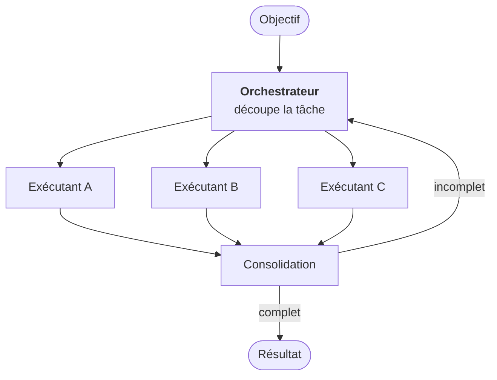
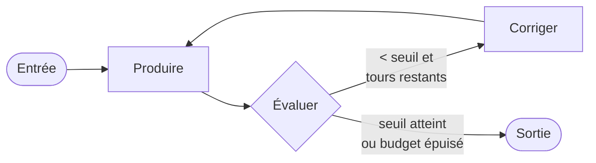

# Les cinq patterns d'orchestration

<div class="opacity-50 pt-2">l'enchaînement est écrit par vous</div>

---
layout: default
---

# Le principe du workflow

<div class="text-2xl pt-4 pb-10">
Vous écrivez l'enchaînement.<br>Le modèle remplit les cases.
</div>

<div class="grid grid-cols-2 gap-x-14 text-base">
<div v-click class="card">

<div class="eyebrow">Vous gardez</div>

<div class="pt-3">

- l'ordre des étapes
- le nombre d'appels, donc le coût
- la reproductibilité
- un point de reprise

</div>

</div>
<div v-click class="card">

<div class="eyebrow">Vous déléguez</div>

<div class="pt-3">

- le contenu de chaque étape
- le langage naturel
- classer, extraire, rédiger

</div>

</div>
</div>

<div v-click class="mt-10 callout-cool">
Cinq patterns couvrent la quasi-totalité des cas réels. Ils se combinent.
</div>

<SourceNote label="D'après" :items="[
  ['Anthropic, « Building Effective Agents », déc. 2024', 'anthropic.com/research/building-effective-agents'],
]" />

<!--
Bien poser que ces cinq patterns ne sont pas une taxonomie académique mais
un vocabulaire d'atelier. L'intérêt est de pouvoir dire « ça, c'est du routage »
en réunion, et que tout le monde voie la même chose.

D'OÙ ILS VIENNENT, à créditer d'une phrase — devant des chercheurs, on ne
présente pas comme sien un découpage qu'on a repris : ces cinq-là sont la
nomenclature de « Building Effective Agents », publié par Anthropic en décembre
2024 (prompt chaining, routing, parallelization, orchestrator-workers,
evaluator-optimizer). Je la reprends parce qu'elle s'est imposée dans le métier,
pas parce qu'elle fait autorité. Le dire tôt évite qu'on me le fasse remarquer
tard.

Sur « vous gardez » : le point le plus sous-estimé est la reprise après panne.
Un workflow s'arrête à l'étape 4 et redémarre à l'étape 4. Un agent, non.

Sur le callout : un vrai système en empile généralement deux ou trois.
Un routage en entrée, une parallélisation au milieu, un évaluateur en sortie.
On les présente séparément pour les nommer, pas parce qu'on les utilise seuls.
-->

---
layout: default
---

# 1 · Chaînage séquentiel

<div class="grid grid-cols-[1.05fr_1fr] gap-8 pt-1 compact">
<div class="min-w-0">


```ts
const brouillon = await generate(
  "Rédige un énoncé d'exercice sur " + sujet)

// contrôle déterministe, sans modèle
const ok = brouillon.length > 200
        && brouillon.includes("Consigne")

const final = await generate(
  "Reformule pour un bachelier 2 : " + brouillon)
```

</div>
<div class="space-y-5 pt-3">

<v-clicks>

<div class="rail"><strong>Quand</strong> — la séquence est fixe</div>
<div class="rail"><strong>Un cas</strong> — énoncé → contrôle → corrigé</div>
<div class="rail"><strong>Le piège</strong> — l'erreur d'une étape s'amplifie</div>
<div class="rail"><strong>Coût</strong> — <em>n</em> étapes, <em>n</em> appels</div>

</v-clicks>

</div>
</div>

<!--
Le contrôle entre étapes est le vrai apport du pattern. Un chaînage sans contrôle,
c'est juste un prompt plus long, et souvent moins bon.

« La séquence est fixe » = connue d'avance et indépendante de l'entrée.
Si elle change selon l'entrée, c'est du routage, slide suivante.

Le piège développé : l'erreur de l'étape 1 est amplifiée par l'étape 3, pas
corrigée. D'où la règle : mettre des contrôles DÉTERMINISTES entre les maillons —
une longueur, une regex, un schéma — pas un second modèle qui hallucine son accord.

Le coût est parfaitement prévisible. C'est la valeur du pattern, à mettre en face
de l'agent de cet après-midi dont le coût ne l'est pas.
-->

---
layout: default
---

# 2 · Routage

<div class="grid grid-cols-[1.05fr_1fr] gap-8 pt-1 compact">
<div>


```ts
const { categorie, confiance } = await generateObject({
  model: petitModele,           // rapide, peu cher
  schema: z.object({
    categorie: z.enum([
      "administratif", "pedagogique", "technique"]),
    confiance: z.number().min(0).max(1),
  }),
  prompt: mail,
})

if (confiance < 0.7) return escaladeHumaine(mail)
```

</div>
<div class="space-y-5 pt-3">

<v-clicks>

<div class="rail"><strong>Quand</strong> — les entrées sont hétérogènes</div>
<div class="rail"><strong>Un cas</strong> — les mails d'un secrétariat</div>
<div class="rail"><strong>Le levier</strong> — un petit modèle trie, un grand traite</div>
<div class="rail"><strong>Jamais sans</strong> — la route « je ne sais pas »</div>

</v-clicks>

</div>
</div>

<!--
Le levier économique : un petit modèle classe tout, un grand ne traite que ce
qui le mérite. Ne PAS annoncer un facteur tout fait — il dépend entièrement des
deux modèles et de la part de cas simples. Ce qui est vérifiable et qu'on peut
donner : l'écart de prix catalogue entre un petit et un grand modèle d'une même
famille est d'un ordre de grandeur, donc le gain suit la part du trafic qu'on
arrive à faire traiter par le petit. Si on me demande un chiffre, sortir celui
du jour, depuis la page de tarifs, pas de mémoire.

La route « doute » : un routeur sans porte de sortie envoie de travers, avec aplomb.
C'est le défaut de conception le plus fréquent sur ce pattern. Insister.

Sur le score de confiance — point technique important : c'est une
auto-évaluation du modèle, sans calibration statistique derrière. Utile comme
signal relatif, jamais comme garantie. Le seuil (0,7 ici) se règle empiriquement sur
un jeu de cas réels, il n'a aucune valeur théorique.
-->

---
layout: default
---

# 3 · Parallélisation

<div class="grid grid-cols-[1.05fr_1fr] gap-8 pt-1 compact">
<div>


```ts
const [methodo, sources, forme] = await Promise.all([
  lire(texte, "rigueur méthodologique"),
  lire(texte, "qualité et actualité des sources"),
  lire(texte, "structure et langue"),
])

const synthese = await generate(
  "Consolide ces trois relectures : " + ...)
```

</div>
<div class="space-y-5 pt-3">

<v-clicks>

<div class="rail"><strong>Quand</strong> — plusieurs regards sur un même objet</div>
<div class="rail"><strong>Un cas</strong> — pré-relire un mémoire sur trois axes</div>
<div class="rail"><strong>Le coût</strong> — en argent, pas en temps</div>
<div class="rail"><strong>Le vrai travail</strong> — l'agrégation</div>

</v-clicks>

</div>
</div>

<!--
Pourquoi c'est mieux qu'un seul prompt qui demande les trois choses :
trois contextes séparés, trois attentions pleines. La formule courte —
« à qui on demande trois choses en fait deux bien et une mal » — est une image,
pas un résultat mesuré : la donner comme telle (« mon expérience »), sans
la chiffrer. Ce qui est documenté et qu'on peut avancer, c'est la dégradation
de l'attention quand le contexte s'allonge : voir la slide « le contexte est
un budget » du module 4 et ses sources.

Le coût : trois appels simultanés, une seule latence. On paie trois fois
en argent, une seule fois en temps d'attente. Souvent le bon échange.

L'agrégation est là où se joue la qualité : trois avis qui se contredisent,
il faut décider qui tranche. Ne pas déléguer ça à un quatrième modèle
sans y réfléchir — c'est le cas d'usage typique où un humain doit voir
les trois avis bruts.

Ce pattern revient au module 6, cas 2, sur la pré-relecture.
-->

---
layout: default
---

# 4 · Orchestrateur et exécutants

<div class="grid grid-cols-[0.95fr_1.05fr] gap-8 pt-1">
<div>



</div>
<div class="space-y-5 pt-6">

<v-clicks>

<div class="rail"><strong>La différence</strong> — ici <strong>le modèle décide</strong> du découpage</div>
<div class="rail"><strong>Un cas</strong> — « construis un syllabus de 12 séances »</div>
<div class="rail"><strong>Le piège</strong> — il ne voit pas les exécutants travailler</div>
<div class="rail"><strong>Le garde-fou</strong> — plafonner, et valider le plan avant</div>

</v-clicks>

</div>
</div>

<!--
La différence avec la parallélisation, développée : là-bas vous connaissiez
d'avance le nombre et la nature des sous-tâches. Ici, non. C'est le premier
pattern vraiment agentique de la liste — le curseur du fil rouge vient
de se déplacer. Le nommer explicitement.

L'exemple du syllabus : l'orchestrateur décide qu'il faut douze exécutants,
un par séance, plus un pour la bibliographie. Vous n'aviez pas écrit « douze ».

Le piège, développé : l'orchestrateur ne voit pas ce que font les exécutants
pendant qu'ils travaillent. S'il a mal découpé, il ne le découvre qu'à la fin,
après avoir tout payé. C'est le premier pattern où on peut brûler un budget
sur un mauvais plan.

Le garde-fou « valider le plan avant de lancer » est un pattern à part entière :
plan-then-execute. Un humain, ou un contrôle déterministe, approuve le découpage.
Ça coûte une interruption et ça évite de payer quarante sous-tâches inutiles.
-->

---
layout: default
---

# 5 · Évaluateur et optimiseur

<div class="grid grid-cols-[1.05fr_1fr] gap-8 pt-1 compact">
<div>



```ts
let sortie = await produire(entree)

for (let i = 0; i < 3; i++) {
  const { score, retour } = await evaluer(sortie)
  if (score >= 0.8) break
  sortie = await corriger(sortie, retour)
}
// on sort TOUJOURS, avec ou sans le seuil
```

</div>
<div class="space-y-5 pt-3">

<v-clicks>

<div class="rail"><strong>Quand</strong> — un critère de qualité existe</div>
<div class="rail"><strong>La condition</strong> — l'évaluateur doit battre le producteur</div>
<div class="rail"><strong>Toujours</strong> — un budget d'itérations</div>
<div class="rail"><strong>Mieux</strong> — un évaluateur déterministe</div>

</v-clicks>

</div>
</div>

<!--
Exemple : traduire un support de cours en vérifiant que la terminologie
du domaine est respectée. Le critère est exprimable, une seconde passe améliore
réellement.

« L'évaluateur doit être plus fiable que le producteur » — c'est le point subtil
et le plus important. Si le même modèle produit et évalue avec un prompt à peine
différent, on obtient surtout de la confirmation, et on paie trois fois pour ça.
Ce qui marche : un évaluateur différent, ou un critère vérifiable mécaniquement.

Le budget : une boucle qualité sans plafond est une facture sans plafond.
Montrer la ligne du commentaire dans le code — on sort TOUJOURS, avec ou sans
le seuil. C'est la même idée que les bornes de l'agent, cet après-midi.

Un évaluateur déterministe — tests, schéma, compilation — bat un évaluateur-modèle
chaque fois qu'il est possible. Le chercher en premier, systématiquement.
-->

---
layout: default
---

# Choisir : la grille

<v-clicks at="+0" every="6">

| Vous êtes dans ce cas | Le pattern |
|---|---|
| La séquence est fixe | **Chaînage** |
| Les entrées sont hétérogènes | **Routage** |
| Plusieurs angles sur un même objet | **Parallélisation** |
| Le découpage dépend de l'entrée | **Orchestrateur / exécutants** |
| Un critère de qualité est vérifiable | **Évaluateur / optimiseur** |
| Vous ne savez pas dire les étapes | **Agent** — module 3 |
| Vous savez les dire, sans langage naturel | **Écrivez le code.** |

</v-clicks>

<div v-click class="mt-8 callout-bad">
La dernière ligne est celle qu'on oublie.
</div>

<!--
Cette grille est le livrable du module. La photographier, elle sert au module 6.

Développer la dernière ligne : un « if » se teste au unitaire, s'exécute en
microsecondes, coûte zéro et ne se trompe jamais. Un appel de modèle coûte une
latence réseau, une fraction de centime, et a un taux d'erreur non nul. Les
trois termes sont vrais sans chiffre — ne pas inventer « 200 ms, deux centimes,
une fois sur cinquante », c'est le genre de nombre qu'on me demandera de
sourcer. On l'oublie parce que l'appel de modèle s'écrit plus vite.

Question à poser à la salle avant de cliquer : « à votre avis, il manque
quelle ligne ? » Souvent quelqu'un trouve.
-->

---
layout: default
---

# Trois anti-patterns qu'on voit tout le temps

<div class="pt-8 space-y-6 text-[1.15rem]">
<v-clicks>

<div class="rail-bad">« Un agent pour tout » — trente outils, et on espère</div>

<div class="rail-bad">Le modèle comme colle — un appel pour reformater un JSON</div>

<div class="rail-bad">Le prompt géant — trois pages qui décrivent une séquence</div>

</v-clicks>
</div>

<!--
1 · Un agent pour tout — on donne trente outils à un modèle et on espère.
Résultat : il en utilise cinq, se trompe d'outil, boucle. Un système d'agents
se conçoit comme un organigramme : des rôles étroits, des périmètres clairs.

2 · Le modèle comme colle — un appel pour reformater un JSON, extraire une date,
choisir entre deux branches booléennes. C'est cher, lent, et non déterministe
pour un travail que du code fait parfaitement. C'est la dernière ligne
de la grille précédente, en pratique.

3 · Le prompt géant — trois pages d'instructions qui décrivent un enchaînement
d'étapes. C'est le plus fréquent chez les débutants parce que c'est le plus
facile à écrire. La reformulation à donner, elle marque : « si tu peux le décrire,
code-le ; garde le modèle pour ce que tu ne peux pas décrire ».
Et surtout : dans le code, la séquence sera RESPECTÉE. Dans le prompt, non.
-->

---
layout: default
---

# Ce qu'il faut retenir du module 2

<div class="pt-8 space-y-5 text-lg">
<v-clicks>

<div class="flex gap-4"><span class="text-accent font-bold">1</span><div>Cinq patterns, et ils se <strong>combinent</strong>.</div></div>

<div class="flex gap-4"><span class="text-accent font-bold">2</span><div>Dans un workflow, coût et comportement sont <strong>prévisibles</strong>.</div></div>

<div class="flex gap-4"><span class="text-accent font-bold">3</span><div>Un contrôle <strong>déterministe</strong> bat un second modèle qui valide.</div></div>

<div class="flex gap-4"><span class="text-accent font-bold">4</span><div>Si vous savez énoncer les étapes, <strong>écrivez-les</strong> — en code.</div></div>

</v-clicks>
</div>

<v-click>
<div class="pt-12 opacity-50 text-sm">Déjeuner. Cet après-midi : ce qui se passe quand on retire l'enchaînement.</div>
</v-click>

<!--
Point 1 — les redonner de mémoire, sans regarder : chaînage, routage,
parallélisation, orchestrateur/exécutants, évaluateur/optimiseur.

Point 2 — c'est la valeur principale du workflow, pas un détail.

Point 4 — insister sur « en code, pas dans le prompt ».

Annoncer l'après-midi en une phrase : on retire l'enchaînement, et on regarde
ce qu'il faut remettre à la place.
-->
