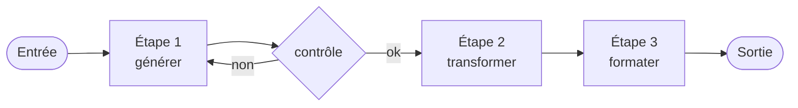
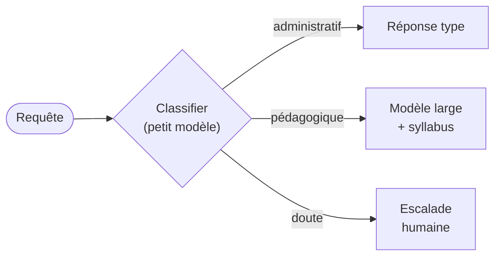
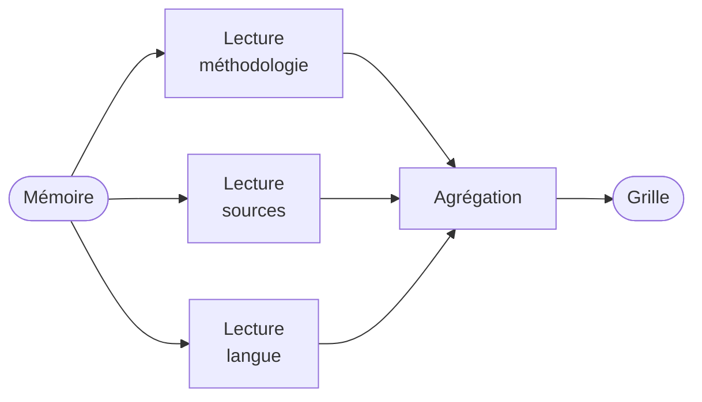
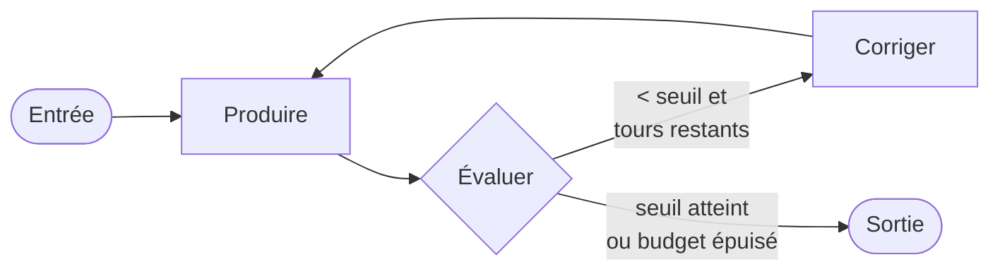

# Les cinq patterns d'orchestration

<div class="opacity-50 pt-2">l'enchaînement est écrit par vous</div>

<!--
**Transition :** passer de la boucle générale à cinq formes réutilisables pour organiser les décisions et les contrôles.
-->
---
layout: default
---

# Le principe du workflow

<div class="text-2xl pt-4 pb-10">
Vous écrivez l'enchaînement.<br>Le modèle remplit les cases.
</div>

<div class="grid grid-cols-2 gap-x-14 text-base">
<div v-click class="card">

<div class="eyebrow">Vous gardez</div>

<div class="pt-3">

- l'ordre des étapes
- le nombre d'appels, donc le coût
- la reproductibilité
- un point de reprise

</div>

</div>
<div v-click class="card">

<div class="eyebrow">Vous déléguez</div>

<div class="pt-3">

- le contenu de chaque étape
- le langage naturel
- classer, extraire, rédiger

</div>

</div>
</div>

<div v-click class="mt-10 callout-cool">
Cinq patterns couvrent la quasi-totalité des cas réels. Ils se combinent.
</div>

<SourceNote label="D'après" :items="[
  ['Anthropic, « Building Effective Agents », déc. 2024', 'anthropic.com/research/building-effective-agents'],
]" />

<!--
**Idée clé :** un workflow fixe l’enchaînement et rend coût, reprise et contrôle prévisibles.

- **Dire :** ces cinq patterns forment un vocabulaire d’atelier, pas une taxonomie académique.
- **Insister :** après une panne, un workflow peut reprendre à l’étape interrompue.
- **Préciser :** un système réel combine souvent routage, parallélisation et évaluation.

**Si question :** la nomenclature vient de « Building Effective Agents », Anthropic, décembre 2024.
-->

---
layout: default
---

# 1 · Chaînage séquentiel

<div class="grid grid-cols-[1.05fr_1fr] gap-8 pt-1 compact">
<div class="min-w-0">



```ts
const brouillon = await generate(
  "Rédige un énoncé d'exercice sur " + sujet)

// contrôle déterministe, sans modèle
const ok = brouillon.length > 200
        && brouillon.includes("Barème")

const final = await generate(
  "Reformule pour un bachelier 2 : " + brouillon)
```

</div>
<div class="space-y-5 pt-3">

<v-clicks>

<div class="rail"><strong>Quand</strong> — la séquence est fixe</div>
<div class="rail"><strong>Un cas</strong> — l'énoncé sort, on vérifie le barème, on reformule</div>
<div class="rail"><strong>Le piège</strong> — l'erreur d'une étape s'amplifie</div>
<div class="rail"><strong>Coût</strong> — <em>n</em> étapes, <em>n</em> appels</div>

</v-clicks>

</div>
</div>

<!--
**Idée clé :** la séquence reste identique quelle que soit l’entrée.

- **Montrer :** produire l’énoncé, vérifier le barème par du code, puis adapter le niveau.
- **Insister :** le contrôle entre les étapes fait la valeur du pattern.
- **Dire :** une erreur amont sera seulement mieux rédigée en aval. Préférer regex, schéma ou test déterministe.
- **Transition :** si l’étape suivante dépend de l’entrée, on passe au routage.
-->

---
layout: default
---

# 2 · Routage

<div class="grid grid-cols-[1.05fr_1fr] gap-8 pt-1 compact">
<div>



```ts
const { categorie, confiance } = await generateObject({
  model: petitModele,           // rapide, peu cher
  schema: z.object({
    categorie: z.enum([
      "administratif", "pedagogique", "technique"]),
    confiance: z.number().min(0).max(1),
  }),
  prompt: mail,
})

if (confiance < 0.7) return escaladeHumaine(mail)
```

</div>
<div class="space-y-5 pt-3">

<v-clicks>

<div class="rail"><strong>Quand</strong> — les entrées sont hétérogènes</div>
<div class="rail"><strong>Un cas</strong> — trois mails du même matin, trois destinations</div>
<div class="rail"><strong>Le levier</strong> — un petit modèle trie, un grand traite</div>
<div class="rail"><strong>Jamais sans</strong> — la route « je ne sais pas »</div>

</v-clicks>

</div>
</div>

<!--
**Idée clé :** un même point d’entrée conduit vers des traitements différents.

- **Montrer :** réponse type pour l’information publique, grand modèle pour le contenu du cours, humain pour la situation personnelle.
- **Insister :** prévoir une route « doute ». Sans elle, le routeur répond de travers.
- **Dire :** un petit modèle peut classer, le grand ne traite que les cas nécessaires.

**Si question :** le score de confiance est une auto-évaluation non calibrée. Régler le seuil sur des cas réels, jamais sur une valeur théorique.
-->

---
layout: default
---

# 3 · Parallélisation

<div class="grid grid-cols-[1.05fr_1fr] gap-8 pt-1 compact">
<div>



```ts
const [methodo, sources, langue] = await Promise.all([
  lire(texte, "rigueur méthodologique"),
  lire(texte, "qualité et actualité des sources"),
  lire(texte, "structure et langue"),
])

const synthese = await generate(
  "Consolide ces trois relectures : " + ...)
```

</div>
<div class="space-y-5 pt-3">

<v-clicks>

<div class="rail"><strong>Quand</strong> — plusieurs regards sur un même objet</div>
<div class="rail"><strong>Un cas</strong> — un mémoire, trois lectures : méthode, sources, langue</div>
<div class="rail"><strong>Le coût</strong> — en argent, pas en temps</div>
<div class="rail"><strong>Le vrai travail</strong> — l'agrégation</div>

</v-clicks>

</div>
</div>

<!--
**Idée clé :** plusieurs lectures connues à l’avance s’exécutent en même temps, dans des contextes séparés.

- **Montrer :** méthode, sources et langue. Le nombre « trois » a été décidé avant l’exécution.
- **Dire :** trois appels coûtent trois fois en argent, mais une seule latence.
- **Insister :** la qualité dépend de l’agrégation. Garder les avis bruts quand ils se contredisent.
- **Transition :** au cas suivant, le nombre de sous-tâches ne sera plus connu d’avance.
-->

---
layout: default
---

# 4 · Orchestrateur et exécutants

<div class="grid grid-cols-[0.95fr_1.05fr] gap-8 pt-1">
<div>


</div>
<div class="space-y-5 pt-6">

<v-clicks>

<div class="rail"><strong>La différence</strong> — ici <strong>le modèle décide</strong> du découpage</div>
<div class="rail"><strong>Un cas</strong> — « corrige cette erreur partout dans mon cours »</div>
<div class="rail"><strong>Le piège</strong> — il ne voit pas les exécutants travailler</div>
<div class="rail"><strong>Le garde-fou</strong> — plafonner, et valider le plan avant</div>

</v-clicks>

</div>
</div>

<!--
**Idée clé :** l’orchestrateur découvre lui-même les sous-tâches à lancer.

- **Montrer :** « corriger partout » devient quatorze passages, chacun confié à un exécutant.
- **Comparer :** en parallélisation, vous aviez écrit trois axes. Ici, le modèle découvre quatorze tâches.
- **Insister :** un mauvais découpage peut consommer tout le budget avant d’être visible.
- **Dire :** valider le plan avant exécution évite de lancer des dizaines de tâches inutiles.
-->

---
layout: default
---

# 5 · Évaluateur et optimiseur

<div class="grid grid-cols-[1.05fr_1fr] gap-8 pt-1 compact">
<div>



```ts
let sortie = await produire(entree)

for (let i = 0; i < 3; i++) {
  const { score, retour } = await evaluer(sortie)
  if (score >= 0.8) break
  sortie = await corriger(sortie, retour)
}
// on sort TOUJOURS, avec ou sans le seuil
```

</div>
<div class="space-y-5 pt-3">

<v-clicks>

<div class="rail"><strong>Un cas</strong> — traduire un cours, puis retraduire tant qu'un terme du glossaire manque</div>
<div class="rail"><strong>La condition</strong> — l'évaluateur doit battre le producteur</div>
<div class="rail"><strong>Toujours</strong> — un budget d'itérations</div>
<div class="rail"><strong>Mieux</strong> — un évaluateur déterministe</div>

</v-clicks>

</div>
</div>

<!--
**Idée clé :** la boucle corrige un écart mesurable jusqu’au seuil ou au plafond.

- **Montrer :** comparer la traduction à un glossaire, renvoyer seulement les termes incorrects, puis vérifier à nouveau.
- **Insister :** chercher d’abord un évaluateur déterministe comme un test, un schéma ou une compilation.
- **Dire :** l’évaluateur doit être plus fiable que le producteur.
- **Montrer :** la boucle possède toujours une sortie, même si le seuil n’est jamais atteint.
-->

---
layout: default
---

# Choisir : la grille

<v-clicks at="+0" every="6">

| Vous êtes dans ce cas | Le pattern |
|---|---|
| La séquence est fixe | **Chaînage** |
| Les entrées sont hétérogènes | **Routage** |
| Plusieurs angles sur un même objet | **Parallélisation** |
| Le découpage dépend de l'entrée | **Orchestrateur / exécutants** |
| Un critère de qualité est vérifiable | **Évaluateur / optimiseur** |
| Vous ne savez pas dire les étapes | **Agent** — module 3 |
| Vous savez les dire, sans langage naturel | **Écrivez le code.** |

</v-clicks>

<div v-click class="mt-8 callout-bad">
La dernière ligne est celle qu'on oublie.
</div>

<!--
**Idée clé :** choisir le pattern le plus simple qui garde le contrôle nécessaire.

- **Dire :** cette grille est le livrable du module. La photographier.
- **Demander avant le dernier clic :** « À votre avis, quelle ligne manque ? »
- **Insister :** si un `if` suffit, l’utiliser. Il est rapide, testable et déterministe, contrairement à un appel de modèle.
- **Éviter :** inventer des chiffres de latence, de prix ou d’erreur.
-->

---
layout: default
---

# Trois anti-patterns qu'on voit tout le temps

<div class="pt-8 space-y-6 text-[1.15rem]">
<v-clicks>

<div class="rail-bad">« Un agent pour tout » — trente outils, et on espère</div>

<div class="rail-bad">Le modèle comme colle — un appel pour reformater un JSON</div>

<div class="rail-bad">Le prompt géant — trois pages qui décrivent une séquence</div>

</v-clicks>
</div>

<!--
**Idée clé :** garder les rôles étroits et réserver le modèle aux décisions difficiles à coder.

- **Dire :** un agent avec trente outils choisit mal et boucle.
- **Dire :** utiliser un modèle pour reformater un JSON ou choisir un booléen ajoute coût, latence et erreur.
- **Dire :** un prompt géant ne garantit pas l’ordre des étapes.
- **Insister :** « Si vous pouvez décrire la séquence, codez-la. »
-->

---
layout: default
---

# Ce qu'il faut retenir du module 2

<div class="pt-8 space-y-5 text-lg">
<v-clicks>

<div class="flex gap-4"><span class="text-accent font-bold">1</span><div>Cinq patterns, et ils se <strong>combinent</strong>.</div></div>

<div class="flex gap-4"><span class="text-accent font-bold">2</span><div>Dans un workflow, coût et comportement sont <strong>prévisibles</strong>.</div></div>

<div class="flex gap-4"><span class="text-accent font-bold">3</span><div>Un contrôle <strong>déterministe</strong> bat un second modèle qui valide.</div></div>

<div class="flex gap-4"><span class="text-accent font-bold">4</span><div>Si vous savez énoncer les étapes, <strong>écrivez-les</strong> — en code.</div></div>

</v-clicks>
</div>

<v-click>
<div class="pt-12 opacity-50 text-sm">Déjeuner. Cet après-midi : ce qui se passe quand on retire l'enchaînement.</div>
</v-click>

<!--
**Idée clé :** les workflows rendent l’enchaînement explicite, contrôlable et testable.

- **Redonner :** chaînage, routage, parallélisation, orchestrateur/exécutants, évaluateur/optimiseur.
- **Insister :** prévoir la reprise après erreur.
- **Dire :** mettre les étapes connues dans le code, pas dans un prompt.
- **Transition :** cet après-midi, nous retirons l’enchaînement et cherchons ce qui doit le remplacer.
-->
