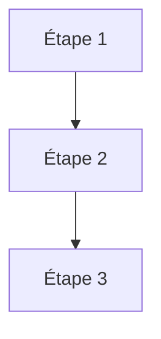
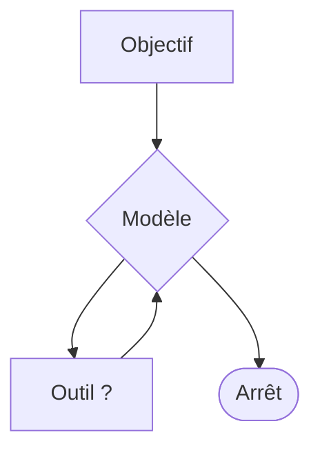

# L'agent autonome

<div class="opacity-50 pt-2">reprendre le contrôle de la boucle</div>

---
layout: statement
class: text-center
---

# Labo 2

<div class="text-xl opacity-60 pt-6">
Qui a lancé ça ?
</div>

<div class="pt-14 text-sm opacity-50">
Vingt minutes. Vous ne cliquez sur rien : vous lui parlez.
</div>

<!--
LABO 2 — 20 minutes, à 13h00 pile, AVANT la première slide du module.
C'est la reprise d'après-déjeuner : ils sont lourds, on les fait regarder
quelque chose avant de leur faire faire quelque chose.

TEMPS 1 — je tire, ils regardent (3 min).
Depuis le pupitre, j'appelle d'un coup les quinze adresses de déclenchement
préparées la veille. Les quinze agents de la salle démarrent en même temps.
Personne dans la salle n'a touché à son clavier.
Leur faire regarder le plateau, pas leur écran.
La phrase : « qu'est-ce qui a lancé cette boucle ? Pas vous. »

TEMPS 2 — le voisin (7 min).
Une seule phrase à écrire, en français, dans leur chat :
  « Demande à @prénom-du-voisin sur quel cours il travaille, et rapporte-moi
    sa réponse. »
Leur agent en appelle un autre — qui n'est pas le leur, qui appartient à la
personne assise à côté. La carte des prénoms est sur les tables.

TEMPS 3 — le rendez-vous (5 min).
Encore une phrase, pas un formulaire :
  « Donne-toi rendez-vous tous les lundis à 9h pour me résumer ma semaine. »
Il se crée la tâche tout seul. Leur faire vérifier qu'elle existe, puis lui
demander de la déclencher tout de suite pour ne pas attendre lundi.

DÉBRIEF (5 min), trois choses et pas une de plus :

1. Quatre façons de démarrer une boucle : vous lui écrivez, l'heure arrive,
   un autre service appelle, un autre agent l'appelle. Trois sur quatre se
   passent de vous. C'est ça, « autonome » — pas l'intelligence, le déclencheur.

2. L'ADRESSE DE DÉCLENCHEMENT EST LE MOT DE PASSE. Pas de signature, pas
   d'en-tête secret : qui détient l'URL déclenche votre agent. On y revient
   au module 5, slide « la combinaison à ne jamais réunir ».

3. « Est-ce que ça valait le coup d'avoir deux agents ? » — Non. On vient de
   payer deux boucles pour une info qu'un seul agent aurait trouvée. Le dire
   franchement : c'est la moitié de la slide « Multi-agents : quand ça aide,
   quand ça nuit » du module 4, qui se traitera en deux minutes en rappelant
   ce moment.

À GARDER POUR LE LABO 3 : chaque exécution planifiée ouvre une conversation
NEUVE. L'agent ne se souvient pas de lundi dernier. Ce qui traverse, c'est
autre chose, et c'est le sujet de 14h45.

REPLI : si le réseau lâche, je déroule les captures et ça devient une démo
commentée de 8 minutes. Le module tient quand même.
-->

---
layout: default
---

# Ce qui reste quand on retire l'enchaînement

<div class="grid grid-cols-2 gap-x-14">
<div v-click class="card">

<div class="eyebrow pb-4">Workflow</div>



<div class="pt-5 text-base">Vous savez le nombre d'appels, l'ordre, le coût.</div>

</div>
<div v-click class="card">

<div class="eyebrow pb-4">Agent</div>



<div class="pt-5 text-base">Vous savez seulement <strong>où ça s'arrête</strong>.</div>

</div>
</div>

<div v-click class="mt-10 callout-warn">
Vous échangez le contrôle de <strong>l'enchaînement</strong> contre le contrôle des <strong>bornes</strong>.
</div>

<!--
C'est la phrase-pivot de l'après-midi. Tout le reste du module ne fait que
détailler les bornes disponibles : arrêt, budget, périmètre d'outils, approbation.

À dire par-dessus la colonne de droite : vous ne savez ni le nombre d'étapes,
ni lesquelles, ni le coût. Vous savez où ça s'arrête — SI vous l'avez écrit.
Et si vous ne l'avez pas écrit, vous n'avez plus aucun contrôle du tout.
Marquer un temps sur cette dernière phrase.

Renvoyer au curseur d'autonomie du module 1 : on vient de sauter deux crans
vers la droite, et on va passer une heure à revenir un peu vers la gauche.
-->

---
layout: default
---

# L'agent minimal

```ts {all|2-8|10-13|15|all}
const agent = new Agent({
  model: "un-modele",
  instructions: `Tu réponds à des questions de règles de jeu.
    Trouve la notice officielle, vérifie que le lien répond, puis lis-la.
    Cite toujours la section d'où vient la règle.`,
  tools: { rechercher, verifierLien, lirePdf },

  stopWhen: [ stepCountIs(20), hasToolCall("rendreSynthese") ],
})

const resultat = await agent.generate({
  prompt: "Peut-on empiler les +2 au UNO ?",
})
```

<div class="pt-6 grid grid-cols-3 gap-8 text-base">
<div><span class="font-semibold text-warn">instructions</span> — le rôle</div>
<div><span class="font-semibold text-warn">tools</span> — le périmètre</div>
<div><span class="font-semibold text-warn">stopWhen</span> — les bornes</div>
</div>

<!--
Cliquer étape par étape, ne pas tout montrer d'un coup.

instructions — le rôle et les règles. Elles persistent à chaque tour, donc chaque
mot est repayé vingt fois. Un prompt système de 2 000 tokens sur 20 étapes,
c'est 40 000 tokens rien que pour les consignes. Le dire, ça surprend.

tools — le périmètre d'action. La phrase à poser ici, elle ressert au module 5 :
ce qui n'est pas dans cette liste ne peut pas arriver. Aucune instruction en
langue naturelle n'a la force d'une capacité absente.

stopWhen — la ligne la plus importante du fichier. C'est la slide suivante.

Préciser : la plupart des bibliothèques d'agents exposent une forme très voisine,
aux noms près. Cette structure vient du problème lui-même, et elle survit
au choix du produit.
-->

---
layout: default
---

# Les conditions d'arrêt

<div class="grid grid-cols-2 gap-12 pt-6">
<div>

<div class="space-y-4 text-base">
<v-clicks>
<div><span class="font-mono text-ok">naturellement</span> — il répond du texte</div>
<div><span class="font-mono text-cool">outil terminal</span> — il appelle l'outil final</div>
<div><span class="font-mono text-warn">budget</span> — le plafond est atteint</div>
<div><span class="font-mono text-bad">erreur</span> — exception, contexte, réseau</div>
</v-clicks>
</div>

</div>
<div>

```ts
stopWhen: [
  stepCountIs(20),
  hasToolCall("rendreSynthese"),
]
```

<div v-click class="pt-8 text-lg">
L'arrêt « naturel » est <strong>le moins fiable</strong>.
</div>

</div>
</div>

<!--
Développer les quatre :
— naturellement : le modèle estime avoir fini. C'est une déclaration, pas un fait.
— outil terminal : un arrêt EXPLICITE, bien plus fiable.
— budget : le garde-fou. Toujours présent.
— erreur : dépassement de contexte, coupure réseau, exception non rattrapée.

Le point à développer, c'est le « done tool », très sous-utilisé et très rentable.
Un modèle déclare volontiers avoir terminé une tâche qu'il n'a pas faite.
Le remède : un outil rendreSynthese que le modèle DOIT appeler pour finir,
avec un schéma qui exige les preuves — le tableau des liens vérifiés,
les sources retenues. Si le schéma exige un tableau non vide, il ne peut pas
conclure à vide.

La formule à donner : vous ne pouvez pas contrôler ce qu'il PENSE avoir fait.
Vous pouvez contrôler la FORME de sa sortie.
-->

---
layout: default
---

# Restreindre le périmètre selon la phase

<div class="pt-2">

```ts
prepareStep: ({ stepNumber, messages }) => {
  if (stepNumber < 5)
    return { activeTools: ["rechercher", "lirePdf"] }      // phase d'exploration

  if (stepNumber < 15)
    return { activeTools: ["verifierLien"] }               // phase de vérification

  return {
    activeTools: ["rendreSynthese"],                       // phase de rédaction
    model: "un-modele-plus-grand",
  }
}
```

</div>

<div v-click class="pt-8 text-center text-lg">
On refixe une partie de <strong>l'enchaînement</strong>.<br>
<span class="opacity-60 text-base">Le curseur revient vers la gauche.</span>
</div>

<!--
Pourquoi c'est efficace : un modèle à qui on présente vingt outils choisit moins
bien qu'un modèle à qui on en présente trois. Restreindre le menu améliore
la décision — et raccourcit le contexte au passage. Double gain.

Ce que ça permet aussi : changer de modèle en cours de route. Un modèle rapide
et bon marché pour explorer, un modèle large pour la synthèse finale.
La facture n'est pas la même, et la qualité non plus.

Le message de fond, à appuyer : « agent » et « workflow » ne sont pas deux camps.
On dose. Les meilleurs systèmes en production sont des agents dont on a
refixé une bonne partie de l'enchaînement.
-->

---
layout: statement
class: text-center
---

# Démonstration

<div class="text-xl opacity-60 pt-6">
La trace d'un agent qui déraille
</div>

<div class="pt-14 text-sm opacity-50">
Même consigne que ce matin. J'ai retiré une borne.
</div>

<!--
DÉMO 2 — une trace réelle et ratée, SAUVEGARDÉE À L'AVANCE en JSON, déroulée
lentement. Ne pas relancer en direct : on veut un échec reproductible,
pas la loterie. Captures de secours prêtes.

Même consigne que la démo du matin (l'empilage des +2 au UNO, cf. module 0),
relancée sans borne d'arrêt : l'agent cherche une règle officielle définitive
qui n'existe pas sous la forme qu'il attend, et il boucle. Le rappeler en une
phrase pour que la salle reconnaisse la tâche.

Ce qu'il faut faire voir, dans cet ordre :
1. l'étape où l'outil renvoie une erreur
2. l'étape où le modèle réinterprète l'erreur de travers
3. les trois étapes suivantes où il répète la même action avec une variation
   cosmétique, en annonçant à chaque fois qu'il progresse
4. l'étape finale où il annonce avoir réussi

Puis la question à poser à la salle, et attendre la réponse :
« à quelle étape auriez-vous coupé ? »

Enchaîner sur la slide suivante : ce qu'on vient de voir a un nom, et il y en a cinq.
-->

---
layout: default
---

# Les cinq modes d'échec

<div class="pt-8 space-y-5 text-[1.15rem]">

<v-clicks>

<div class="rail-bad">La boucle polie — il refait la même chose, poliment</div>
<div class="rail-bad">La dérive d'objectif — il résout un autre problème</div>
<div class="rail-bad">La fin déclarée — « j'ai vérifié les trois liens »</div>
<div class="rail-bad">La contamination — l'erreur de l'étape 3 pèse jusqu'au bout</div>
<div class="rail-bad">Le mauvais outil — deux descriptions trop voisines</div>

</v-clicks>

</div>

<div v-click class="pt-9 text-base">
Quatre sur cinq se corrigent <strong>sans toucher au modèle</strong>.
</div>

<!--
Ces cinq modes couvrent l'écrasante majorité des incidents. Quand on débugge
un agent, on commence par se demander lequel des cinq c'est — ça oriente
immédiatement le remède. Le dire comme une méthode, pas comme une liste.

1 · La boucle polie — il annonce qu'il progresse à chaque tour. Se détecte
mécaniquement, en comparant les arguments d'outil d'un tour à l'autre.

2 · La dérive d'objectif — il résout brillamment un sous-problème rencontré
en chemin et ne revient jamais à la demande initiale. Plus la boucle est longue,
plus c'est probable.

3 · La fin déclarée — il en a vérifié un sur trois. Le remède est structurel :
exiger les preuves dans le SCHÉMA DE SORTIE, pas dans le prompt. C'est le done tool
de tout à l'heure.

4 · La contamination — une donnée fausse entrée à l'étape 3 reste dans le contexte
jusqu'à l'étape 20 et oriente tout le reste. → module 4.

5 · Le mauvais outil — la cause est dans la rédaction des descriptions.
Relire les deux côte à côte, elles se ressemblent.

La phrase du bas est la bonne nouvelle du module : le réflexe « il faut un modèle
plus fort » est presque toujours faux.
-->

---
layout: default
---

# Le vrai coût d'une boucle

<div class="pt-6">

| Étape | Contexte relu | Cumulé |
|---|---|---|
| 1 | 2 000 tokens | 2 000 |
| 5 | 10 000 tokens | 30 000 |
| 10 | 20 000 tokens | 110 000 |
| 20 | 40 000 tokens | **420 000** |

</div>

<div v-click class="pt-9 text-lg">
Vingt étapes coûtent <strong>deux cent dix fois</strong> une étape.
</div>

<div class="pt-6 text-xs opacity-50">
Ordres de grandeur illustratifs. La mise en cache atténue la facture, pas la forme de la courbe.
</div>

<!--
Laisser la salle lire le tableau, puis dire la phrase. Elle produit son effet
toute seule.

Le tableau est arithmétiquement juste et il faut qu'il le reste — un public de
profs additionne. Modèle : le contexte relu à l'étape n vaut 2 000 × n, donc le
cumulé vaut 2 000 × n(n+1)/2. À vingt étapes : 2 000 × 210 = 420 000, soit
210 fois la première étape. Si on me sort le calcul, c'est un nombre
triangulaire, et c'est exactement le point : la croissance est quadratique.

Le pourquoi, à redire même si on l'a vu ce matin : chaque appel relit tout
ce qui précède. Le modèle est sans état. C'est la conséquence directe de la slide
« le fait que tout le monde oublie ».

Enchaîner : c'est ce qui rend le module 4 nécessaire. Gérer le contexte décide
si le système est viable économiquement.

Si on me demande le cache de préfixe : oui, ça réduit fortement la facture réelle,
non, ça ne change pas la forme quadratique de la courbe. Et le cache tombe
dès qu'on modifie le début du contexte — donc dès qu'on résume. Module 4.
-->

---
layout: default
---

# Ce qu'il faut retenir du module 3

<div class="pt-8 space-y-5 text-lg">
<v-clicks>

<div class="flex gap-4"><span class="text-accent font-bold">1</span><div>Passer à l'agent = échanger l'enchaînement contre <strong>les bornes</strong>.</div></div>

<div class="flex gap-4"><span class="text-accent font-bold">2</span><div>L'arrêt naturel est le moins fiable. Un <strong>outil terminal exigeant</strong>.</div></div>

<div class="flex gap-4"><span class="text-accent font-bold">3</span><div>Restreindre les outils par phase. <strong>Refixez l'enchaînement.</strong></div></div>

<div class="flex gap-4"><span class="text-accent font-bold">4</span><div>Quatre des cinq modes d'échec se corrigent <strong>sans changer de modèle</strong>.</div></div>

</v-clicks>
</div>

<!--
Point 1 — et si vous ne posez pas les bornes, vous n'avez aucun contrôle.
Point 3 — ça améliore la décision ET ça baisse la facture.
Point 4 — c'est le point qui fait gagner du temps aux gens. L'appuyer.

Enchaîner sans pause sur le module 4 : le contexte, la ressource rare.
-->
