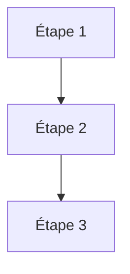

# L'agent autonome

<div class="opacity-50 pt-2">reprendre le contrôle de la boucle</div>

<!--
**Transition :** retirer l’enchaînement fixé par le workflow, puis examiner les bornes nécessaires pour garder le contrôle.
-->
---
layout: statement
class: text-center
---

# Labo 2

<div class="text-xl opacity-60 pt-6">
La même liste. En PDF.
</div>

<div class="pt-14 text-sm opacity-50">
Vingt minutes. Encore une phrase, et un fichier à ouvrir.
</div>

<!--
**Objectif :** observer deux déclencheurs et faire produire un PDF par un outil.

1. **Depuis le pupitre :** dire « Personne ne touche son clavier. Regardez le plateau, pas votre écran. », puis déclencher les quinze agents.
2. **Demander :** « Qu’est-ce qui a lancé la boucle ? » Réponse : un service, pas l’utilisateur.
3. **Faire :** rouvrir la conversation du matin et taper « Mets-moi cette liste en PDF, une fiche par cabinet. »
4. **Attendre :** chacun télécharge et ouvre réellement le PDF.

**Débrief :**
- Quatre déclencheurs : utilisateur, horaire, service ou autre agent.
- L’URL de déclenchement n’est pas protégée. Toute personne qui la possède peut lancer l’agent.
- Le modèle choisit la fonction et ses arguments. Le code produit le fichier et peut facturer.

**Rappel pour 14h45 :** au prochain labo, le PDF arrivera sans intervention.

**Si problème :** utiliser les captures et la démonstration commentée.
-->

---
layout: default
---

# Ce qui reste quand on retire l'enchaînement

<div class="grid grid-cols-2 gap-x-14">
<div v-click class="card">

<div class="eyebrow pb-4">Workflow</div>



<div class="pt-5 text-base">Vous savez le nombre d'appels, l'ordre, le coût.</div>

</div>
<div v-click class="card">

<div class="eyebrow pb-4">Agent</div>


<div class="pt-5 text-base">Vous savez seulement <strong>où ça s'arrête</strong>.</div>

</div>
</div>

<div v-click class="mt-10 callout-warn">
Vous échangez le contrôle de <strong>l'enchaînement</strong> contre le contrôle des <strong>bornes</strong>.
</div>

<!--
**Idée clé :** sans séquence fixe, on contrôle les bornes plutôt que les étapes.

- **Dire :** nombre d’étapes, actions précises et coût restent inconnus.
- **Insister :** on connaît la fin seulement si une condition d’arrêt a été écrite.
- **Faire :** marquer un silence après « Sans condition d’arrêt, vous n’avez plus de contrôle. »
- **Transition :** revenir vers la gauche du curseur grâce à l’arrêt, au budget, aux outils et à l’approbation.
-->

---
layout: default
---

# L'agent minimal

```ts {all|2-8|10-13|15|all}
const agent = new Agent({
  model: "un-modele",
  instructions: `Tu réponds à des questions de règles de jeu.
    Trouve la notice officielle, vérifie que le lien répond, puis lis-la.
    Cite toujours la section d'où vient la règle.`,
  tools: { rechercher, verifierLien, lirePdf },

  stopWhen: [ stepCountIs(20), hasToolCall("rendreSynthese") ],
})

const resultat = await agent.generate({
  prompt: "Peut-on empiler les +2 au UNO ?",
})
```

<div class="pt-6 grid grid-cols-3 gap-8 text-base">
<div><span class="font-semibold text-warn">instructions</span> — le rôle</div>
<div><span class="font-semibold text-warn">tools</span> — le périmètre</div>
<div><span class="font-semibold text-warn">stopWhen</span> — les bornes</div>
</div>

<!--
**Idée clé :** un agent minimal combine instructions, outils et condition d’arrêt.

- **Montrer :** révéler le code étape par étape.
- **Dire :** les instructions reviennent à chaque tour et sont repayées à chaque appel.
- **Insister :** un outil absent de la liste ne peut pas être utilisé. Cette absence protège mieux qu’un prompt.
- **Transition :** `stopWhen` est la ligne la plus importante.

**Si question :** 2 000 tokens d’instructions répétés sur 20 étapes représentent 40 000 tokens.
-->

---
layout: default
---

# Les conditions d'arrêt

<div class="grid grid-cols-2 gap-12 pt-6">
<div>

<div class="space-y-4 text-base">
<v-clicks>
<div><span class="font-mono text-ok">naturellement</span> — il répond du texte</div>
<div><span class="font-mono text-cool">outil terminal</span> — il appelle l'outil final</div>
<div><span class="font-mono text-warn">budget</span> — le plafond est atteint</div>
<div><span class="font-mono text-bad">erreur</span> — exception, contexte, réseau</div>
</v-clicks>
</div>

</div>
<div>

<v-switch at="1">

<template #1>

```ts
stopWhen: [
  // rien à écrire ici : dès qu'une étape
  // n'appelle aucun outil, la boucle rend
  // la main d'elle-même
]
```

</template>

<template #2>

```ts
stopWhen: [
  hasToolCall("rendreSynthese"),
]
```

</template>

<template #3>

```ts
stopWhen: [
  hasToolCall("rendreSynthese"),
  stepCountIs(20),
]
```

</template>

<template #4-6>

```ts
try {
  await agent.generate({ prompt })
} catch (err) {
  // hors de la boucle : elle ne s'arrête pas,
  // elle casse
}
```

</template>

</v-switch>

</div>
</div>

<div v-click="5" class="pt-10 text-lg">
L'arrêt « naturel » est <strong>le moins fiable</strong>.
</div>

<!--
**Idée clé :** une boucle fiable possède un arrêt explicite et un plafond dur.

- **Montrer :** fin naturelle, outil terminal, budget puis erreur.
- **Insister :** la fin naturelle reste une déclaration du modèle. Le budget doit toujours exister.
- **Dire :** un outil terminal impose une sortie structurée avec les preuves attendues.
- **Demander :** « À l’étape 14 sur 20, que reste-t-il après une panne ? »

**Si question :** le `try/catch` vit hors de la boucle. On ne contrôle pas ce que le modèle pense avoir fait, mais on contrôle la forme de sa sortie.
-->

---
layout: default
---

# Restreindre le périmètre selon la phase

<div class="pt-2">

```ts
prepareStep: ({ stepNumber, messages }) => {
  if (stepNumber < 5)
    return { activeTools: ["rechercher", "lirePdf"] }      // phase d'exploration

  if (stepNumber < 15)
    return { activeTools: ["verifierLien"] }               // phase de vérification

  return {
    activeTools: ["rendreSynthese"],                       // phase de rédaction
    model: "un-modele-plus-grand",
  }
}
```

</div>

<div v-click class="pt-8 text-center text-lg">
On refixe une partie de <strong>l'enchaînement</strong>.<br>
<span class="opacity-60 text-base">Le curseur revient vers la gauche.</span>
</div>

<!--
**Idée clé :** réduire les outils disponibles améliore le choix et raccourcit le contexte.

- **Dire :** proposer trois outils plutôt que vingt réduit les erreurs de sélection.
- **Montrer :** exploration avec un petit modèle, synthèse avec un modèle plus capable.
- **Insister :** agent et workflow se combinent. On peut refixer une partie de l’enchaînement.
- **Transition :** les systèmes stables dosent l’autonomie selon la phase.
-->

---
layout: statement
class: text-center
---

# Démonstration

<div class="text-xl opacity-60 pt-6">
La trace d'un agent qui déraille
</div>

<div class="pt-14 text-sm opacity-50">
Même consigne que ce matin. J'ai retiré une borne.
</div>

<!--
**Objectif :** reconnaître une boucle qui déraille dans une trace préparée.

- **Règle :** ne pas relancer en direct. Ouvrir la trace JSON sauvegardée.
- **Contexte :** « J’ai demandé si l’on peut empiler les +2 au UNO. J’ai retiré la borne d’arrêt. »
- **Montrer :** erreur d’outil, mauvaise interprétation, répétitions annoncées comme des progrès, puis réussite déclarée.
- **Demander :** « À quelle étape auriez-vous coupé ? » Attendre une réponse.
- **Transition :** nommer ensuite les cinq modes d’échec.

**Si problème :** garder les captures de secours prêtes.
-->

---
layout: default
---

# Les cinq modes d'échec

<div class="pt-8 space-y-5 text-[1.15rem]">

<v-clicks>

<div class="rail-bad">La boucle polie — il refait la même chose, poliment</div>
<div class="rail-bad">La dérive d'objectif — il résout un autre problème</div>
<div class="rail-bad">La fin déclarée — « j'ai vérifié les trois liens »</div>
<div class="rail-bad">La contamination — l'erreur de l'étape 3 pèse jusqu'au bout</div>
<div class="rail-bad">Le mauvais outil — deux descriptions trop voisines</div>

</v-clicks>

</div>

<div v-click class="pt-9 text-base">
Quatre sur cinq se corrigent <strong>sans toucher au modèle</strong>.
</div>

<!--
**Idée clé :** identifier le mode d’échec indique directement le type de remède.

- **Dire :** boucle polie, dérive d’objectif, fin déclarée, contamination, mauvais outil.
- **Montrer :** détecter la répétition en comparant les appels. Exiger les preuves dans le schéma de sortie.
- **Insister :** une donnée fausse reste dans le contexte et déforme les étapes suivantes.
- **Éviter :** conclure trop vite qu’il faut un modèle plus puissant. Vérifier d’abord boucle, bornes, contexte et descriptions.
-->

---
layout: default
---

# Le vrai coût d'une boucle

<div class="pt-6">

| Étape | Contexte relu | Cumulé |
|---|---|---|
| 1 | 2 000 tokens | 2 000 |
| 5 | 10 000 tokens | 30 000 |
| 10 | 20 000 tokens | 110 000 |
| 20 | 40 000 tokens | **420 000** |

</div>

<div v-click class="pt-9 text-lg">
Vingt étapes coûtent <strong>deux cent dix fois</strong> une étape.
</div>

<div class="pt-6 text-xs opacity-50">
Ordres de grandeur illustratifs. La mise en cache atténue la facture, pas la forme de la courbe.
</div>

<!--
**Idée clé :** relire tout le contexte à chaque tour produit une croissance quadratique.

- **Faire :** laisser la salle lire le tableau avant de commenter.
- **Dire :** à l’étape `n`, le modèle relit tout ce qui précède parce qu’il reste sans état.
- **Montrer :** 20 étapes de 2 000 tokens cumulent 420 000 tokens, soit 210 fois la première étape.
- **Transition :** gérer le contexte détermine la viabilité économique du système.

**Si question :** le cache de préfixe réduit la facture réelle, mais pas la forme quadratique. Il tombe lorsque le début du contexte change.
-->
