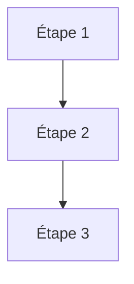

# L'agent autonome

<div class="opacity-50 pt-2">75 minutes · reprendre le contrôle de la boucle</div>

---
layout: default
---

# Ce qui reste quand on retire le graphe

<div class="grid grid-cols-2 gap-10 pt-4">
<div>

<div class="text-sm opacity-60 pb-2">Workflow</div>



<div class="pt-4 text-sm opacity-70">Vous savez d'avance combien d'appels, dans quel ordre, pour quel coût.</div>

</div>
<div>

<div class="text-sm opacity-60 pb-2">Agent</div>


<div class="pt-4 text-sm opacity-70">Vous ne savez ni le nombre d'étapes, ni lesquelles, ni le coût. Vous savez seulement <strong>où ça s'arrête</strong> — si vous l'avez écrit.</div>

</div>
</div>

<div v-click class="pt-8 callout-warn">
En passant à l'agent, vous échangez le contrôle de <strong>l'enchaînement</strong> contre le contrôle des <strong>bornes</strong>. Si vous ne posez pas les bornes, vous n'avez plus aucun contrôle du tout.
</div>

<!--
C'est la phrase-pivot de l'après-midi. La suite du module ne fait que détailler
les bornes disponibles : arrêt, budget, périmètre d'outils, approbation.
-->

---
layout: default
---

# L'agent minimal

```ts {all|2-8|10-13|15|all}
const agent = new Agent({
  model: "un-modele",
  instructions: `Tu recherches des publications académiques.
    Cherche, vérifie que chaque lien répond, puis synthétise.
    Si une source est inaccessible, ne la cite pas.`,
  tools: { rechercher, verifierLien, lireResume },

  stopWhen: [ stepCount(20), toolCalled("rendreSynthese") ],
})

const resultat = await agent.generate({
  prompt: "Les trois articles les plus cités de 2026 sur X",
})
```

<div class="pt-4 grid grid-cols-3 gap-6 text-sm">
<div><span class="font-semibold text-warn">instructions</span><div class="opacity-70">Le rôle et les règles. Persistent à chaque tour, donc chaque mot est repayé 20 fois.</div></div>
<div><span class="font-semibold text-warn">tools</span><div class="opacity-70">Le périmètre d'action. Ce qui n'est pas là ne peut pas arriver.</div></div>
<div><span class="font-semibold text-warn">stopWhen</span><div class="opacity-70">Les bornes. La ligne la plus importante du fichier.</div></div>
</div>

<div class="pt-4 text-xs opacity-50">La plupart des bibliothèques d'agents exposent une forme très voisine de celle-ci, aux noms près.</div>

<!--
Cliquer étape par étape. À "instructions", faire remarquer que le prompt système est
relu et refacturé à CHAQUE tour : un prompt système de 2000 tokens sur 20 étapes,
c'est 40 000 tokens rien que pour les consignes.
-->

---
layout: default
---

# Les conditions d'arrêt

<div class="grid grid-cols-2 gap-8 pt-4">
<div>

**Les quatre façons dont une boucle se termine**

<div class="space-y-3 pt-3 text-sm">

<div><span class="font-mono text-ok">naturellement</span> — le modèle répond du texte au lieu d'appeler un outil. Il estime avoir fini.</div>

<div><span class="font-mono text-cool">outil terminal</span> — il appelle un outil déclaré comme final. C'est un arrêt <em>explicite</em>, plus fiable que le précédent.</div>

<div><span class="font-mono text-warn">budget</span> — le plafond d'étapes est atteint. Le garde-fou.</div>

<div><span class="font-mono text-bad">erreur</span> — exception non rattrapée, dépassement de contexte, coupure réseau.</div>

</div>

</div>
<div>

```ts
stopWhen: [
  stepCount(20),
  toolCalled("rendreSynthese"),
]
```

<div class="pt-6 text-sm space-y-3">

L'arrêt « naturel » est **le moins fiable**. Un modèle déclare volontiers avoir terminé une tâche qu'il n'a pas faite.

Le remède : un outil `rendreSynthese` que le modèle **doit** appeler pour finir, avec un schéma qui exige les preuves — les liens vérifiés, les sources retenues.

Vous ne pouvez pas contrôler ce qu'il *pense* avoir fait. Vous pouvez contrôler la **forme de sa sortie**.

</div>

</div>
</div>

<!--
Le "done tool" est un pattern très sous-utilisé et très rentable. Il transforme
une déclaration de fin en un contrat vérifiable. Si le schéma exige un tableau
de liens vérifiés non vide, le modèle ne peut pas conclure à vide.
-->

---
layout: default
---

# Restreindre le périmètre selon la phase

<div class="pt-2">

```ts
prepareStep: ({ stepNumber, messages }) => {
  if (stepNumber < 5)
    return { activeTools: ["rechercher", "lireResume"] }   // phase d'exploration

  if (stepNumber < 15)
    return { activeTools: ["verifierLien"] }               // phase de vérification

  return {
    activeTools: ["rendreSynthese"],                       // phase de rédaction
    model: "un-modele-plus-grand",
  }
}
```

</div>

<div class="grid grid-cols-2 gap-8 pt-6 text-sm">
<div>

**Pourquoi c'est efficace**

Un modèle à qui on présente 20 outils choisit moins bien qu'un modèle à qui on en présente 3. Restreindre le menu améliore la décision — et raccourcit le contexte.

</div>
<div>

**Ce que ça permet aussi**

Changer de modèle en cours de route : un modèle rapide et bon marché pour explorer, un modèle large pour la synthèse finale. La facture n'est pas la même.

</div>
</div>

<div class="pt-6 text-center text-sm opacity-60">
Vous voyez le mouvement : on réintroduit du <strong>graphe</strong> dans l'agent. Le curseur revient vers la gauche.
</div>

---
layout: statement
class: text-center
---

# Démonstration

<div class="text-xl opacity-60 pt-6">
La trace d'un agent qui déraille
</div>

<div class="pt-12 text-base opacity-80 max-w-2xl mx-auto">
Même consigne que ce matin. Cette fois j'ai retiré une borne,<br>et on regarde ligne par ligne où ça part de travers.
</div>

<!--
DÉMO 2 — préparer une trace réelle et ratée, sauvegardée en JSON, à dérouler lentement.
Ne pas relancer en direct : on veut un échec reproductible, pas la loterie.

Ce qu'il faut faire voir, dans l'ordre :
1. l'étape où l'outil renvoie une erreur
2. l'étape où le modèle réinterprète l'erreur de travers
3. les trois étapes suivantes où il répète la même action avec une variation cosmétique
4. l'étape finale où il annonce avoir réussi

Puis demander à la salle : "à quelle étape auriez-vous coupé ?"
-->

---
layout: default
---

# Les cinq modes d'échec

<div class="pt-2 space-y-4">

<div class="flex gap-5 items-start">
<div class="w-52 shrink-0 font-semibold text-bad">La boucle polie</div>
<div class="text-sm opacity-80">Il refait la même action avec une variation cosmétique, en annonçant à chaque tour qu'il progresse. Se détecte en comparant les arguments d'outil d'un tour à l'autre.</div>
</div>

<div class="flex gap-5 items-start">
<div class="w-52 shrink-0 font-semibold text-bad">La dérive d'objectif</div>
<div class="text-sm opacity-80">Il résout brillamment un sous-problème rencontré en chemin et ne revient jamais à la demande initiale. Plus la boucle est longue, plus c'est probable.</div>
</div>

<div class="flex gap-5 items-start">
<div class="w-52 shrink-0 font-semibold text-bad">La fin déclarée</div>
<div class="text-sm opacity-80">« J'ai vérifié les trois liens » — alors qu'il en a vérifié un. Le remède est structurel : exiger les preuves dans le schéma de sortie, pas dans le prompt.</div>
</div>

<div class="flex gap-5 items-start">
<div class="w-52 shrink-0 font-semibold text-bad">La contamination</div>
<div class="text-sm opacity-80">Une donnée fausse entrée à l'étape 3 reste dans le contexte jusqu'à l'étape 20 et oriente tout le reste. On en reparle au module 4.</div>
</div>

<div class="flex gap-5 items-start">
<div class="w-52 shrink-0 font-semibold text-bad">Le mauvais outil</div>
<div class="text-sm opacity-80">Deux outils aux descriptions voisines, et il choisit systématiquement le mauvais. Ce n'est pas un problème de modèle, c'est un problème de rédaction.</div>
</div>

</div>

<!--
Ces cinq modes couvrent l'écrasante majorité des incidents. Quand on débugge un agent,
on commence par se demander lequel des cinq c'est — ça oriente immédiatement le remède.

Faire remarquer : quatre sur cinq se corrigent SANS toucher au modèle.
-->

---
layout: default
---

# Le vrai coût d'une boucle

<div class="pt-4">

| Étape | Contexte relu | Cumulé |
|---|---|---|
| 1 | 2 000 tokens | 2 000 |
| 5 | 8 000 tokens | 25 000 |
| 10 | 18 000 tokens | 90 000 |
| 20 | 40 000 tokens | **320 000** |

</div>

<div class="pt-6 grid grid-cols-2 gap-10 text-sm">
<div>

Vingt étapes ne coûtent pas vingt fois une étape. Elles en coûtent **cent soixante fois**, parce que chaque appel relit tout ce qui précède.

</div>
<div>

C'est ce qui rend le module 4 nécessaire. Gérer le contexte n'est pas une optimisation de confort : c'est ce qui décide si le système est viable.

</div>
</div>

<div class="pt-6 text-xs opacity-50">
Ordres de grandeur illustratifs. La mise en cache du préfixe atténue fortement la facture, mais ne change pas la forme de la courbe.
</div>

---
layout: default
---

# Ce qu'il faut retenir du module 3

<div class="pt-6 space-y-4 text-lg">
<v-clicks>

<div class="flex gap-4"><span class="text-accent font-bold">1</span><div>Passer à l'agent, c'est échanger le contrôle de l'enchaînement contre <strong>le contrôle des bornes</strong>.</div></div>

<div class="flex gap-4"><span class="text-accent font-bold">2</span><div>L'arrêt naturel est le moins fiable. Préférez un <strong>outil terminal au schéma exigeant</strong>.</div></div>

<div class="flex gap-4"><span class="text-accent font-bold">3</span><div>Restreindre les outils selon la phase améliore la décision et baisse la facture. <strong>Réintroduisez du graphe.</strong></div></div>

<div class="flex gap-4"><span class="text-accent font-bold">4</span><div>Quatre des cinq modes d'échec se corrigent <strong>sans changer de modèle</strong>.</div></div>

</v-clicks>
</div>
