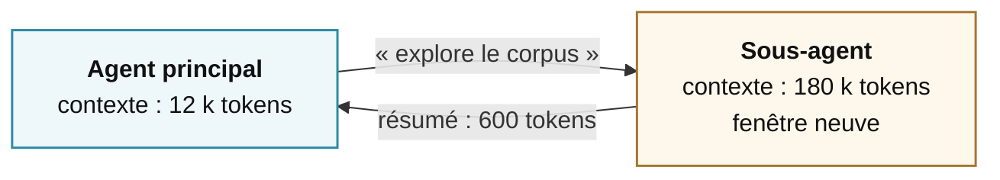

# Contexte et mémoire

la ressource rare

---
layout: default
---

# La fenêtre de contexte est un budget, pas un coffre

Ce qui la remplit

~5 %Les instructions

~5 %Les descriptions d'outils

~5 %La demande

~85 %Les résultats d'outils

Le point non-intuitif

Une fenêtre d'un million de tokens ne résout pas le problème. Elle le déplace.

Le contexte se gère comme un budget serré, <strong>même quand la limite est loin</strong>.

<SourceNote :items="[
  ['Liu et al., « Lost in the Middle », TACL 2024', 'arxiv.org/abs/2307.03172'],
  ['Modarressi et al., « NoLiMa », ICML 2025', 'arxiv.org/abs/2502.05167'],
]" />

<!--
LES POURCENTAGES, à annoncer pour ce qu'ils sont avant de les commenter :
c'est une répartition typique, pas une mesure. La forme est robuste et
n'importe qui peut la retrouver sur ses propres traces en une soirée — les
résultats d'outils écrasent tout le reste. Les nombres exacts, non : ils
dépendent des outils exposés et de la longueur de la boucle. Dire « en ordre
de grandeur » une fois, et ne plus y revenir.

Colonne de gauche : les 85 %, c'est tout le sujet. Une seule requête HTTP mal
découpée peut injecter 30 000 tokens de HTML dans le contexte. En un tour.
C'est la première cause d'explosion de facture sur les agents en production —
le résultat d'outil non tronqué. Le raconter comme une anecdote.

Colonne de droite, développer : un modèle nourri de 400 000 tokens ne raisonne pas
aussi bien qu'avec 20 000. L'information pertinente est noyée, l'attention
se dilue, les instructions du début perdent du poids.

Ce point-là est mesuré, et il faut pouvoir le sourcer devant cette salle :
« Lost in the Middle » (Liu et al., TACL 2024) montre l'effondrement de la
performance quand l'information utile est au milieu du contexte plutôt qu'aux
extrémités ; le banc NoLiMa, qui retire les indices littéraux, fait tomber
GPT-4o de 99,3 % à 1 000 tokens à 69,7 % à 32 000. Une phrase suffit :
« la fenêtre annoncée n'est pas la fenêtre exploitable, et c'est publié ».

L'analogie qui passe bien : un bureau. On peut avoir un très grand bureau,
ça ne veut pas dire qu'on travaille bien avec quatre cents documents ouverts dessus.
-->

---
layout: default
---

# Quatre stratégies, dans l'ordre où on les applique

<v-clicks>

1 · Réduire

Tronquer le résultat <strong>avant</strong> qu'il entre

2 · Stocker ailleurs

Écrire ailleurs, ne garder qu'une référence

3 · Résumer

Remplacer les vingt premiers tours

4 · Isoler

Déléguer à un sous-agent, ne ramener que la conclusion

</v-clicks>

<!--
L'ordre compte, le dire : on applique 1, puis 2, puis 3, puis 4. La plupart
des gens sautent directement à 3 ou 4.

1 · Réduire — renvoyer dix résultats, pas deux cents. Extraire le texte,
pas le HTML. C'est la stratégie la plus rentable et la plus négligée,
parce qu'elle se fait dans le code de l'outil, là où personne ne regarde.

2 · Stocker ailleurs — le gros volume sur disque ou en base, une référence dans
le contexte. L'agent relit le fichier s'il en a besoin. Le contexte redevient
un index. C'est là que le RAG trouve sa place, et seulement là — le dire
franchement : la recherche documentaire est un outil au service de la
stratégie « Stocker ailleurs », rien de plus.

3 · Résumer — quand le contexte atteint un seuil, remplacer les vingt premiers
tours par un résumé. On perd du détail, on gagne de la marge. À faire à des
points de coupure CHOISIS, jamais au milieu d'une séquence d'outils.
Attention : ça invalide le cache de préfixe, donc ça a un coût immédiat.

4 · Isoler — on y vient dans trois slides.
-->

---
layout: default
---

# Trois mémoires qu'il faut distinguer

De travail

la tâche en cours

« Corrige ce bug » + les logs

conversation, fichiers ouverts

Persistante

les faits à retenir

« Toujours répondre en français »

mémoire locale, README.md

Procédurale

la marche à suivre

« Après une modif : lint et tests »

AGENTS.md, SKILL.md

<strong>AGENTS.md peut mêler les deux dernières</strong> : ce que l'agent doit savoir et comment il doit agir.

<!--
De travail — ce qui s'est passé depuis le début de CETTE tâche. Disparaît
à la fin. C'est ce qu'on gère avec les quatre stratégies précédentes.

Persistante — « ce cours compte 12 séances », « cette personne veut ses réponses
en français ». Petit, stable, réinjecté à chaque session. Se range dans une base
ou un fichier. Toujours présent.

Procédurale — « pour préparer une séance, commencer par relire les objectifs,
puis… ». Long, et chargé SEULEMENT quand c'est pertinent. C'est un mode d'emploi,
pas un fait.

Pointer la dernière ligne de chaque carte : la mémoire de travail prend la forme
de la conversation et des fichiers ouverts ; la persistante, d'une mémoire locale
ou d'un document du projet ; la procédurale, d'un AGENTS.md ou d'un SKILL.md.

AGENTS.md peut contenir les deux dernières. « Le projet utilise pnpm » est un fait
durable. « Après une modification, lancer lint et tests » est une procédure.

Pourquoi la distinction compte : un fait durable est toujours là, une procédure
ne se charge qu'au moment où on en a besoin. Sinon elle mange le budget pour rien,
à chaque session, sur toutes les tâches où elle ne sert pas.

Exemple à donner si la salle décroche : la différence entre ce qu'on sait
par cœur d'un collègue, et le classeur de procédures qu'on va chercher
quand on en a besoin.
-->

---
layout: statement
class: text-center
---

# Labo 3

Tous les lundis, 9h. Sans vous.

Vingt minutes. Une dernière phrase, et un onglet à aller voir.

<!--
**LABO 3 · 20 MIN**

**Temps 1 · 5 min · Ce qu'ils font**

1. Rester dans la même conversation.
2. Taper :

> Tous les lundis à 9h, refais cette liste et envoie-moi le PDF par mail.

3. Vérifier que la tâche planifiée existe.

Faire remarquer qu'ils n'ont ouvert aucun formulaire ni choisi une fréquence dans un menu.

**Temps 2 · 3 min · Déclenchement immédiat**

1. Taper : « Déclenche-la maintenant. »
2. Vérifier que le mail et son PDF arrivent.

Dire : « Vous pouvez fermer votre ordinateur, ça continuera sans vous. »

**Temps 3 · 5 min · Nouvelle exécution**

1. Ouvrir l'exécution qui vient de tourner.
2. Constater qu'elle a créé une conversation neuve.
3. Constater que l'agent a tout refait et ne sait pas ce qu'il avait envoyé trois minutes plus tôt.

Demander : « Comment pourrait-il le savoir ? » Laisser un silence. Réponse : quelque chose doit traverser les exécutions. C'est la mémoire.

**Temps 4 · 4 min · Les mémoires**

1. Ouvrir l'onglet des mémoires.
2. Chercher les informations enregistrées automatiquement.
3. Repérer une déduction fausse ou une information que personne n'avait demandé de retenir.

Demander : « Qui a une mémoire fausse ? » Puis dire : « La mémoire d'un agent est une reconstruction. Elle s'écrit sans que personne la relise. »

**Débrief · 3 min**

1. Une mémoire inutilisée finit par disparaître. Chaque rappel prolonge sa durée de vie.
2. L'écriture automatique après une conversation est active par défaut et peut être coupée.
3. Les cabinets déjà envoyés constituent un fait à mémoriser. Le format « une fiche par cabinet » constitue une règle à écrire dans une procédure.

**Phrase de clôture**

« Trois phrases depuis ce matin. La première a cherché, la deuxième a produit un document, la troisième a mis les deux au calendrier. On n'a touché aucun réglage de la journée. »

**Ensuite :** passer à « L'agent qui apprend de ses exécutions ».
-->

---
layout: default
---

# L'agent qui apprend de ses exécutions

faire → constater → <strong>écrire</strong> → recharger

Ce qu'on y gagne

- il ne réinvente plus la marche à suivre
- les corrections deviennent durables

Ce qu'il faut surveiller

- la qualité de ce qui est écrit
- l'accumulation sans élagage
- qui relit

<!--
Le mécanisme, à raconter : l'agent termine une tâche non triviale. Il écrit
la marche à suivre dans un fichier, sous forme de procédure réutilisable.
La fois suivante, il la charge au lieu de réinventer. C'est la mémoire
procédurale de la slide précédente, mais écrite par le système lui-même.

Certains systèmes vont plus loin : les corrections répétées de l'utilisateur
deviennent des entrées de mémoire persistante, et les écritures peuvent être
SOUMISES À VALIDATION avant d'affecter les sessions futures.

Les trois points de vigilance, développés :
— la qualité : une procédure apprise d'un cas particulier et appliquée à un cas
  général produit des erreurs confiantes. Les pires.
— l'accumulation : sans élagage, la bibliothèque de procédures devient un bruit
  qui coûte du contexte à chaque session.
— la validation : un agent qui écrit sa propre mémoire sans relecture humaine
  peut consolider une erreur pour de bon.

C'est un des sujets ouverts les plus intéressants de 2026 — et un excellent objet
de mémoire de fin d'études. Le dire, c'est un pont naturel vers le module 6 :
la vraie question porte sur la règle, « qu'est-ce qu'un système a le droit
d'apprendre tout seul, et qui relit ? », bien avant l'outil.

Plusieurs projets, open source comme propriétaires, explorent cette voie
avec des approches différentes. Ne pas en privilégier un.
-->

---
layout: default
---

# Ce qu'on vend sous le mot « mémoire »

<BrandRow v-click label="Recherche dans vos documents" marks="qdrant Qdrant, chroma Chroma, neo4j Neo4j, cognee Cognee" />

<BrandRow v-click label="Mémoire pour agents" marks="mem0 Mem0, supermemory Supermemory, zep Zep, letta Letta" />

<BrandRow v-click label="Intégrée au produit" marks="openai ChatGPT, claude Claude, googlegemini Gemini, *rerun rerun.build" />

Douze noms, trois familles. En violet, celui du labo&nbsp;3 — c'est le mien, je le déclare.

<!--
LE MUR DE LA MÉMOIRE. Même geste que celui du module 0, même règle : on montre
un paysage, on ne recommande rien. Trois rangées, une par famille, et surtout
pas de comparatif. Si le débat « lequel est le meilleur » démarre, le couper
tout de suite et renvoyer à la slide suivante — c'est exactement ce qu'elle sert.

Dérouler les rangées au clic, une phrase chacune, pas plus :

RECHERCHE DANS VOS DOCUMENTS. On y range des documents pour les retrouver. Qdrant et Chroma
indexent par similarité de vecteurs ; Neo4j est une base de graphes, et Cognee
construit le graphe à partir des documents. Ce sont des moteurs de recherche,
pas des mémoires : ils ne retiennent rien de vous, ils retrouvent ce qu'on
leur a donné.

MÉMOIRE POUR AGENTS. Là on est dans le sujet du module : extraire les faits
durables d'une conversation, les ranger, les mettre à jour, les oublier.
Letta vient du papier MemGPT de Berkeley (Packer et al., 2023), qui a posé
l'analogie avec un système d'exploitation : la fenêtre de contexte comme
mémoire vive, le reste paginé dedans et dehors. Les autres tournent autour
de la même idée avec des choix différents.

INTÉGRÉE AU PRODUIT. Ce que la plupart des gens dans la salle ont déjà utilisé
sans le nommer — la mémoire qui se remplit toute seule dans un assistant grand
public. C'est celle du labo 3. Elle est la plus confortable et la moins
inspectable des trois.

DÉCLARATION D'INTÉRÊT — la faire, ne pas la survoler. La quatrième tuile de la
troisième rangée est l'outil sur lequel ils ont travaillé toute la journée, et
c'est le mien. Une phrase, la même qu'au module 0 : je vous ai fait manipuler le
mien parce qu'il démarre en deux minutes ; à vous de choisir le vôtre.
Puis enchaîner. Ne pas s'excuser, ne pas argumenter.

CE QUE VAUT CE MUR. Une photo partielle, sans ordre et datée : il y a des
dizaines d'autres projets, et elle aura vieilli à la rentrée prochaine. Le dire à voix haute évite la question « pourquoi X n'y est
pas ». Ce qui ne vieillira pas, c'est le rangement en trois familles —
c'est ça qu'ils doivent noter, pas les douze noms.
-->

---
layout: default
---

# Le mot « mémoire » désigne deux besoins

Chercher dans des documents

« Que dit le règlement sur les absences&nbsp;? »

Le <strong>RAG</strong> retrouve des passages. Le <strong>GraphRAG</strong> relie des informations dispersées.

Se souvenir entre deux échanges

« Cet étudiant préfère un exemple avant la théorie. »

Une <strong>mémoire persistante</strong> conserve cette information pour une prochaine conversation.

Le premier besoin concerne un <strong>corpus</strong>. Le second concerne ce que le système <strong>retient dans la durée</strong>.

<SourceNote :items="[
  ['Lewis et al., « Retrieval-Augmented Generation », NeurIPS 2020', 'arxiv.org/abs/2005.11401'],
  ['Edge et al., « From Local to Global » (GraphRAG), 2024', 'arxiv.org/abs/2404.16130'],
]" />

<!--
LA DISTINCTION À INSTALLER. Le mot « mémoire » recouvre deux besoins qui se
retrouvent souvent dans la même conversation commerciale. Les séparer avant de
nommer les outils.

COLONNE DE GAUCHE. Le système cherche une information dans un ensemble de
documents qu'on lui a fourni. Le RAG retrouve des passages proches de la
question. Le GraphRAG ajoute des relations entre les personnes, les notions et
les événements pour répondre à des questions d'ensemble. Dans les deux cas, le
système consulte un corpus. Il n'apprend rien sur l'utilisateur.

COLONNE DE DROITE. Le système conserve une information issue d'un échange pour
la réutiliser lors d'une session future. C'est une mémoire persistante. Elle
peut être écrite automatiquement par un service ou explicitement par le code de
l'application. La slide suivante détaille cette différence de contrôle.

LE CALLOUT. Faire reformuler la distinction par la salle : d'un côté, « dans
quel document se trouve la réponse ? » ; de l'autre, « qu'est-ce que le système
doit encore savoir la prochaine fois ? ».

SI ON DEMANDE « le RAG est mort ? » — non, et la question est mal posée. Ce qui
a changé, c'est qu'on ne pré-charge plus tout au début : l'agent va chercher
quand il en a besoin, avec un outil, et parfois plusieurs fois de suite. La
recherche vectorielle est devenue un outil parmi d'autres dans la boucle
au lieu d'être l'architecture du système. C'est un déplacement, pas un
enterrement.
-->

---
layout: default
---

# Quatre solutions, quatre compromis

| Solution | Ce qu'elle fait | Point de vigilance |
|---|---|---|
| **RAG vectoriel** | Retrouve les passages proches d'une question | Peut manquer une idée dispersée |
| **GraphRAG** | Relie les informations pour une vue d'ensemble | Coûte plus cher à construire et à actualiser |
| **Service de mémoire** | Retient automatiquement des informations tirées des échanges | Peut retenir une erreur. Vous contrôlez moins. |
| **Mémoire dans l'application** | Votre code décide quoi conserver, corriger ou supprimer | Demande du développement et une validation |

Les scores dépendent aussi de la manière de compter les bonnes réponses.

<SourceNote :items="[
  ['Xiang et al., « When to use Graphs in RAG », 2025', 'arxiv.org/abs/2506.05690'],
  ['Panthi & Abdelfattah, « Same Ranking, Different Winner », 2026', 'arxiv.org/abs/2605.24060'],
]" />

<!--
QUATRE LIGNES, DEUX FAMILLES. Les deux premières cherchent dans des documents.
Les deux suivantes conservent une information entre les conversations. Ne pas
présenter ces quatre solutions comme des concurrentes directes.

RAG VECTORIEL. On découpe les documents en passages et on retrouve ceux qui
ressemblent le plus à la question. C'est efficace pour une question précise.
La limite est structurelle : une question comme « quels sont les grands thèmes
du corpus ? » n'a pas forcément un passage unique à retrouver.

GRAPHRAG. On extrait les personnes, les notions, les événements et leurs
relations afin de produire une vue d'ensemble. Construire ce graphe suppose de
faire passer le corpus dans un modèle. Il faut repayer une partie de ce travail
quand les documents changent. Deux faits pour l'appuyer :
— Microsoft a publié en novembre 2024 une variante, LazyGraphRAG, dont
  l'argument de vente est exactement celui-là : « LazyGraphRAG data indexing
  costs are identical to vector RAG and 0.1% of the costs of full GraphRAG ».
  C'est l'éditeur qui parle de son propre produit — mais quand quelqu'un annonce
  un facteur mille sur le coût de sa version précédente, c'est un aveu sur
  la version précédente.
— Et le graphe ne gagne pas toujours : le travail de Xiang et al. sur
  GraphRAG-Bench part d'un constat déjà publié, « GraphRAG frequently
  underperforms vanilla RAG on many real-world tasks ». Le graphe gagne sur la
  synthèse d'ensemble, pas sur le fait précis.

MÉMOIRE GÉRÉE PAR UN SERVICE. Le fournisseur lit les échanges, extrait ce qu'il
juge utile, le stocke sur son infrastructure et le réinjecte plus tard. Voilà ce
que l'ancienne slide appelait « hébergé ». Le gain est le confort. La limite est
le contrôle : le service peut conserver un fait faux ou devenu obsolète.

MÉMOIRE GÉRÉE PAR VOTRE APPLICATION. Le modèle peut proposer une information à
retenir, mais le code de l'application décide de l'écrire, de la corriger ou de
la supprimer. Vous choisissez aussi le lieu de stockage. Cela demande plus de
travail, mais permet de définir une validation et une politique d'effacement.

LE CALLOUT — c'est le point à ne pas rater devant cette salle, et c'est le seul
moment de la journée où on parle méthode d'évaluation.
Panthi & Abdelfattah (mai 2026) montrent que selon la forme de mémoire à
laquelle on accorde le crédit du rappel — la donnée brute, la source, la forme
canonique — les résultats changent sur 83 à 94 % des questions communes, et le
classement entre deux systèmes s'inverse. Ce choix n'est presque jamais
documenté dans les papiers.

L'HISTOIRE, si on a deux minutes et que la salle mord — elle est excellente et
elle est vérifiable :
— 2025 : deux éditeurs de mémoire s'accusent mutuellement d'avoir mal configuré
  le concurrent dans leur propre évaluation, sur le même jeu de test. L'un
  recalcule le score de l'autre et le fait tomber de 84 % à 58,4 % ; un
  troisième explique qu'il n'a jamais réussi à faire tourner sa propre
  bibliothèque dans le protocole publié et n'a pas obtenu de réponse.
— 2026 : un audit indépendant de ce même jeu de test trouve 6,4 % de réponses
  fausses dans le corrigé, et un juge automatique qui accepte jusqu'à 63 % de
  réponses volontairement fausses. Précision d'honnêteté à donner en même temps :
  l'auteur de l'audit est lui-même sur ce marché. Le code est public et
  reproductible, et l'auteur reste partie prenante.

Ce qu'on en fait, sans procès d'intention : ce champ
n'a pas encore de mesure stable. Conséquence pratique, à donner comme règle :
on n'achète pas un système de mémoire sur un score, on l'évalue sur ses propres
données. Et pour la salle, c'est un sujet de fin d'études directement
exploitable — reproduire une évaluation publiée est un exercice de méthode,
et ici il y a de la matière.

LE RÉSULTAT QUI FAIT LE PONT avec le reste du module, à garder pour la fin :
en août 2025, l'équipe de Letta a montré qu'un agent équipé de simples outils de
fichiers — lire, écrire, chercher — obtenait 74,0 % sur ce jeu de test, contre
68,5 % annoncés par un système de mémoire spécialisé, avec le même petit modèle.
Leur conclusion tient en une phrase : « memory is more about how agents manage
context than the exact retrieval mechanism used ». C'est mot pour mot la thèse
du module. Source : letta.com/blog/benchmarking-ai-agent-memory.
-->

---
layout: default
---

# Les sous-agents : déléguer pour isoler

La délégation est un <strong>échange</strong> : 
de la place contre de la traçabilité.

<!--
L'idée : le sous-agent démarre avec une fenêtre vierge, brûle autant de tokens
qu'il veut, et ne remonte qu'une conclusion. Le parent ne voit jamais
les 180 000 tokens — seulement les 600. C'est la seule façon de faire
de l'exploration lourde sans détruire la cohérence de l'agent principal.

Ce qu'on y perd, et c'est rarement dit : le parent ne peut plus juger la démarche,
seulement le résumé. Si le sous-agent s'est trompé, l'erreur remonte proprement
formatée — et devient très difficile à repérer. Un résumé qui contient une erreur
est plus dangereux qu'une trace brute qui contient la même erreur,
parce qu'il a l'air propre.

Bonne pratique à donner : conserver la trace complète du sous-agent dans les logs,
même si le parent ne reçoit que le résumé. Ça coûte du stockage, pas du contexte.
-->

---
layout: default
---

# Multi-agents : quand ça aide, quand ça nuit

Ça aide quand

- les sous-tâches sont vraiment indépendantes
- les périmètres d'outils diffèrent
- l'exploration est chère, la conclusion courte
- vous voulez des avis divergents

Ça nuit quand

- il faut se coordonner en continu
- la même info est payée *n* fois
- vous ajoutez un agent pour en corriger un
- personne ne peut dire lequel s'est trompé

Passer au multi-agents, c'est accepter un <strong>compromis</strong>.

<!--
« Périmètres d'outils différents » = droits différents. C'est le cas d'usage
le plus solide, et il ressort au module 5 : on scinde en deux agents pour retirer
un des trois. L'annoncer.

« Personne ne peut dire lequel s'est trompé » — c'est le coût caché du multi-agents,
et il se paie en production, pas au développement.

Le callout : à prendre quand l'isolation de contexte ou de droits le justifie,
et à refuser le reste du temps. Comme pour le curseur du module 1 :
la bonne réponse est presque toujours plus simple que le premier réflexe.
-->

---
layout: default
---

# Les trois labos, sans la plateforme

| Ce que vous avez vu | Le nom générique |
|---|---|
| La phrase tapée dans le chat | Un **prompt**, ajouté au prompt système |
| Les pages qu'il est allé ouvrir | Des **appels d'outils** |
| Le PDF qui est sorti | Un **appel d'outil**, lui aussi |
| Le rendez-vous du lundi | Un **ordonnanceur**, `cron`, Unix V7, 1979 |
| L'adresse que j'ai déclenchée | Un **webhook**, une route HTTP |
| L'onglet des mémoires | Une **table**, relue à chaque démarrage |

Aucune de ces six lignes n'a été inventée cette année.

<!--
La slide de contrepoids. Elle a deux fonctions et il faut assumer les deux.

La première est honnête : je vous ai fait manipuler MON outil toute la journée,
voilà ce qu'il y a derrière, et tout est reproductible ailleurs. Vous refaites les
trois labos avec quelques fonctions, une table et un ordonnanceur, dans la
bibliothèque de votre choix.

La seconde est pédagogique, et c'est la vraie : une interface qui marche bien
donne l'illusion d'une technologie nouvelle. Six lignes, cinq concepts, et
quatre d'entre eux sont vieux : l'appel de fonction est aussi vieux que la
programmation, la table relationnelle date de 1970, cron de 1979, et le plus
jeune des quatre — le webhook, nommé par Jeff Lindsay — a dix-neuf ans. Le
cinquième, le prompt système, a trois ans : celui-là est récent, autant le dire.
Ce qui est neuf, ce n'est aucune de ces six lignes : c'est le fait que ce soit
le modèle qui décide dans quel ordre les employer.
On revient au fil rouge, une fois de plus.

Appuyer sur les deux lignes du milieu : elles portent le même nom. Chercher une
page et fabriquer un PDF sont le même geste pour le modèle — il écrit un nom de
fonction et des arguments, et il attend. Ce que l'outil fait derrière, il ne le
sait pas.

Ne pas s'excuser sur cette slide. La dire vite, elle se suffit.
-->

---
layout: default
---

# Ce qu'il faut retenir du module 4

<v-clicks>

1
Le contexte est un <strong>budget serré</strong>, même quand la fenêtre est immense.

2
Réduire à la source bat tout le reste. <strong>Tronquez les résultats d'outils.</strong>

3
Trois mémoires : de travail, persistante, procédurale.

4
Déléguer, c'est échanger <strong>de la place contre de la traçabilité</strong>.

</v-clicks>

<v-click>

Pause 15 minutes. Ensuite : ce qui casse quand on met tout ça en production.

</v-click>

<!--
Point 3 — ajouter : elles n'entrent pas dans le contexte au même moment,
c'est toute la différence.
Point 4 — ajouter : gardez les traces même si le parent ne les lit pas.
-->
