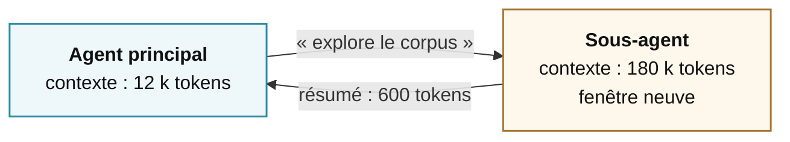

# Contexte et mémoire

la ressource rare

<!--
**Transition :** reprendre le coût quadratique de la boucle, puis montrer comment réduire, stocker, résumer et isoler le contexte.
-->
---
layout: default
---

# La fenêtre de contexte est un budget, pas un coffre

Ce qui la remplit

~5 %Les instructions

~5 %Les descriptions d'outils

~5 %La demande

~85 %Les résultats d'outils

Le point non-intuitif

Une fenêtre d'un million de tokens ne résout pas le problème. Elle le déplace.

Le contexte se gère comme un budget serré, <strong>même quand la limite est loin</strong>.

<SourceNote :items="[
  ['Liu et al., « Lost in the Middle », TACL 2024', 'arxiv.org/abs/2307.03172'],
  ['Modarressi et al., « NoLiMa », ICML 2025', 'arxiv.org/abs/2502.05167'],
]" />

<!--
**Idée clé :** une grande fenêtre ne garantit ni faible coût ni bonne attention.

- **Dire :** les pourcentages affichés donnent un ordre de grandeur. Les résultats d’outils occupent généralement l’essentiel du contexte.
- **Montrer :** une page HTML non filtrée peut injecter 30 000 tokens en un tour.
- **Insister :** 400 000 tokens disponibles ne signifient pas 400 000 tokens exploitables.
- **Comparer :** un grand bureau reste inutilisable avec quatre cents documents ouverts.

**Si question :** NoLiMa fait passer GPT-4o de 99,3 % à 1 000 tokens à 69,7 % à 32 000. « Lost in the Middle » montre aussi la faiblesse des informations placées au milieu.
-->

---
layout: default
---

# Quatre stratégies, dans l'ordre où on les applique

<v-clicks>

1 · Réduire

Tronquer le résultat <strong>avant</strong> qu'il entre

2 · Stocker ailleurs

Écrire ailleurs, ne garder qu'une référence

3 · Résumer

Remplacer les vingt premiers tours

4 · Isoler

Déléguer à un sous-agent, ne ramener que la conclusion

</v-clicks>

<!--
**Idée clé :** réduire d’abord, puis stocker ailleurs, résumer et enfin isoler.

- **Dire :** limiter les résultats et extraire le texte avant le HTML.
- **Montrer :** garder le volume sur disque ou en base, avec seulement une référence dans le contexte.
- **Insister :** résumer à un point de coupure choisi. Le résumé perd du détail et invalide le cache de préfixe.
- **Transition :** l’isolation par sous-agent viendra après la mémoire.
-->

---
layout: default
---

# Trois mémoires qu'il faut distinguer

De travail

la tâche en cours

« Corrige ce bug » + les logs

conversation, fichiers ouverts

Persistante

les faits à retenir

« Toujours répondre en français »

mémoire locale, README.md

Procédurale

la marche à suivre

« Après une modif : lint et tests »

AGENTS.md, SKILL.md

<strong>AGENTS.md peut mêler les deux dernières</strong> : ce que l'agent doit savoir et comment il doit agir.

<!--
**Idée clé :** travail, faits persistants et procédures n’entrent pas dans le contexte au même moment.

- **Dire :** la mémoire de travail couvre la tâche actuelle et disparaît ensuite.
- **Dire :** les faits persistants, comme la langue préférée, reviennent à chaque session.
- **Dire :** les procédures longues, comme un `SKILL.md`, se chargent seulement quand elles servent.
- **Insister :** charger une procédure inutile consomme du contexte à chaque session.
-->

---
layout: statement
class: text-center
---

# Labo 3

Tous les lundis, 9h. Sans vous.

Vingt minutes. Une dernière phrase, et un onglet à aller voir.

<!--
**Objectif :** planifier l’agent, constater une nouvelle exécution et inspecter sa mémoire.

1. **Taper :** « Tous les lundis à 9h, refais cette liste et envoie-moi le PDF par mail. »
2. **Vérifier :** la tâche planifiée existe, sans formulaire ni réglage.
3. **Taper :** « Déclenche-la maintenant. » Vérifier le mail et le PDF.
4. **Ouvrir :** la nouvelle exécution. Elle repart dans une conversation neuve et ignore le PDF précédent.
5. **Demander :** « Comment pourrait-elle le savoir ? »
6. **Inspecter :** l’onglet mémoire et chercher une déduction fausse.

**Débrief :** une mémoire est une reconstruction. Elle peut s’écrire automatiquement, se prolonger lorsqu’elle sert et disparaître lorsqu’elle reste inutilisée. Les cabinets déjà envoyés sont un fait. « Une fiche par cabinet » est une procédure.

**Clôture :** trois phrases ont cherché, produit un PDF et planifié la boucle, sans aucun réglage.
-->

---
layout: default
---

# L'agent qui apprend de ses exécutions

faire → constater → <strong>écrire</strong> → recharger

Ce qu'on y gagne

- il ne réinvente plus la marche à suivre
- les corrections deviennent durables

Ce qu'il faut surveiller

- la qualité de ce qui est écrit
- l'accumulation sans élagage
- qui relit

<!--
**Idée clé :** l’agent peut transformer une exécution réussie en procédure réutilisable.

- **Dire :** après une tâche, il écrit une marche à suivre qu’il rechargera la prochaine fois.
- **Insister :** une procédure issue d’un cas particulier peut généraliser une erreur.
- **Montrer :** sans élagage, les procédures s’accumulent et consomment du contexte.
- **Demander :** « Qu’a-t-il le droit d’apprendre seul, et qui valide l’écriture ? »

**Si question :** certains systèmes soumettent les nouvelles mémoires à validation avant les sessions futures.
-->

---
layout: default
---

# Ce qu'on vend sous le mot « mémoire »

<BrandRow v-click label="Recherche dans vos documents" marks="qdrant Qdrant, chroma Chroma, neo4j Neo4j, cognee Cognee" />

<BrandRow v-click label="Mémoire pour agents" marks="mem0 Mem0, supermemory Supermemory, zep Zep, letta Letta" />

<BrandRow v-click label="Intégrée au produit" marks="openai ChatGPT, claude Claude, googlegemini Gemini, *rerun rerun.build" />

Douze noms, trois familles. En violet, celui du labo&nbsp;3 — c'est le mien, je le déclare.

<!--
**Idée clé :** le marché mélange recherche documentaire, mémoire d’agent et mémoire intégrée au produit.

- **Montrer :** une rangée par clic et une phrase par famille.
- **Dire :** Qdrant, Chroma, Neo4j et Cognee retrouvent des documents. Les outils d’agents conservent des faits entre sessions. Les produits grand public automatisent ce travail.
- **Insister :** le mur est partiel, non classé et daté.
- **Déclarer :** « L’outil manipulé aujourd’hui est le mien. Je le choisis pour démarrer vite, pas pour vous le recommander. »

**Si question :** Letta vient de MemGPT, Packer et al., 2023.
-->

---
layout: default
---

# Le mot « mémoire » désigne deux besoins

Chercher dans des documents

« Que dit le règlement sur les absences&nbsp;? »

Le <strong>RAG</strong> retrouve des passages. Le <strong>GraphRAG</strong> relie des informations dispersées.

Se souvenir entre deux échanges

« Cet étudiant préfère un exemple avant la théorie. »

Une <strong>mémoire persistante</strong> conserve cette information pour une prochaine conversation.

Le premier besoin concerne un <strong>corpus</strong>. Le second concerne ce que le système <strong>retient dans la durée</strong>.

<SourceNote :items="[
  ['Lewis et al., « Retrieval-Augmented Generation », NeurIPS 2020', 'arxiv.org/abs/2005.11401'],
  ['Edge et al., « From Local to Global » (GraphRAG), 2024', 'arxiv.org/abs/2404.16130'],
]" />

<!--
**Idée clé :** retrouver un document et se souvenir d’un échange répondent à deux besoins distincts.

- **Dire :** RAG et GraphRAG cherchent dans un corpus fourni.
- **Dire :** la mémoire persistante conserve un fait issu d’une conversation pour une session future.
- **Demander :** faire reformuler « Où se trouve la réponse ? » contre « Que faut-il encore savoir la prochaine fois ? »
- **Transition :** la slide suivante compare les solutions à l’intérieur de ces deux familles.

**Si question :** le RAG reste un outil que l’agent appelle au besoin. Il n’a pas disparu.
-->

---
layout: default
---

# Quatre solutions, quatre compromis

| Solution | Ce qu'elle fait | Point de vigilance |
|---|---|---|
| **RAG vectoriel** | Retrouve les passages proches d'une question | Peut manquer une idée dispersée |
| **GraphRAG** | Relie les informations pour une vue d'ensemble | Coûte plus cher à construire et à actualiser |
| **Service de mémoire** | Retient automatiquement des informations tirées des échanges | Peut retenir une erreur. Vous contrôlez moins. |
| **Mémoire dans l'application** | Votre code décide quoi conserver, corriger ou supprimer | Demande du développement et une validation |

Les scores dépendent aussi de la manière de compter les bonnes réponses.

<SourceNote :items="[
  ['Xiang et al., « When to use Graphs in RAG », 2025', 'arxiv.org/abs/2506.05690'],
  ['Panthi & Abdelfattah, « Same Ranking, Different Winner », 2026', 'arxiv.org/abs/2605.24060'],
]" />

<!--
**Idée clé :** les solutions de recherche et de mémoire ne se comparent pas sur un score unique.

- **Dire :** RAG vectoriel pour un passage précis, GraphRAG pour une vue d’ensemble.
- **Dire :** service géré pour le confort, mémoire applicative pour le contrôle, la validation et l’effacement.
- **Insister :** évaluer sur ses propres données. Les benchmarks du domaine restent instables.

**Si question :**
- Panthi et Abdelfattah, 2026 : selon la forme créditée, 83 à 94 % des réponses communes changent et le classement peut s’inverser.
- Un audit trouve 6,4 % d’erreurs dans le corrigé et jusqu’à 63 % de fausses réponses acceptées. Letta obtient 74,0 % avec des outils fichiers contre 68,5 % annoncés par une mémoire spécialisée.
-->

---
layout: default
---

# Les sous-agents : déléguer pour isoler

La délégation est un <strong>échange</strong> : 
de la place contre de la traçabilité.

<!--
**Idée clé :** un sous-agent consomme son propre contexte et ne renvoie qu’une synthèse.

- **Montrer :** le parent reçoit 600 tokens au lieu des 180 000 tokens de l’exploration.
- **Insister :** le parent ne peut plus juger la démarche. Une erreur revient proprement résumée et devient plus difficile à voir.
- **Dire :** conserver la trace complète du sous-agent dans les logs.
- **Transition :** l’isolation économise du contexte, mais réduit l’observabilité.
-->

---
layout: default
---

# Multi-agents : quand ça aide, quand ça nuit

Ça aide quand

- les sous-tâches sont vraiment indépendantes
- les périmètres d'outils diffèrent
- l'exploration est chère, la conclusion courte
- vous voulez des avis divergents

Ça nuit quand

- il faut se coordonner en continu
- la même info est payée *n* fois
- vous ajoutez un agent pour en corriger un
- personne ne peut dire lequel s'est trompé

Passer au multi-agents, c'est accepter un <strong>compromis</strong>.

<!--
**Idée clé :** multiplier les agents se justifie surtout par l’isolation du contexte ou des droits.

- **Dire :** des périmètres d’outils différents donnent des droits différents.
- **Insister :** si personne ne peut attribuer l’erreur, le débogage devient plus difficile.
- **Choisir :** utiliser plusieurs agents seulement lorsque l’isolation apporte une valeur claire.
- **Transition :** la solution la plus simple reste souvent la meilleure.
-->

---
layout: default
---

# Les trois labos, sans la plateforme

| Ce que vous avez vu | Le nom générique |
|---|---|
| La phrase tapée dans le chat | Un **prompt**, ajouté au prompt système |
| Les pages qu'il est allé ouvrir | Des **appels d'outils** |
| Le PDF qui est sorti | Un **appel d'outil**, lui aussi |
| Le rendez-vous du lundi | Un **ordonnanceur**, `cron`, Unix V7, 1979 |
| L'adresse que j'ai déclenchée | Un **webhook**, une route HTTP |
| L'onglet des mémoires | Une **table**, relue à chaque démarrage |

Aucune de ces six lignes n'a été inventée cette année.

<!--
**Idée clé :** les trois labos reposent sur des composants ordinaires que toute bibliothèque peut reproduire.

- **Dire :** appel de fonction, table, ordonnanceur, webhook et prompt système suffisent.
- **Montrer :** chercher une page et fabriquer un PDF ont la même forme pour le modèle : nom de fonction, arguments, résultat.
- **Insister :** la nouveauté vient du modèle qui choisit l’ordre d’emploi, pas des composants.
- **Déclarer :** l’interface utilisée aujourd’hui est la mienne, mais l’architecture ne lui appartient pas.
-->

---
layout: default
---

# Ce qu'il faut retenir du module 4

<v-clicks>

1
Le contexte est un <strong>budget serré</strong>, même quand la fenêtre est immense.

2
Réduire à la source bat tout le reste. <strong>Tronquez les résultats d'outils.</strong>

3
Trois mémoires : de travail, persistante, procédurale.

4
Déléguer, c'est échanger <strong>de la place contre de la traçabilité</strong>.

</v-clicks>

<v-click>

Pause 15 minutes. Ensuite : ce qui casse quand on met tout ça en production.

</v-click>

<!--
**Idée clé :** gérer le contexte signifie choisir quoi garder, quand le charger et ce qu’il faut isoler.

- **Reprendre :** fenêtre exploitable, quatre stratégies, trois types de mémoire et sous-agents.
- **Insister :** les faits persistants et les procédures n’entrent pas au même moment.
- **Dire :** un sous-agent protège le contexte du parent, pas la vérité de sa synthèse.
- **Rappeler :** conserver sa trace complète dans les logs.
-->
