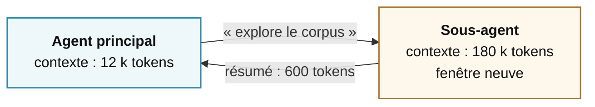

# Contexte, mémoire, délégation

75 minutes · la ressource rare

---
layout: default
---

# La fenêtre de contexte est un budget, pas un coffre

**Ce qui la remplit, dans l'ordre**

~5 %Les instructions système

~5 %Les descriptions d'outils

~5 %La demande de l'utilisateur

~85 %Les résultats d'outils accumulés

Une seule requête HTTP mal découpée peut injecter 30 000 tokens de HTML dans le contexte. En un tour.

**Le point non-intuitif**

Une fenêtre d'un million de tokens ne résout pas le problème — elle le déplace.

Un modèle nourri de 400 000 tokens ne « raisonne » pas aussi bien qu'avec 20 000. L'information pertinente est noyée, l'attention se dilue, les instructions du début perdent du poids.

Le contexte se gère comme un budget serré, <strong>même quand la limite technique est loin</strong>.

<!--
Analogie qui passe bien : un bureau. On peut avoir un très grand bureau,
ça ne veut pas dire qu'on travaille bien avec 400 documents ouverts dessus.

Anecdote à raconter si le temps le permet : le résultat d'outil non tronqué
est la première cause d'explosion de facture sur les agents en production.
-->

---
layout: default
---

# Quatre stratégies, dans l'ordre où on les applique

1 · Réduire
à la source

Tronquer et filtrer le résultat d'outil <strong>avant</strong> qu'il n'entre dans le contexte. Renvoyer 10 résultats, pas 200. Extraire le texte, pas le HTML. C'est la stratégie la plus rentable et la plus négligée.

2 · Décharger
hors contexte

Écrire le gros volume sur disque ou en base, ne garder dans le contexte qu'une référence. L'agent relit le fichier s'il en a besoin. Le contexte redevient un index.

3 · Résumer
en cours de route

Quand le contexte atteint un seuil, remplacer les vingt premiers tours par un résumé. On perd du détail, on gagne de la marge. À faire à des points de coupure choisis, pas au milieu d'une séquence d'outils.

4 · Isoler
déléguer

Confier l'exploration coûteuse à un sous-agent qui a son propre contexte, et n'en ramener que la conclusion. On y vient dans trois slides.

La recherche documentaire (« RAG ») n'est pas une architecture. C'est <strong>un outil</strong> au service de la stratégie 2.

---
layout: default
---

# Trois mémoires qu'il faut distinguer

De travail

le tableau de messages

Ce qui s'est passé depuis le début de <em>cette</em> tâche. Disparaît à la fin. C'est ce qu'on gère avec les quatre stratégies précédentes.

Persistante

des faits durables

« Ce cours compte 12 séances. » « Cette personne veut ses réponses en français. » Petit, stable, réinjecté à chaque session. Se range dans une base ou un fichier.

Procédurale

des façons de faire

« Pour préparer une séance, commencer par relire les objectifs, puis… » Long, chargé <em>seulement</em> quand c'est pertinent. C'est un mode d'emploi, pas un fait.

La distinction n'est pas cosmétique : elle détermine <strong>quand</strong> chaque chose entre dans le contexte. Un fait durable est toujours là. Une procédure ne se charge qu'au moment où on en a besoin — sinon elle mange le budget pour rien.

---
layout: default
---

# L'agent qui apprend de ses exécutions

**Le mécanisme**

L'agent termine une tâche non triviale. Il écrit la marche à suivre dans un fichier, sous forme de procédure réutilisable. La fois suivante, il la charge au lieu de réinventer.

Certains systèmes vont plus loin : les corrections répétées de l'utilisateur deviennent des entrées de mémoire persistante, et les écritures peuvent être **soumises à validation** avant d'affecter les sessions futures.

C'est la boucle d'apprentissage : *faire → constater → écrire → recharger*.

**Ce qu'il faut regarder de près**

<strong>La qualité de l'écriture.</strong> Une procédure apprise d'un cas particulier et appliquée à un cas général produit des erreurs confiantes.

<strong>L'accumulation.</strong> Sans élagage, la bibliothèque de procédures devient un bruit qui coûte du contexte à chaque session.

<strong>La validation.</strong> Un agent qui écrit sa propre mémoire sans relecture humaine peut consolider une erreur pour de bon.

C'est un des sujets ouverts les plus intéressants de 2026 — et un excellent objet de mémoire de fin d'études.

<!--
Signaler que plusieurs projets, open source comme propriétaires, explorent cette voie
avec des approches différentes. L'intérêt pédagogique ici n'est pas l'outil,
c'est la question : qu'est-ce qu'un système a le droit d'apprendre tout seul,
et qui relit ?

C'est un pont naturel vers le module 6 (la fac) — un vrai sujet de recherche accessible.
-->

---
layout: default
---

# Les sous-agents : déléguer pour isoler

**L'idée**

Le sous-agent démarre avec une fenêtre vierge, brûle autant de tokens qu'il veut, et ne remonte qu'une conclusion. Le parent ne voit jamais les 180 000 tokens — seulement les 600.

C'est la seule façon de faire de l'exploration lourde sans détruire la cohérence de l'agent principal.

**Ce qu'on y perd**

Le parent ne peut plus juger la démarche, seulement le résumé. Si le sous-agent s'est trompé, l'erreur remonte proprement formatée et devient très difficile à repérer.

La délégation est un **échange** : de la place contre de la traçabilité.

<!--
Le point sur la traçabilité est important et rarement dit. Un résumé de sous-agent
qui contient une erreur est plus dangereux qu'une trace brute qui contient la même erreur,
parce qu'il a l'air propre.

Bonne pratique : conserver la trace complète du sous-agent dans les logs même si
le parent ne reçoit que le résumé. Ça coûte du stockage, pas du contexte.
-->

---
layout: default
---

# Multi-agents : quand ça aide, quand ça nuit

## Ça aide quand

Les sous-tâches sont <strong>vraiment indépendantes</strong> et vérifiables séparément

Chaque agent a un périmètre d'outils <strong>différent</strong>, donc des droits différents

L'exploration est coûteuse en contexte et sa conclusion est courte

Vous voulez plusieurs avis divergents sur le même objet

## Ça nuit quand

Les agents doivent se coordonner en continu — le coût de coordination dépasse le gain

Une même information doit être partagée par tous : elle est alors payée <em>n</em> fois

Vous cherchez à corriger un mauvais agent en en ajoutant un deuxième

Personne ne peut dire, après coup, <strong>lequel</strong> s'est trompé

Le multi-agents n'est pas un niveau supérieur de sophistication. C'est un <strong>compromis</strong>, à prendre quand l'isolation de contexte ou de droits le justifie — et à refuser le reste du temps.

---
layout: default
---

# Ce qu'il faut retenir du module 4

<v-clicks>

1
Le contexte est un <strong>budget serré</strong>, même quand la fenêtre est immense.

2
Réduire à la source bat tout le reste. <strong>Tronquez les résultats d'outils.</strong>

3
Trois mémoires distinctes : de travail, persistante, procédurale. Elles n'entrent pas dans le contexte au même moment.

4
Déléguer, c'est échanger <strong>de la place contre de la traçabilité</strong>. Gardez les traces même si le parent ne les lit pas.

</v-clicks>

Pause 15 minutes. Ensuite : ce qui casse quand on met tout ça en production.

