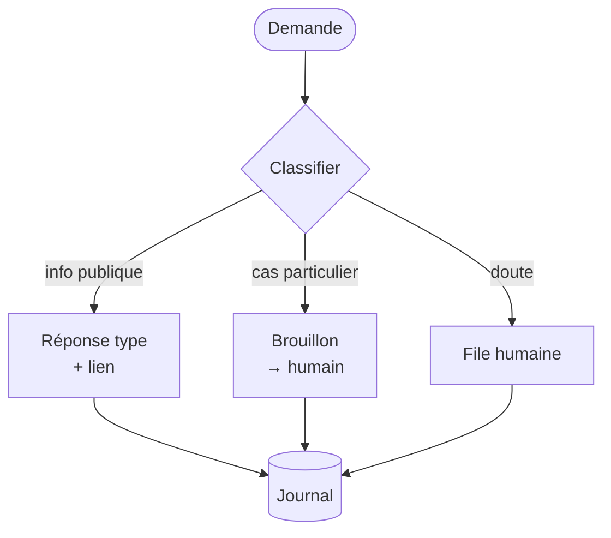
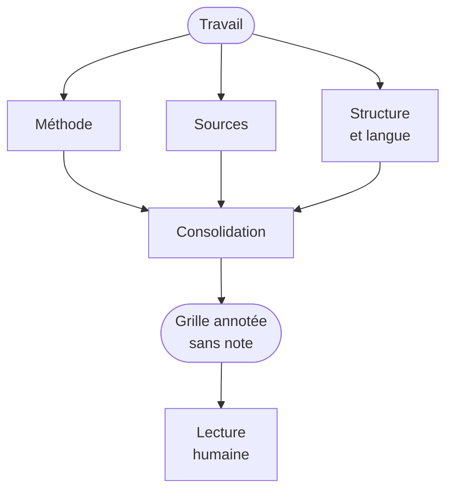
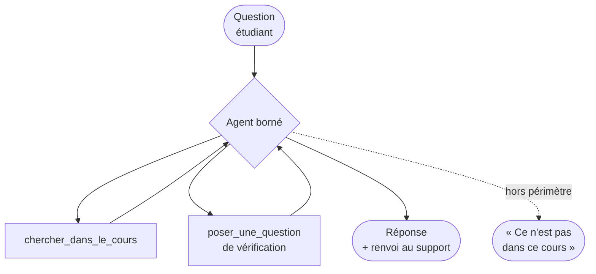

# Et à la fac ?

45 minutes · vos usages, et le sujet qui fâche

---
layout: default
---

# Trier avant de construire

Automatisable

l'erreur est visible et rattrapable

Convertir et reformater des supports

Extraire les références d'un corpus

Produire des variantes d'un même exercice

Résumer un compte rendu de réunion

Trier et router des demandes entrantes

Assistable

l'agent prépare, l'humain décide

Pré-relire un travail selon une grille

Repérer les similitudes entre copies

Proposer un plan de séance à retravailler

Constituer une bibliographie à valider

Rédiger un premier jet de retour

À garder humain

l'erreur est invisible ou irréparable

Attribuer une note

Décider d'une réussite ou d'un échec

Qualifier une fraude

Répondre à un étudiant en difficulté

Tout ce qui relève d'un recours

Le critère de la troisième colonne n'est pas « c'est trop dur pour la machine ». C'est : <strong>quelqu'un doit pouvoir en répondre devant la personne concernée.</strong> Une décision qu'on ne peut pas justifier n'est pas une décision acceptable, quelle que soit sa qualité.

<!--
Ouvrir la discussion ici, 5 minutes : est-ce que quelqu'un placerait un item
dans une autre colonne ? Les désaccords sont instructifs et souvent disciplinaires.

Ne pas trancher à leur place. L'objectif est qu'ils repartent avec la grille,
pas avec mon classement.
-->

---
layout: default
---

# Cas 1 · Le flux de demandes entrantes

Pattern : <strong>routage</strong>, avec sortie « je ne sais pas ».

**Ce qui rend le cas viable** — la majorité des demandes portent sur une information publique et stable. Le volume est réel, la valeur ajoutée humaine est nulle sur cette part.

**Le garde-fou** — la classe « doute » doit exister et être généreuse. Mieux vaut escalader trop que répondre de travers à quelqu'un qui s'inquiète d'une inscription.

**Le triangle du module 5** — cet agent est exposé à du contenu non maîtrisé (des mails) et possède un canal de sortie (répondre). Donc il **n'a pas** accès aux dossiers. S'il en faut, on sépare en deux services.

**La mesure** — part traitée sans humain, part escaladée, et surtout : nombre de réponses fausses détectées après coup.

---
layout: default
---

# Cas 2 · La pré-relecture d'un travail écrit

Pattern : <strong>parallélisation</strong>. Trois lectures indépendantes.

**La règle non négociable** — la sortie est une **grille de remarques localisées**, jamais un score. Dès qu'un chiffre apparaît, il devient l'ancre de la lecture humaine et le travail d'évaluation est perdu.

**Pourquoi trois lectures et pas une** — un modèle à qui on demande trois choses en même temps en fait deux bien. Trois contextes séparés, trois attentions pleines. Le vrai travail est ensuite dans la consolidation des avis divergents.

**Ce que ça fait gagner** — pas du temps de correction : du **temps de correction utile**. L'humain arrive avec les passages déjà repérés.

**À dire aux étudiants** — explicitement, dès le début du cours. Une pré-relecture automatique non annoncée est un problème de confiance avant d'être un problème technique.

<!--
Le point sur l'ancrage est appuyé par la littérature en évaluation : un score affiché
avant lecture déplace fortement la note finale. C'est un argument recevable
en conseil pédagogique, pas juste une précaution de prudence.
-->

---
layout: default
---

# Cas 3 · L'assistant de révision d'un cours

Pattern : <strong>agent borné</strong>, corpus fermé.

**Le choix structurant** — le corpus est **fermé** : vos supports, et rien d'autre. L'agent cite ses sources par numéro de page. Hors périmètre, il refuse au lieu d'improviser.

**Ce que ça change pédagogiquement** — l'étudiant obtient une réponse ancrée dans le cours, pas dans une moyenne du web. Et vous voyez, en agrégé, **sur quoi il bute**.

**Le sous-produit le plus intéressant** — le journal des questions. C'est une donnée d'enseignement que vous n'aviez jamais eue : les incompréhensions réelles, en volume, avant l'examen.

**La limite honnête** — un agent qui répond trop bien remplace l'effort de recherche. Le faire poser une question de vérification avant de répondre change complètement l'effet.

---
layout: default
---

# Le sujet qui fâche

Vos étudiants ont déjà des agents. La question n'est pas de savoir s'il faut l'autoriser.

**Ce qui ne fonctionne plus**

Le devoir à rendre à la maison, sans autre garde-fou

La détection automatique de texte généré — le taux de faux positifs est trop élevé pour fonder une sanction

L'interdiction non vérifiable, qui pénalise surtout ceux qui la respectent

**Ce qui fonctionne encore**

Évaluer le <strong>processus</strong> autant que le produit : versions successives, journal de travail, choix justifiés

La soutenance courte, même cinq minutes : on ne défend pas ce qu'on n'a pas compris

Rendre l'usage <strong>obligatoire et documenté</strong> : « utilise un agent, joins la trace, critique sa sortie »

Des sujets ancrés dans un contexte local que l'agent n'a pas

Le déplacement à opérer : <strong>de « as-tu produit ce texte ? » vers « peux-tu répondre de ce texte ? »</strong>. C'est la seule question qui reste vérifiable, et c'était sans doute déjà la bonne avant.

<!--
Prévoir que ce soit le moment le plus animé de la journée. Laisser 10 minutes.

Ne pas prendre position sur la politique de l'établissement — ce n'est pas mon rôle.
Décrire ce qui tient techniquement et ce qui ne tient pas, et les laisser décider.

Sur la détection : être factuel. Les détecteurs produisent des faux positifs, et ils
en produisent davantage sur les textes de personnes qui n'écrivent pas dans leur langue
maternelle. Une sanction fondée là-dessus est difficilement défendable.
-->

---
layout: default
---

# Une architecture tient en cinq lignes

Avant d'écrire du code, remplissez ceci. Si vous ne pouvez pas, le projet n'est pas prêt.

Objectif

Une phrase. Ce que le système produit, pour qui, et à la place de quoi.

Outils

La liste exhaustive. Chacun classé : réversible, coûteux à défaire, irréversible.

Pattern

Lequel des cinq, ou agent borné. Et pourquoi pas celui d'à côté.

Bornes

Condition d'arrêt, plafond d'étapes, budget, ce qui passe par un humain.

Critère de succès

Un nombre mesurable sur trente cas réels. Pas « ça marche bien ».

La ligne qui bloque le plus souvent est la dernière. C'est presque toujours le signe que l'objectif de la première n'est pas assez précis.

