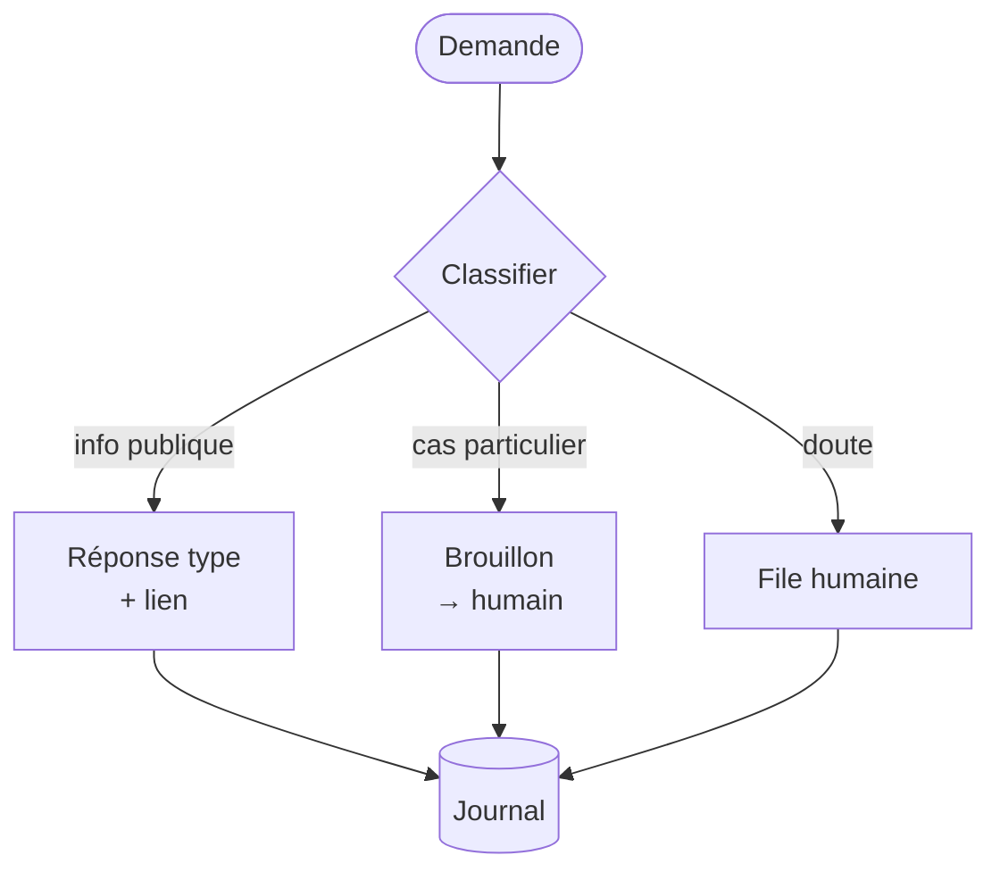
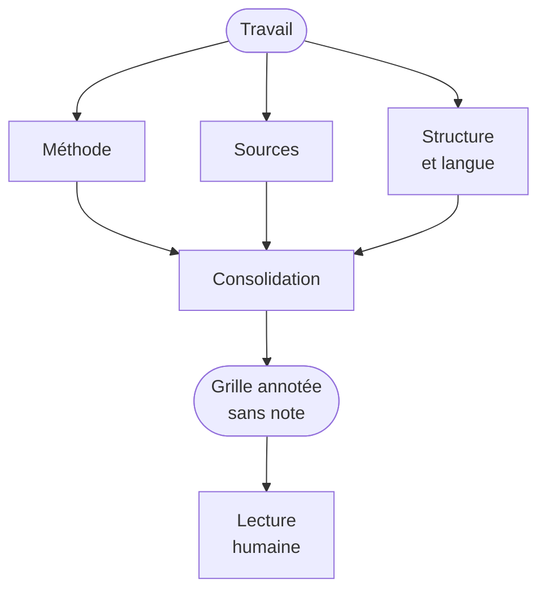
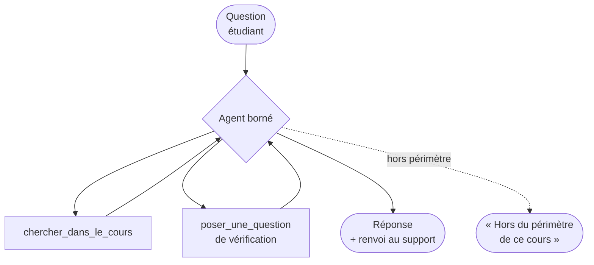

# Usages dans l'enseignement

vos usages, et le sujet qui fâche

---
layout: default
---

# Trier avant de construire

Automatisable

l'erreur est visible

Reformater des supports

Extraire des références

Varier un exercice

Résumer un compte rendu

Router des demandes

Assistable

l'humain décide

Pré-relire selon une grille

Repérer des similitudes

Proposer un plan de séance

Constituer une bibliographie

Rédiger un premier jet

À garder humain

l'erreur est irréparable

Attribuer une note

Décider d'un échec

Qualifier une fraude

Répondre à une détresse

Tout ce qui relève d'un recours

Le critère de la troisième colonne : <strong>quelqu'un doit pouvoir en répondre devant la personne concernée.</strong>

<!--
Ouvrir la discussion ici, cinq minutes : est-ce que quelqu'un placerait un item
dans une autre colonne ? Les désaccords sont instructifs et souvent disciplinaires.
Ne pas trancher à leur place — l'objectif est qu'ils repartent avec la grille,
pas avec mon classement.

Le critère de la troisième colonne, développé : la responsabilité. La question
à poser est « qui répond de cette décision ? », et jamais « est-ce que la
machine y arriverait ? ». Une décision qu'on ne peut pas justifier reste
inacceptable, quelle que soit sa qualité.
C'est un argument qui tient en conseil pédagogique.

Rappeler la grille du module 2 : une fois la colonne choisie, on choisit
le pattern. Les trois slides suivantes font exactement ça sur trois cas.
-->

---
layout: default
---

# Cas 1 · Le flux de demandes entrantes

<v-clicks>

<strong>Pattern</strong> — routage, avec sortie « je ne sais pas »

<strong>Le garde-fou</strong> — la classe « doute », généreuse

<strong>Déjà deux sur trois</strong> — donc <strong>pas</strong> d'accès aux dossiers

<strong>La mesure</strong> — les réponses fausses vues après coup

</v-clicks>

<!--
Ce qui rend le cas viable : une part importante des demandes porte sur une
information publique et stable, et sur cette part la valeur ajoutée humaine
est nulle. NE PAS l'affirmer à leur place — ils connaissent leur secrétariat,
pas moi. Le poser en question : « chez vous, quelle proportion des mails
appelle une réponse qui est déjà écrite quelque part ? » Leur réponse vaut
mieux que mon estimation, et c'est exactement le critère à chercher en premier
sur n'importe quel cas.

Le garde-fou : mieux vaut escalader trop que répondre de travers à quelqu'un
qui s'inquiète d'une inscription. La classe « doute » doit être généreuse
au démarrage, on la resserre ensuite avec les données.

Les trois du module 5, appliqués : cet agent est exposé à du contenu non maîtrisé
(des mails) et possède un canal de sortie (répondre). Il en a donc déjà deux
sur trois. Donc il N'A PAS accès aux dossiers. S'il en faut, on sépare
en deux services. Le faire dire à la salle plutôt que le dire.

La mesure : part traitée sans humain, part escaladée, et surtout le nombre
de réponses fausses détectées après coup. C'est ce dernier chiffre qui décide
si on continue.
-->

---
layout: default
---

# Cas 2 · La pré-relecture d'un travail écrit

<v-clicks>

<strong>Pattern</strong> — parallélisation, trois lectures

<strong>Non négociable</strong> — des remarques, jamais un score

<strong>Le gain</strong> — du temps de correction <em>utile</em>

<strong>À dire aux étudiants</strong> — dès le début du cours

</v-clicks>

<SourceNote :items="[
  ['Malouff & Thorsteinsson, « Bias in grading », Australian Journal of Education, 2016', 'doi.org/10.1177/0004944116664618'],
]" />

<!--
La règle non négociable, développée : la sortie est une grille de remarques
LOCALISÉES, jamais un score. Dès qu'un chiffre apparaît, il devient l'ancre
de la lecture humaine.

CE QUE DIT VRAIMENT LA LITTÉRATURE, à donner exactement comme ça si on me
demande la source — c'est un public qui la demandera : la méta-analyse de
Malouff & Thorsteinsson (« Bias in grading », Australian Journal of Education,
2016 ; 20 études, 1 935 correcteurs) mesure un biais de correction significatif,
d'effet g = 0,36, notamment quand le correcteur connaît une performance
antérieure faible de l'étudiant. Donc : l'effet est établi et il est modéré,
pas « fort ». Dire « mesurable et documenté », jamais « fortement ».
L'application à une pré-note produite par un agent est une extrapolation
raisonnable — la présenter comme telle. Ça reste un argument recevable en
conseil pédagogique.

Pourquoi trois lectures et pas une : trois contextes séparés, trois attentions
pleines. Même remarque qu'au module 2 — la formule « il en fait deux bien »
est une image de praticien, pas un chiffre. Le vrai travail est ensuite dans
la consolidation des avis divergents.

Le gain : pas du temps de correction, du temps de correction UTILE.
L'humain arrive avec les passages déjà repérés. Nuance importante,
sinon on promet un gain de temps qui ne vient pas.

L'annonce aux étudiants : une pré-relecture automatique non annoncée
est un problème de confiance avant d'être un problème technique.
-->

---
layout: default
---

# Cas 3 · L'assistant de révision d'un cours

<v-clicks>

<strong>Pattern</strong> — agent borné, corpus fermé

<strong>Il cite</strong> — la page, sinon il refuse

<strong>Le sous-produit</strong> — le journal des questions

<strong>La limite</strong> — répondre trop bien remplace l'effort

</v-clicks>

<!--
Le choix structurant : le corpus est FERMÉ — vos supports, et rien d'autre.
Hors périmètre, l'agent refuse au lieu d'improviser. C'est ce refus qui fait
la valeur pédagogique.

Ce que ça change : l'étudiant obtient une réponse ancrée dans le cours,
pas dans une moyenne du web. Et vous voyez, en agrégé, sur quoi il bute.

Le sous-produit le plus intéressant, et c'est celui qui accroche toujours :
le journal des questions. C'est une donnée d'enseignement que vous n'aviez
jamais eue — les incompréhensions réelles, en volume, AVANT l'examen.

La limite honnête : un agent qui répond trop bien remplace l'effort de recherche.
Le remède est dans le schéma — le faire poser une question de vérification
avant de répondre change complètement l'effet. Montrer la branche dans le diagramme.
-->

---
layout: default
---

# Le sujet qui fâche

Vos étudiants ont déjà des agents.

Ce qui ne fonctionne plus

- noter le seul fichier rendu
- sanctionner sur un score de détecteur
- « IA interdite » écrit dans la consigne

Ce qui fonctionne encore

- noter les versions successives, pas le fichier
- deux questions sur son rendu, sans machine
- exiger la trace et ce que l'agent a raté
- un sujet que le web ne connaît pas

De « as-tu produit ce texte ? » vers <strong>« peux-tu répondre de ce texte ? »</strong>

<SourceNote :items="[
  ['Liang et al., « GPT detectors are biased against non-native English writers », Patterns, 2023', 'doi.org/10.1016/j.patter.2023.100779'],
]" />

<!--
Prévoir que ce soit le moment le plus animé de la journée. Laisser dix minutes.

Ouvrir avec : la question porte sur ce qu'on évalue, une fois l'IA dans la salle.

Ce qui ne fonctionne plus, développé :
— noter le seul fichier rendu : un travail de dix heures et un travail de dix
  minutes arrivent dans la même boîte de dépôt, dans le même format. Rien dans
  le fichier ne permet de les distinguer ;
— sanctionner sur un score de détecteur : le taux de faux positifs est trop
  élevé pour fonder une sanction. Être factuel là-dessus, et ajouter le point
  qui compte, avec sa source, parce qu'ici on me la demandera : Liang, Yuksekgonul,
  Mao, Wu & Zou, « GPT detectors are biased against non-native English writers »,
  Patterns (Cell Press), 2023. Sept détecteurs testés ; plus de la moitié des
  copies TOEFL rédigées par des non-natifs sont classées « générées par IA »,
  alors que les détecteurs sont quasi parfaits sur des copies de collégiens
  américains. Une sanction fondée là-dessus est difficilement défendable ;
— « IA interdite » écrit dans la consigne : la phrase n'est pas vérifiable, donc
  elle ne trie pas les étudiants selon leur travail, elle les trie selon leur
  obéissance. Ceux qui la respectent sont les seuls à en payer le prix.

Ce qui fonctionne encore — quatre gestes, pas quatre principes :
— noter les versions successives, pas le fichier : demander le dépôt à trois
  dates, ou l'historique du document. Le barème porte sur ce qui a bougé entre
  deux versions. C'est ce qui coûte le moins cher à mettre en place ;
— deux questions sur son rendu, sans machine : « pourquoi ce choix-là page 3 »,
  « qu'est-ce qui casse si on change cette hypothèse ». Deux minutes par étudiant,
  à l'oral ou à l'écrit en début de séance. On ne défend pas ce qu'on n'a pas lu ;
— exiger la trace et ce que l'agent a raté : la consigne devient « utilise un
  agent, joins la conversation, et écris un paragraphe sur ce qu'il a écrit de
  faux ». Le paragraphe est la partie notée — il est impossible à écrire sans
  avoir relu ;
— un sujet que le web ne connaît pas : les données mesurées en labo la semaine
  dernière, le cas vu en séance, le terrain de stage, le corpus interne. L'agent
  reste utile, mais il ne peut plus produire la réponse tout seul.

Si on me demande quoi mettre en place demain matin, répondre : les versions
successives et les deux questions. Les deux se font sans changer le sujet
d'examen ni acheter quoi que ce soit.

Le callout : c'est la seule question qui reste vérifiable — et c'était sans doute
déjà la bonne avant.

NE PAS prendre position sur la politique de l'établissement : hors de mon rôle.
Décrire ce qui tient techniquement et ce qui ne tient pas, et les laisser décider.
-->

---
layout: default
---

# Une architecture tient en cinq lignes

<v-clicks>

Objectif

une phrase

Outils

la liste, classée par réversibilité

Pattern

lequel des cinq, et pourquoi pas l'autre

Bornes

arrêt, plafond, budget, ce qui passe par un humain

Critère de succès

un nombre, sur trente cas réels

</v-clicks>

Si vous ne pouvez pas la remplir, le projet n'est pas prêt.

<!--
C'est le livrable de la journée. Le dire, et proposer de la remplir en direct
sur un cas apporté par la salle — c'est le meilleur usage des dix dernières minutes.

Développer chaque ligne :
— Objectif : ce que le système produit, pour qui, et À LA PLACE DE QUOI.
  La troisième partie est celle qu'on oublie.
— Outils : la liste exhaustive, chacun classé réversible / coûteux à défaire /
  irréversible.
— Pattern : lequel des cinq, ou agent borné. Et pourquoi pas celui d'à côté.
— Bornes : condition d'arrêt, plafond d'étapes, budget, ce qui passe par un humain.
— Critère de succès : un nombre mesurable sur trente cas réels. Pas « ça marche bien ».

LA remarque à faire en sortant : la ligne qui bloque le plus souvent est
la dernière. C'est presque toujours le signe que l'objectif de la première
n'est pas assez précis. Remonter, ne pas forcer.
-->
